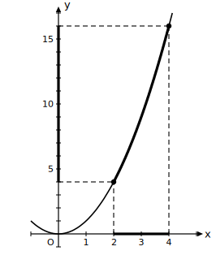
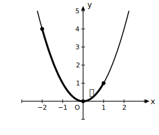

# L07 変域——端の値だけでは決まらない

## ねらい

- xの変域が与えられたとき、対応するyの変域を、**グラフの増減に照らして**正しく求められる。
- 「①端の値を代入 ②変域内にx＝0を含むか確認 ③グラフの概形で確認」という検算の型を身につける。

## まず、うまくいく例から

変域は中1で学んだ、変数の取りうる値の範囲のことだ。y＝x²で、xの変域が2≦x≦4のとき、yの変域を求めてみよう。

L06で確かめたとおり、x＞0の範囲ではxが増えるとyも増える。2≦x≦4はまるごとx＞0の中にあるから、yはx＝2のときの4からx＝4のときの16まで、素直に増えるだけだ。

よって、yの変域は**4≦y≦16**。端の値を代入するだけで答えが出た。

## 端だけ見ると、まちがえる例

では同じy＝x²で、xの変域が−2≦x≦1のときはどうか。端の値を代入すると、x＝−2でy＝4、x＝1でy＝1。「1≦y≦4」としたくなるが——ここに落とし穴がある。

グラフを見よう。

変域−2≦x≦1は、増減の境目であるx＝0をまたいでいる。xが−2から0へ増えるあいだyは4から0まで**下がり**、0から1へ増えるあいだに0から1まで**上がる**。つまりこの範囲でyがもっとも小さくなるのは、端ではなく**x＝0のときのy＝0**だ。もっとも大きい値は、2つの端のうち高い方、x＝−2のときの4。

よって、yの変域は**0≦y≦4**。

端の値は「範囲の両はしの点」でしかない。yの変域が問うているのは「この範囲でyはどこからどこまで動くか」——グラフ全体のいちばん低い場所といちばん高い場所だ。

## a＜0でも考え方は同じ

y＝−2x²で、xの変域が−1≦x≦2のとき。下に開くグラフだから、頂点(0, 0)が**いちばん高い**場所になる。変域はx＝0を含むので、yのもっとも大きい値は0。もっとも小さい値は端のうち低い方で、x＝2のときy＝−8（x＝−1ではy＝−2）。よってyの変域は**−8≦y≦0**。

## 検算の型——3点セット

> **変域の検算の型**
> ① **端の値を代入**する（xの変域の両端でのyの値を求める）
> ② **変域内にx＝0を含むか**確認する（含むなら、y＝0が、もっとも小さい値（a＞0）またはもっとも大きい値（a＜0）になる）
> ③ **グラフの概形**をかいて、該当部分のいちばん低い場所・高い場所を目で確認する

①だけで済ませないこと。②と③が、落とし穴を照らすライトになる。この型は、この章の解答すべてで使っていく。

:::zatsudan
「両はしさえ見れば全体が分かる」という考えは、直線の世界ではいつも正しかった。橋の両端の高さが分かれば、まっすぐな橋のどこよりも高い場所も低い場所もその2点のどちらかだ。しかし谷にかかる曲がった橋では、いちばん低い場所は真ん中あたりに沈んでいるかもしれない。曲線の世界に入った私たちは、「はしを見る」に加えて「底を探す」目を持つ必要がある。
:::

:::guide
**なぜx＝0だけを特別あつかいするのか**

y＝ax²の増減の境目は、L06で見たとおり原点ただ1つだ。だからyの変域で「端以外の値」が顔を出すとしたら、それはx＝0のときのy＝0しかない。検算の型の②が「x＝0を含むか」という1点チェックで済むのは、この関数のグラフの形が単純だからこそだ。関数の種類が変われば境目の場所も変わる——「この関数の境目はどこか」から考える習慣にしておくと、先々の学びにもそのまま持ちこせる。
:::

:::guide
**「y＝0が入るか」を言葉にしておく**

−2≦x≦1の例の答え0≦y≦4を見て、「0はどこから来たのか」と一瞬戸惑う人は多い。表を作ると正体が見える: x＝−2, −1, 0, 1に対しy＝4, 1, 0, 1。yの値の並びの中に0がちゃんといる。変域の答案でまちがえたときは、xの値を1刻みで並べた小さな表を作って、yの値の顔ぶれを直接ながめるのが確実な立て直し方だ。表・グラフ・式のどれからでも同じ答えに着けることが、この章の目標そのものでもある。
:::

## 練習

1. y＝x²について、次のxの変域に対するyの変域を求めよう。
   (1) 2≦x≦4　(2) −3≦x≦−1
2. y＝2x²について、xの変域が−2≦x≦1のときのyの変域を求めよう。
3. y＝−x²について、xの変域が−1≦x≦3のときのyの変域を求めよう。
4. 【まちがい直し】次の解答には誤りがある。誤りを見つけて、正しい答えに直そう。
   「y＝x²/2で、xの変域が−4≦x≦2のとき。x＝−4のときy＝8、x＝2のときy＝2だから、yの変域は2≦y≦8である。」

:::stretch
**S1** y＝x²で、yの変域が0≦y≦9になるようなxの変域を、2つ以上見つけよう。答えは1通りに決まるだろうか？　「x→yの向きでは1つに決まるのに、逆向きは1つに決まらない」——この非対称は、関数というものの性格をよく表している。
:::

---

対応解答: answer_key_L06-09.md

<!-- gen_nav:nav:start（自動生成・手編集しない） -->

---

[← 前のレッスン](lesson_06.md)｜[単元の目次](README.md)｜[解答](answer_key_L06-09.md)｜[次のレッスン →](lesson_08.md)

<!-- gen_nav:nav:end -->
