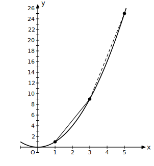

# L08 変化の割合は一定でない——だから曲線になる

## ねらい

- y＝ax²の変化の割合が**一定でない**ことを計算で確かめ、それが**グラフが曲線になる理由**だと理解する。
- 変化の割合の、グラフ上の意味（2点を結ぶ直線の傾き）と、事象の中での意味（平均の速さ）を知る。
- 「求めたら、読む」、つまり計算した数値から言えることを一言添える習慣をつける。

## 準備：変化の割合の意味、もう一度

L01の準備運動5を思い出そう。変化の割合とは、

**変化の割合＝（yの増加量）÷（xの増加量）**

つまり**割り算の値**であって、yの増加量そのものではない。ここがあいまいなままだと、このレッスンは霧の中になる。不安な人は、先に進む前にL01のguide「『変化の割合＝yの差』と思っていた人へ」をもう一度読んでおこう。

## まず、差でながめる——1, 3, 5, 7, …

y＝x²の表で、xが1ずつ増えるときのyの**差**を書きこんでみよう。

| x | 0 | 1 | 2 | 3 | 4 | 5 |
|---|---|---|---|---|---|---|
| y | 0 | 1 | 4 | 9 | 16 | 25 |
| 差 | | 1 | 3 | 5 | 7 | 9 |

差の行に、1, 3, 5, 7, 9——奇数の列が現れた（L02のstretchで予想した人は答え合わせだ）。一次関数なら、xが1ずつ増えるときのyの差はどこでも同じだった。y＝x²では、差が**進むほど大きくなっていく**。

## 主概念1：変化の割合は区間で変わる——だから曲線

差の観察を、変化の割合の計算にきちんと格上げしよう。y＝x²で、

- xの値が**1から3まで**増えるとき: yは1から9まで増えるから、変化の割合＝(9−1)÷(3−1)＝8÷2＝**4**
- xの値が**3から5まで**増えるとき: yは9から25まで増えるから、変化の割合＝(25−9)÷(5−3)＝16÷2＝**8**

xの増加量はどちらも2で同じなのに、変化の割合は4と8——**区間によってちがう**。比べるために、一次関数y＝2x＋1でも同じ2区間を計算すると、(7−3)÷2＝2、(11−7)÷2＝2。こちらは何度やっても2、つまり傾きと同じ値になる（中2で学んだとおりだ）。

> **【ことば】y＝ax²の変化の割合**
> y＝ax²の変化の割合は、**一定ではなく**、どの区間で考えるかによって変わる。
> （比例・一次関数の変化の割合は一定で、傾きaに等しかったが、その性質はこの関数にはない）

そしてこれが、グラフの形の謎を解く。変化の割合が一定であることと、グラフが直線になることは、同じことの2通りの表現だった。y＝ax²は変化の割合が一定でない。**だから、グラフは直線にならず、曲線になる**。L04で「なめらかな曲線になった」と観察した事実に、これで理由が付いた。

## 主概念2：変化の割合はグラフの上でも見える

変化の割合(9−1)÷(3−1)という式は、グラフ上の2点(1, 1)と(3, 9)について「yの増加量÷xの増加量」を計算している。これは中2で学んだ、**2点を結ぶ直線の傾き**の計算そのものだ。

図の2本の直線を見比べると、あとの区間の直線の方が明らかに急だ。変化の割合が4から8へ増えたことが、傾きのちがいとして目に見えている。曲線に沿って右へ進むほど、結んだ直線はどんどん立っていく——「変化の割合が一定でない」とは、グラフの言葉でいえばこういうことだ。

## 平均の速さ——変化の割合が事象の中で持つ意味

架空の実験をひとつ。**これは学習用に作った架空の設定で、実測データではない。** まっすぐな斜面で台車を静かに放したところ、x秒間に進む距離y mがy＝2x²で表せたとしよう。

台車が、放してから1秒後〜3秒後の2秒間に進んだ距離は、2×3²−2×1²＝18−2＝16 (m)。この間の**平均の速さ**は、

（進んだ距離）÷（かかった時間）＝16÷2＝**8 (m/秒)**

この計算、どこかで見た形ではないだろうか？　そう、（yの増加量）÷（xの増加量）——**変化の割合そのもの**だ。同じ計算を3秒後〜5秒後でやると(50−18)÷2＝16 (m/秒)。同じ2秒間でも、あとの2秒間の方が平均の速さが大きい。台車はだんだん速くなっている。変化の割合の増加が、事象の言葉では「加速」として現れるのだ。

## 「求めたら、読む」

このレッスンから、計算の締めに新しい型を加える。

> **求めたら、読む**
> 変化の割合などの数値を求めたら、そこで終わりにせず、**「この数値から何が言えるか」を一言書く**。
> 例:「区間が右に移ると変化の割合が4から8に増えた。→ グラフは右へ行くほど急になっている」

変化の割合は、計算の練習台ではなく、関数のようすを読み取るための**ものさし**だ。数値を出して読まないのは、体温を測って見ないのと同じで、もったいない。

:::zatsudan
「平均の速さ」という言葉には、少しさびしい正直さがある。1秒後から3秒後までの平均が秒速8mだと言っても、台車がその2秒間ずっと秒速8mだった瞬間はないかもしれない。平均とは、でこぼこの実際をひとつの数に押しこんだ要約だ。要約だからこそ比べやすく、要約だからこそこぼれ落ちるものがある。数値を読むとき、この両面をおぼえておきたい。
:::

:::guide
**「差が1, 3, 5と増える」と「変化の割合が変わる」の関係**

差の観察（1, 3, 5, 7, …）と変化の割合の計算は、別々の話ではない。xが1ずつ増える表では、xの増加量がいつも1だから、**yの差がそのまま変化の割合**になっている（差÷1＝差）。つまりあの奇数の列は、「区間幅1で測った変化の割合の一覧表」だったのだ。一次関数の表で差が一定だったことも、「変化の割合が一定」の表への現れだった。表の差・割合の計算・グラフの傾き。三つの顔はぜんぶ同一人物である。
:::

:::guide
**変化の割合を求める計算の型**

計算そのものは中2と同じ型で、（yの増加量）÷（xの増加量）を機械的に実行すればよい。ミスが出やすいのは負の数がからむ区間だ。たとえばy＝x²でxが−3から−1まで増えるとき、yは9から1へ変わるから、(1−9)÷(−1−(−3))＝(−8)÷2＝−4。増加量は必ず「あとの値−前の値」で作る（xもyも同じ向きでそろえる）こと。結果が負になったら、「この区間ではyが減っている」という読みまで添えられれば完璧だ。
:::

:::guide
**「aが変化の割合」と書きたくなったら**

一次関数y＝ax＋bでは、aがそのまま変化の割合だった。その記憶のまま「y＝3x²の変化の割合は3」と書いてしまう誤りは、型の流用として自然に起こりうる（頻度の調査データがあるわけではないが、指導経験からの経験則としてもよく見かける型だ）。防ぎ方は単純で、y＝ax²の変化の割合を答えるときは**必ず区間を確認する**こと。区間が示されていない「変化の割合」は、この関数では答えようがない。問いとして成立していないと気づけることが、理解の証拠になる。
:::

## 練習

1. y＝x²について、次の各区間での変化の割合を求めよう。
   (1) xが1から3まで増えるとき　(2) xが3から5まで増えるとき　(3) xが−3から−1まで増えるとき
2. 次の関数の、xが1から4まで増えるときの変化の割合をそれぞれ求めよう。
   (1) y＝2x²　(2) y＝−x²
3. 一次関数y＝4x−1について、xが1から3まで増えるときと、5から8まで増えるときの変化の割合をそれぞれ求めよう。結果に一言コメントを添えよう（求めたら、読む）。
4. 本文の台車（架空の設定・y＝2x²）について、放してから0秒後〜2秒後の平均の速さと、2秒後〜4秒後の平均の速さをそれぞれ求めよう。求めたら、2つの数値から言えることを一言書こう。
5. 【説明】y＝x²の変化の割合が一定でないことと、グラフが直線にならないことのつながりを、練習1の(1)(2)の結果を使って2〜3文で説明しよう。

:::stretch
**S1** y＝x²で、xがtからt＋1まで増えるときの変化の割合を、tの式で表そう（(t＋1)²の展開を使う。区間の始まりの数は、比例定数のaと混同しないようにtと書く）。できた式にt＝0, 1, 2, 3を代入してみると、本文の差の行に現れたあの数列と再会するはずだ。奇数の列の正体を、式が説明してくれる。
:::

---

対応解答: answer_key_L06-09.md

<!-- gen_nav:nav:start（自動生成・手編集しない） -->

---

[← 前のレッスン](lesson_07.md)｜[単元の目次](README.md)｜[解答](answer_key_L06-09.md)｜[次のレッスン →](lesson_09.md)

<!-- gen_nav:nav:end -->
