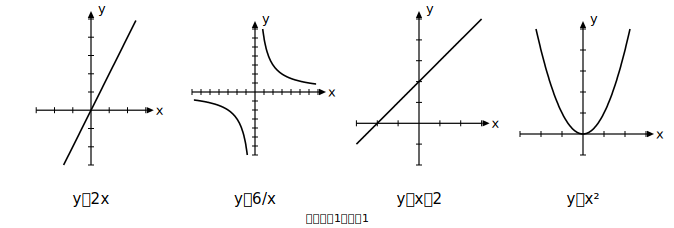

# L09 四つの関数を見わたす——特徴をことばにする

## ねらい

- 比例・反比例・一次関数・y＝ax²の4つを1枚の比較表に**自分の手で**整理し、中学で学んだ関数を見わたす。
- 関数の特徴を説明するための型（**観点＋比較＋根拠**）を身につけ、「なぜ直線にならないのか」を自分の言葉で書けるようになる。

## 中学関数、勢ぞろい

3年間で出会った関数を、一列に並べてみよう。

形はばらばらだが、どれも「xの値を決めるとyの値がただ1つ決まる」——関数という一つの家族だ。家族のちがいを整理する表を作ろう。次の表の空欄（▢）を、これまでのレッスンを思い出しながら自分で埋めてみてほしい（埋めた結果は練習1として答え合わせする）。

| 観点 | 比例 y＝ax | 反比例 y＝a/x | 一次関数 y＝ax＋b（b≠0のとき） | y＝ax² |
|---|---|---|---|---|
| グラフの形 | 原点を通る直線 | 曲線（2本1組） | 直線 | ▢ |
| 変化の割合 | 一定（aに等しい） | ▢ | 一定（aに等しい） | ▢ |
| xがm倍になると | yもm倍 | yは1/m倍 | （きまった倍にならない） | ▢ |
| 一定になっている商・積 | y÷xが一定 | ▢ | （なし） | ▢ |

ひとつ注意を。**比例は一次関数の特別な場合（b＝0）** だ。だから表の一次関数の列は、比例とは別の顔を見せる**b≠0のとき**のようすを書いてある——b＝0なら、その列は比例の列そのもの（y÷x＝aが一定）になる。

表を埋めると、見えてくることがある。曲線のグラフを持つのは反比例とy＝ax²の2つ。変化の割合が一定なのは、直線組（比例・一次関数）だけ。**グラフの形と変化の割合が、きれいに対応している。**

## 説明の型——観点・比較・根拠

「y＝ax²の特徴を説明しなさい」と言われて、何から話せばよいか困ったことはないだろうか。困るのは知識がないからではなく、**説明の組み立て方**が手もとにないからだ。型を渡そう。

> **説明の型**
> ① **観点**を決める（変化の割合／グラフの形／m倍したときのふるまい／商の一定性…比較表のタテの項目が観点の在庫だ）
> ② **比較**する（「一次関数では〜だったが、y＝ax²では〜」）
> ③ **根拠**を添える（表の値・計算結果・式の形など、数学の言葉で1つ）

例を1つ。「y＝ax²のグラフはなぜ直線にならないのか」を型で組み立てると——

①観点: 変化の割合。②比較: 一次関数の変化の割合はどの区間でも一定だが、y＝x²では区間によって変わる。③根拠: 実際、xが1から3までの変化の割合は4、3から5までは8だった（L08）。変化の割合が一定であることが直線の性質だから、一定でないy＝ax²のグラフは直線にならない。

観点を宣言し、比べ、数値で裏づける。この3手が打てれば、説明はもう怖くない。

## 「どの関数か」を見抜く目

比較表は、逆向きにも使える。表やグラフだけが与えられて式が分からないとき、「変化の割合は一定か？」「y÷xとy÷x²のどちらが一定か？」と観点を順に当てていけば、4つのうちのどれかを見抜ける。練習2で試そう。

:::zatsudan
図鑑のおもしろさは、1種類をくわしく知ることより、並べて見たときに際立つ「ちがい」にある。ツバメ単独のページよりも、ツバメとスズメの飛び方を見開きで比べたページの方が、両方の輪郭がくっきりする。関数も同じで、y＝ax²の個性は、比例や一次関数と並べた瞬間にいちばんよく見える。この章の最初から「一次関数ではどうだったか」と問い続けてきたのは、ずっと見開きのページを作っていたのだ。
:::

:::guide
**説明が「感想」になってしまう人へ**

「グラフがぐにゃっとしているから曲線」「増え方がすごいから」——こうした答案は、感じたことは正しいのに、根拠の部分が数学の言葉になっていない。直すコツは、③根拠のところに**必ず数値か式を1つ置く**と決めてしまうことだ。「変化の割合が4から8に変わった」「y÷x²がどの列でも2だった」のように、計算した事実を1つ置くだけで、感想文は説明文に変わる。①観点の宣言を文の先頭に持ってくる（「変化の割合に注目すると、」）のも、書き出しの迷いを消す実用的な手だ。
:::

:::guide
**比較表は「暗記表」ではない**

この表の各マスは、暗記する項目ではなく、これまでのレッスンで**計算して確かめてきた事実の索引**だ。「y＝ax²の変化の割合は一定でない」のマスの裏には、L08の計算（4と8）がある。「y÷x²が一定」の裏にはL02の表がある。マスを見て根拠のレッスンが思い出せないときは、そこが復習ポイントだと教えてくれる——表は自分の理解の点検地図として使うのがいちばん役に立つ。
:::

## 練習

1. 本文の比較表の空欄▢をすべて埋めて、表を完成させよう。
2. 次の(ア)〜(エ)の表は、それぞれ比例・反比例・一次関数・y＝ax²のどれかである。どれかを見抜き、yをxの式で表そう。
   (ア)
   | x | 1 | 2 | 3 | 4 |
   |---|---|---|---|---|
   | y | 5 | 10 | 15 | 20 |
   (イ)
   | x | 1 | 2 | 3 | 4 |
   |---|---|---|---|---|
   | y | 3 | 5 | 7 | 9 |
   (ウ)
   | x | 1 | 2 | 3 | 4 |
   |---|---|---|---|---|
   | y | 2 | 8 | 18 | 32 |
   (エ)
   | x | 1 | 2 | 3 | 4 |
   |---|---|---|---|---|
   | y | 12 | 6 | 4 | 3 |
3. 【説明】y＝2xとy＝2x²のちがいを、「xの値が2倍になったとき」という観点で、説明の型（観点＋比較＋根拠）にそって説明しよう。根拠には具体的な値の計算を使うこと。
4. 【説明】「y＝x²のグラフはなぜ直線にならないのか」を、変化の割合という観点で、自分の言葉で3文以内で書こう。

:::stretch
**S1** 反比例y＝12/xの変化の割合を、xが1から2まで増えるときと、2から3まで増えるときでそれぞれ計算してみよう。反比例もまた「変化の割合が一定でない曲線組」だと確かめられるはずだ。では、同じ曲線組なのに、反比例とy＝ax²のグラフの形はなぜあんなにちがうのだろう。表の値の変わり方（増えていく先・0に近づく先）に注目して、考えたことを自由に書いてみよう。
:::

---

対応解答: answer_key_L06-09.md

<!-- gen_nav:nav:start（自動生成・手編集しない） -->

---

[← 前のレッスン](lesson_08.md)｜[単元の目次](README.md)｜[解答](answer_key_L06-09.md)｜[次のレッスン →](lesson_10.md)

<!-- gen_nav:nav:end -->
