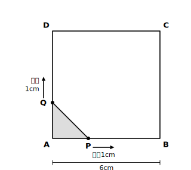
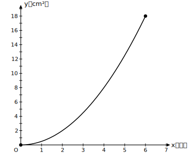

# L10 図形の中の関数——動く点と面積

## ねらい

- 図形の上を動く点が作る面積の変化を、**場面→表→式→グラフ→読み取り**の流れで最初から最後まで扱えるようになる。
- 変域が「場面」から決まることを、動く点の例で実感する。

## 動く点の場面を、フルコースで

L03で身につけた数学化の型を、この章の道具ぜんぶ（式・グラフ・変域・読み取り）とつないで、1つの場面を最初から最後まで料理してみよう。

**場面** 1辺6cmの正方形ABCDがある。点Pは頂点Aを出発して辺AB上をBまで、点Qは同時にAを出発して辺AD上をDまで、どちらも**毎秒1cm**の速さで動く。出発してからx秒後の三角形APQの面積をy cm²とする。

**① 変わる量を選ぶ**: 決める側は時間x（秒）、決まる側は面積y（cm²）。

**② 表を作る**: x秒後、AP＝x cm、AQ＝x cmだ。三角形APQは、直角をはさむ2辺がともにx cmの直角三角形だから、面積を順に求めると、次のようになる。

| x（秒） | 0 | 1 | 2 | 3 | 4 | 5 | 6 |
|---|---|---|---|---|---|---|---|
| y（cm²） | 0 | 0.5 | 2 | 4.5 | 8 | 12.5 | 18 |

**③ きまりを調べる**: y÷x²を計算すると、x＝0以外のどの列でも0.5で一定（例: 2÷4＝0.5、8÷16＝0.5）。x＝0の列では割れない（0÷0は決められない）から、この確かめはx＝0以外の列で行う。xが2倍になるとyは4倍（1秒後0.5→2秒後2）。2本の見分け方がそろった。

**④ 式と変域**: **y＝x²/2**。そして変域を場面に戻って確認する。PがBに着くのは6秒後だから、xが動けるのは**0≦x≦6**。このときyは0からx＝6のときの18まで（x≧0の範囲では増えるだけ）、つまり**0≦y≦18**。

**⑤ グラフをかいて、読む**:

グラフはx＝6でぷつりと終わっている。式のy＝x²/2自体はどんなxでも計算できるが、**場面が生きているのは0≦x≦6だけ**——グラフの「終わり」は、場面の終わり（PがBに、QがDに着く瞬間）を表している。

読み取りもしてみよう。面積が8cm²になるのは何秒後か。グラフでy＝8の高さを横に見ると、曲線とぶつかるのはx＝4のあたり。式で確かめると、x²/2＝8からx²＝16、変域内で正のx＝4。**4秒後**だ。グラフで見当をつけ、式で確定する——2つの道具の合わせ技が確実で速い。

## 「速さ」が変わると式も変わる

同じ正方形でも、Qの速さが毎秒2cmなら、x秒後のAQは2x cmになり、y＝x×2x÷2＝x²。比例定数が変わり、Qが先にDへ着くから変域も変わる（練習1で扱う）。場面の設定のどこが式のどこに効くのか、対応を意識しながら練習しよう。

:::zatsudan
「動くものを、止めて考える」というのは数学の得意技のひとつだ。動き続ける点をそのまま目で追うと難しいのに、「x秒後」と時刻をひとつ固定したとたん、そこには止まった図形がひとつ現れて、面積が計算できてしまう。パラパラまんがの1コマ1コマは静止画なのに、めくれば動きが見える——表とグラフは、この場面のパラパラまんがなのだと思う。
:::

:::guide
**「x秒後の図」を自分でかく**

動く点の問題でつまずく原因になりやすいのは、式を立てる前の段階、つまり「x秒後の図」を描かずに頭の中だけで処理しようとすることにある。おすすめの手順は、まずx＝2など具体的な時刻の図を1枚かいて長さを数値で入れ、面積を計算してみることだ（AP＝2、AQ＝2、面積2）。数値でできた計算の「2」を「x」に置きかえれば、それがそのまま式になる（AP＝x、AQ＝x、y＝x×x÷2）。具体で1回できたことを文字に置きかえる——文章題全般に効く、安全な立式の道すじだ。
:::

:::guide
**変域の端がどちらの点で決まるか**

本文の場面ではPとQが同じ速さだから、2点は同時にゴールに着く。しかし速さがちがう場面（練習1）では、**先にゴールへ着く点**が変域の端を決める。「場面が成立しなくなる最初の瞬間はいつか」を問うのが、変域を決めるときの正しい問い方だ。式だけを見ていると絶対に出てこない情報なので、変域の確認だけは必ず場面（図）に戻ること。L03の④で「場面が変域を決める」と学んだことの、これが実戦の形だ。
:::

## 練習

1. 1辺10cmの正方形ABCDで、点Pは頂点Aから辺AB上をBまで**毎秒1cm**で、点Qは同時にAから辺AD上をDまで**毎秒2cm**で動く。出発してからx秒後の三角形APQの面積をy cm²とする。
   (1) yをxの式で表そう（まずx＝1, 2, 3秒後の図を思いうかべて、AP・AQの長さから面積を計算してみよう）。
   (2) xの変域を答えよう（どちらの点が先にゴールに着くか）。
   (3) yの変域を答えよう。
   (4) グラフをかこう。
   (5) 面積が16cm²になるのは何秒後か、式で求めよう。
2. 水面に石を落とすと、円形の波紋（はもん）が広がっていく。波紋の半径が毎秒2cmずつ大きくなるとしたとき、x秒後の波紋の円の面積をy cm²とする（これは学習用に単純化した設定だ）。
   (1) x秒後の半径をxの式で表そう。
   (2) yをxの式で表し、yがxの2乗に比例することを確かめよう。比例定数も答えよう。
   (3) x＝3のときのyの値を求めよう。

:::stretch
**S1** 練習1の場面で、もしPとQが止まらずにそのまま進み続けられたら、式y＝x²はいつまでこの場面を表すだろうか。5秒より先で式が場面と合わなくなるのはなぜか、図をかいて考えてみよう。「式は正しいのに場面に合わない」という状況こそ、変域という考えが必要になる理由だ。
:::

---

対応解答: answer_key_L10-13.md

<!-- gen_nav:nav:start（自動生成・手編集しない） -->

---

[← 前のレッスン](lesson_09.md)｜[単元の目次](README.md)｜[解答](answer_key_L10-13.md)｜[次のレッスン →](lesson_11.md)

<!-- gen_nav:nav:end -->
