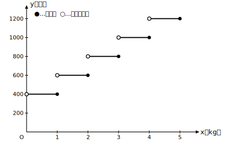

# L12 式に表しにくい関数——料金の仕組み

## ねらい

- **式に表すことが困難な関数**があることを知り、式がなくても表やグラフで変化や対応を調べられることを実感する。
- 「xの値を決めるとyの値がただ1つ決まる」という中1の関数の定義に立ち返り、関数の理解を完成させる。

## 荷物の重さと料金——この対応は関数か？

架空の宅配サービス「はこぶ便」の料金を考えよう（**学習用に作った架空の設定**だ）。荷物の重さで料金が決まる仕組みで、料金表はこうなっている。

| 荷物の重さx（kg） | 1kgまで | 1kgをこえて2kgまで | 2kgをこえて3kgまで | 3kgをこえて4kgまで | 4kgをこえて5kgまで |
|---|---|---|---|---|---|
| 料金y（円） | 400 | 600 | 800 | 1000 | 1200 |

重さ1.5kgの荷物なら600円。2.8kgなら800円。3kgちょうどなら——「2kgをこえて3kgまで」の段だから800円だ。

さて、この対応をy＝ax²やy＝ax＋bのような式に表せるだろうか。試しにいくつか調べると、x＝0.5でもx＝1でもy＝400。xが2倍になったのにyは1倍のまま。かと思えばx＝1と1.1では、重さはほんの少ししかちがわないのに料金は400円から600円へ跳ぶ。比例でも、一次関数でも、2乗に比例でもない。**1本の式で表すのは難しい**対応だ。

では、これは関数ではないのだろうか？　中1の定義に戻ろう。

> **【ことば】関数（中1の定義の再掲）**
> ともなって変わる2つの変数x, yがあって、**xの値を決めると、それに対応するyの値がただ1つ決まる**とき、yはxの関数であるという。

重さxを決めれば（1.5kgなら600円、3kgなら800円）、料金yは必ずただ1つに決まる。定義の条件を完全に満たしている。**yはxの関数である。** 定義のどこにも「式で表せること」という条件はない。式は関数を表す便利な道具の1つであって、関数であることの条件ではなかったのだ。

## 式がなくても、グラフはかける

この関数のようすは、グラフにするとよく見える。

階段のような形のグラフになった。ここで新しい記号の約束をひとつ。線分の端の●はその点をふくむ、○はふくまないことを表す。たとえば重さ2kgちょうどは「1kgをこえて2kgまで」の段に入るから、点(2, 600)は●（ふくむ）、点(2, 800)は○（ふくまない）。この●と○のおかげで、境目の重さでも料金がただ1つに読み取れる——つまりグラフの上でも「関数であること」が保たれている。

なめらかな曲線とはずいぶんちがう姿だが、これも立派な関数のグラフだ。式がなくても、表とグラフがあれば、変化のようす（どこで料金が跳ぶか）も対応（この重さならいくらか）もすべて調べられる。

## 逆向きに見ると——「yを決めてもxはただ1つに決まらない」

ためしに対応を逆向きにたどってみよう。「料金が600円だった」と分かったとき、荷物の重さはただ1つに決まるだろうか。1.2kgかもしれないし、2kgちょうどかもしれない——**1つに決まらない**。つまり、yはxの関数だが、**xはyの関数とはいえない**。関数とは「xを決める→yが決まる」という**向きのついた**対応だった（L01のguide「決める側と決まる側」）。この非対称まで見えたら、関数の定義の理解は仕上げの段階だ。

比例から始まって、反比例、一次関数、y＝ax²、そして式に表すことが困難な関数まで。「関数」という言葉のさす範囲は、式の形のコレクションではなく、「ただ1つに決まる対応」すべてなのだ。

:::zatsudan
じつは「式に表すことが困難な関数」を中学3年で学ぶようになったのは、比較的新しいことだ。学習指導要領（がくしゅうしどうようりょう）という、学校で教える内容の国の基準があるのだが、この内容が中3に位置づいたのは平成20年告示のものから。平成10年告示のときの中3にはなかった。いま君が読んでいるこのページは、教育の歴史の中では新顔のメンバーというわけだ。
:::

:::guide
**「まで」と「をこえて」を読む技術**

料金表の読みまちがいは、境目の値で起きる。「1kgまで」は1kgちょうどを**ふくみ**、「1kgをこえて」は1kgちょうどを**ふくまない**。不等号で書けば、最初の段は0＜x≦1、次の段は1＜x≦2だ。日常の文章（料金表・時刻表・規約）を数学の不等号に正確に翻訳する練習として、この題材はとてもよい。グラフの●○は、この不等号の≦と＜をそのまま絵にした記号だと思えばよい。
:::

:::guide
**この関数に「1本の式がない」ことの意味**

正確に言えば、この関数も「0＜x≦1のときy＝400、1＜x≦2のときy＝600、……」と**場合分けの形**で書き表すことはできる。「式に表すことが困難」とは、y＝ax²のような1本のなじみの式にまとまらない、という意味だ。それでも関数として少しも欠けたところがないのは、本文で見たとおり。世の中の量の対応は、むしろこういう「式がすっきり書けない」タイプの方が多いくらいで、そのとき頼りになるのが表とグラフという道具だ。式・表・グラフの3点セットのうち、どれか1つが使えなくても残りで戦える——この章で育ててきた道具箱の、それが本当の強みである。
:::

## 練習

1. 本文の「はこぶ便」の料金表について答えよう。
   (1) 重さ2.4kgの荷物の料金はいくらか。
   (2) 重さ3kgちょうどの荷物の料金はいくらか。
   (3) 重さ4.1kgの荷物の料金はいくらか。
2. 本文のグラフで、点(2, 600)と点(2, 800)のうち、●（ふくむ）で表されるのはどちらか。理由も添えて答えよう。
3. 本文の料金の仕組みについて、次の問いに理由を添えて答えよう。
   (1) yはxの関数といえるか。
   (2) xはyの関数といえるか。
4. 架空のレンタサイクル「まわる号」は、利用時間30分ごとに200円ずつ料金が上がる仕組みである（利用時間30分まで200円、30分をこえて60分まで400円、60分をこえて90分まで600円）。利用時間をx分（0＜x≦90）、料金をy円とする。
   (1) 対応の表を作ろう。
   (2) グラフをかこう（●と○の使い分けに注意）。
   (3) 45分利用したときの料金を答えよう。

:::stretch
**S1** 身のまわりから「式に表すことが困難だが、関数といえる対応」を1つ探して、xとyが何か、なぜ関数といえるか（xを決めるとyがただ1つ決まるか）を書いてみよう。交通機関や郵便の料金の仕組みは有力な狩り場だ。調べるフレーズ例:「郵便 料金 重さ 区分」「運賃 距離 きざみ」。実際の料金の仕組みが調べられたら、この本文と同じように表とグラフ（●○つき）にしてみると、L12の内容がまるごと復習できる。
:::

---

対応解答: answer_key_L10-13.md

<!-- gen_nav:nav:start（自動生成・手編集しない） -->

---

[← 前のレッスン](lesson_11.md)｜[単元の目次](README.md)｜[解答](answer_key_L10-13.md)｜[次のレッスン →](lesson_13.md)

<!-- gen_nav:nav:end -->
