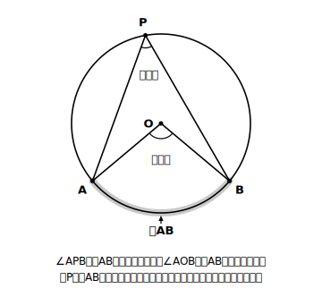
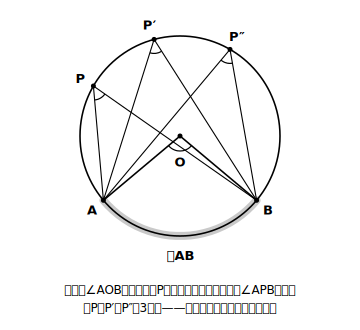
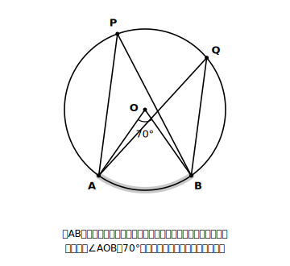

# L01 円のふしぎ——動かしても変わらない角

## ねらい

- **円周角**と**中心角**という言葉を、弧との対応づけとセットで理解する。
- 円周上の点を動かす実験から、「円周角は中心角の半分らしい」「同じ弧に対する円周角は等しいらしい」という2つの推測を自分の手で見つける。

## 準備運動——例・たしかめ（答えつき）：円の言葉の点検

この章の主役は円だ。中1で学んだ円の言葉がそろっているか、まず点検してみよう。ここは練習問題ではなく**答えをすぐ下に示すたしかめ**なので、頭の中で言えるか確かめたら、そのまま答え合わせしてよい（この教材の練習問題の解答は、いつもどおり別ファイルにある）。

1. 円Oの周上に2点A、Bをとる。A、Bを両端とする円周の一部分を何というか。
2. A、Bを結ぶ線分を何というか。
3. 円の中心Oと結んでできる∠AOBのような角を、弧（こ）ABに対する何というか。

答えは、弧・弦（げん）・中心角（ちゅうしんかく）。あやしかった人は、中1の「円とおうぎ形」に一度戻っておこう。この3つの言葉は今日からずっと使い続けることになる。

## 主概念1：円周角——円周の上から弧を見た角

円Oの周上に2点A、Bをとり、さらにA、Bとは別の点Pを、**弧ABの上ではない側**の円周上にとる。このとき、∠APBのことを次のようにいう。

> **【ことば】円周角（えんしゅうかく）**
> 円Oの周上の点Pから、円周上の2点A、Bへ線分を引いてできる∠APBを、**弧ABに対する円周角**という。ただし、点Pは弧ABの上にはとらない。
> また、このときの∠AOB（Oは円の中心）を、**弧ABに対する中心角**という。

大事なのは、円周角がいつも「**どの弧に対する**円周角か」とセットで決まることだ。角だけを見るのではなく、角の向こう側にある弧とペアで見る。この見方が、この章全体を貫く背骨になる。

## 主概念2：実験——点Pを動かすと、角はどうなる？

さて、ここからが今日の本番だ。円周上の点Pを、A、Bに重ならない範囲で弧ABと反対側の円周上を動かしてみる。∠APBの大きさはどうなるだろうか？

**まず予想を書こう。** 「Pが動けば角も変わる」と思うか、「変わらない」と思うか。理由も一言そえてみよう。

それでは確かめよう。やり方は2通りあり、どちらでも同じことが確かめられる。

**紙でやる場合**
1. コンパスで円をかき、中心Oを記す。
2. 円周上に2点A、Bをとり、分度器で中心角∠AOBが100°になるようにする。
3. 弧ABと反対側の円周上に点Pをとり、線分PA、PBを引いて∠APBを分度器で測る。
4. Pの位置を変えて（P′、P″）、あと2回測り、表に記録する。

**下の図でやる場合（紙だけで完結）**
下の実験図には、同じ円・同じ弧ABに対して、点Pの位置だけを変えた**3つの円周角**がかかれている（この図の中心角∠AOBは100°にしてある）。3つの位置それぞれの∠APBを分度器で測り（印刷して測るか、画面に写して測る）、値を表に記録する。静止した図を順に見比べるだけでも、「位置がちがうのに角の開きぐあいが同じらしい」ことは確かめられる。
（点Pを指で動かせる可動版の図は、今後の追加を予定している。）

| Pの位置 | 1か所目 | 2か所目 | 3か所目 |
|---|---|---|---|
| ∠APBの大きさ | 　 | 　 | 　 |

測れたら、次の2つを確かめてみよう。

- 3か所の∠APBは、（測定の誤差を除けば）**同じ大きさ**になっていないだろうか。
- その大きさは、中心角100°と比べてどんな関係になっているだろうか。

多くの人の実験ノートには、「どこで測っても約50°」という結果が並ぶはずだ。つまり、次の2つだ。

- ∠APBは、Pをどこに動かしても**変わらないらしい**。
- その大きさは、中心角の**半分らしい**。

「同じ弧を見ている角どうしは等しい」「しかも中心角のちょうど半分」。円周上のどこから見ても角が変わらないなんて、少し不思議だと思わないだろうか？

:::zatsudan
点Pの位置を変えて何度測っても、角度がぴたりと同じ値のまま動かない。この実験を初めてやったとき、何かの間違いかと思って何度も測り直したくなる。図形の性質には「動かしてみて初めて驚けるもの」があって、円周角はその代表格だ。止まった1枚の図を眺めるだけでは、この驚きは味わえない。
:::

## 「らしい」で終わらせない——次への宿題

ここで立ち止まって考えたい。私たちが確かめたのは、たった数か所の測定だ。中心角を100°以外に変えたら？　もっと大きな円だったら？　測っていない場所では？

実験からいえるのは「**たぶん、いつでもそうなる**」まで。測定には誤差もあるし、すべての場合を測り尽くすことはできない。「いつでも成り立つ」と言い切るには、実験とは別の道具、**証明**が必要になる。それはL04のお楽しみにとっておいて、まずはこの2つの推測に名前を付け、使いこなす練習から始めよう（L02）。

:::guide
**なぜ「弧とセット」を最初にしつこく言うのか**

このレッスンで「どの弧に対する円周角か」という言い方を繰り返しているのには理由がある。この章のつまずきの多くは、定理そのものを忘れることではなく、図の中で「この角はどの弧を見ている角なのか」の対応づけがあいまいなまま計算に入ることから生じることが多い（よくあるミスの型として、頂点と同じ側の弧を「対する弧」と取り違えるものがある。ここまで含めて講師の経験則）。L02で導入する「弧を塗る」手順はその対応づけを目に見える形にする道具で、L01のうちから「角と弧はペア」という見方に慣れておくと、型がすっと入る。
:::

:::guide
**実験の位置づけ：「答え合わせ」ではなく「疑いを残す」**

独習では、実験は「定理を教わったあとの確認作業」になりがちだ。しかしこのレッスンでは、あえて定理を先に言わず、予想→測定→推測の順に置いている。自分の測定から「半分らしい」「等しいらしい」を自分で言えた経験は、定理の暗記よりずっと長持ちする。そしてもう1つ大事なのは、最後に「本当にいつでも？」という疑いを**残したまま**終わること。この疑いが、L04で証明を学ぶ動機そのものになる。きれいに解決して終わらない気持ち悪さは、ここでは設計どおりなので安心してほしい。
:::

## 練習

1. 
   図の中で、弧AB（下側の弧）に対する円周角をすべて答えよう。また、弧ABに対する中心角を答えよう。
2. 次の角は、弧ABに対する円周角と**いえるか**。いえない場合は理由も一言書こう。
   (ア) 円周上の点P（Pは弧AB上にはとらない）についての∠APB
   (イ) 円の内部（円周上ではない点）Rについての∠ARB
   (ウ) 円の中心Oについての∠AOB
3. コンパスと分度器を使って、中心角∠AOB＝80°の弧ABをもつ円を自分でかき、弧ABと反対側の円周上の3か所で円周角を測ってみよう。測る前に予想を書くこと。

:::stretch
**S1** 実験では中心角100°のとき円周角は約50°だった。では、中心角∠AOBが180°のとき（つまりABが直径のとき）、円周角∠APBは何度になると予想できるだろうか。予想を書き、コンパスと分度器で1回確かめてみよう（この特別な場合はL03の主役になる）。
:::

---

対応解答: answer_key_L01-04.md

<!-- gen_nav:nav:start（自動生成・手編集しない） -->

---

[単元の目次](README.md)｜[解答](answer_key_L01-04.md)｜[次のレッスン →](lesson_02.md)

<!-- gen_nav:nav:end -->
