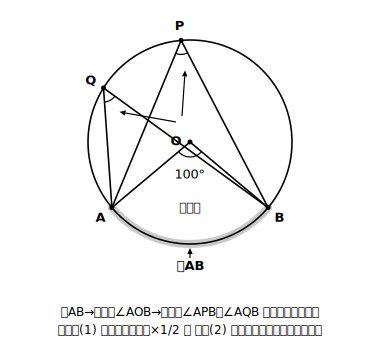
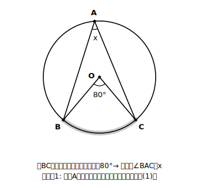
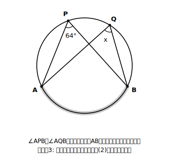
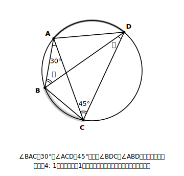
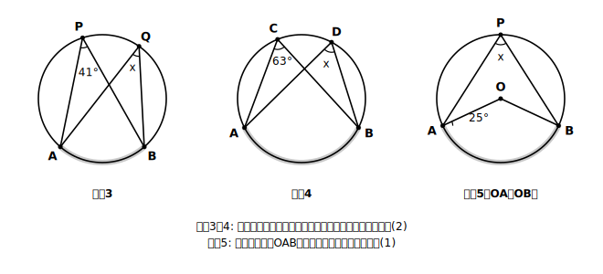
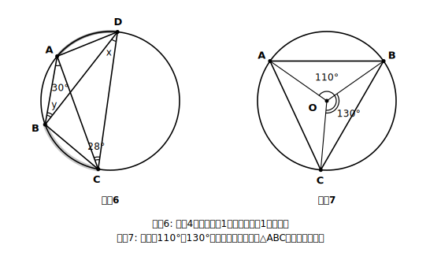
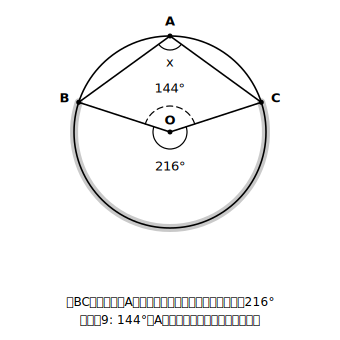

# L02 円周角の定理——「どの弧に対する角か」を塗って見抜く

## ねらい

- **円周角の定理**を、2つの命題のセットとして正しく言えるようになる。
- 「**弧を塗る**」4ステップの型を身につけ、図の中で円周角・中心角・弧を対応づけて角の大きさを求められるようになる。

## 主概念1：円周角の定理——2つでワンセット

L01の実験で見つけた2つの推測に、正式な名前を付けよう。この2つは、いつでも成り立つことが証明できる（証明はL04で）。証明された事柄なので、ここからは安心して道具として使ってよい。

> **【ことば】円周角の定理**
> 一つの円において、
> **（1）同じ弧に対する円周角の大きさは、中心角の大きさの半分（1/2）である。**
> **（2）同じ弧に対する円周角の大きさは等しい。**
> この2つをあわせて**円周角の定理**という。

順番に注意してほしい。出発点はいつも「**どの弧に対する角か**」の対応づけ。それが決まって初めて、（1）の半分の関係と、（2）の等しい関係が使える。定理が2つセットなのは、使い道が2通りあるからだ。

- （1）を使う場面: 中心角と円周角の**どちらか一方から他方を求める**。
- （2）を使う場面: 同じ弧に対する**円周角どうしをつなぐ**（中心角が図にないときの主力）。

## 主概念2：「弧を塗る」4ステップ

定理を覚えることと、図の中で使えることは、実は別の力だ。ごちゃごちゃした図の中で定理を使うために、次の型をおすすめする。

> **弧を塗る4ステップ**
> ① 角の**頂点**がどこにあるか確かめる（円周上→円周角、中心→中心角）。
> ② 角の2辺が円周と交わる**2点**を見つける。
> ③ その2点の間の弧のうち、**頂点を含まない側**を鉛筆で塗る。
> ④ **同じ塗り弧**に対する円周角・中心角を探して、定理で結ぶ。

ポイントは③だ。塗るのは、角の頂点から見て「向こう側」の弧。頂点と同じ側の弧を塗ってしまうと、対応がすべて狂う（よくあるミス。講師の経験則として、この取り違えはとても多い）。

### 例題1　中心角から円周角へ

弧BCに対する中心角が80°のとき、円周角∠BAC＝x を求めよう。

（考え方）①頂点Aは円周上→xは円周角。②辺AB・ACが円周と交わるのはB・C。③Aを含まない側の弧BCを塗る。④同じ弧BCに対する中心角が80°だから、定理(1)で
**x ＝ 80° × 1/2 ＝ 40°**

### 例題2　円周角から中心角へ

弧ABに対する円周角が55°のとき、同じ弧に対する中心角yは？　今度は逆向きだ。円周角は中心角の半分、いいかえると**中心角は円周角の2倍**。
**y ＝ 55° × 2 ＝ 110°**

半分にするのか2倍にするのか迷ったら、図を見て「中心角と円周角、大きいのはどっち？」と自問しよう。**同じ弧に対する**中心角は、円周角のちょうど2倍だから必ず大きい。「小さいほう（円周角）を求めるなら半分、大きいほう（中心角）を求めるなら2倍」——数を操作する前に大小で検算する癖をつけると、方向ミス（よくあるミス）を防ぎやすくなる。これも講師の経験則だ。

ここでひとつ注意。円周角がいつも90°以下とは限らない。頂点を含まない側の弧が半円より大きいときは、その弧に対する中心角は180°を超え、円周角も90°を超える鈍角になる。このとき中心Oのまわりには、塗った弧に対する「大回りの角」と、残りの弧に対する小さい角の2つが見えている。目についた小さいほうの角を反射的に半分にすると、別の弧の円周角を求めたことになってしまう。だから合言葉は「**対応する弧を確認してから、2倍・半分**」。この一呼吸が、鈍角のケースでも4ステップの型を守ってくれる（練習9で確かめよう）。

### 例題3　円周角どうしをつなぐ

∠APB＝64°のとき、∠AQB＝x を求めよう。

（考え方）どちらの角も、塗ってみると**同じ弧AB**に対する円周角。中心角が図になくても、定理(2)で直接つなげる。
**x ＝ 64°**

:::zatsudan
「塗る」というのは、ずいぶん原始的な作戦に見えるかもしれない。でも、数学が得意な人ほど、図に色や印をどんどん書き込んでいる。頭の中だけで対応を追うのは、実は上級者でも間違えやすい。手を動かして図を「自分用に改造」することは、幼稚どころか、いちばん確実な技術だ。きれいなままの図は、まだ考え始めていない図なのかもしれない。
:::

## 例題4　1つの図に円周角が2組あるとき

∠BAC＝30°、∠ACD＝45°のとき、∠BDCと∠ABDを求めよう。

（考え方）角が増えても、やることは同じ。1つずつ塗る。
- ∠BAC（頂点A）→ Aを含まない側の**弧BC**を塗る → ∠BDCも弧BCに対する円周角 → **∠BDC＝30°**
- ∠ACD（頂点C）→ Cを含まない側の**弧AD**を塗る → ∠ABDも弧ADに対する円周角 → **∠ABD＝45°**

弧ごとに色を変えて塗ると、2組の対応が混ざらない。「1つの角につき1回塗る」を徹底しよう。

:::guide
**この型は「わかっているのに解けない」への処方箋**

定理の文はすらすら言えるのに、図の問題になると手が止まる——この段差は、この単元でいちばん大きなつまずきどころだと考えて、本教材は設計されている。原因の多くは、定理の理解不足ではなく、「どの弧に対する角か」を特定する作業が**手順として身についていない**ことにある、というのが本教材の優先仮説だ。だから4ステップは、①②③で「対応づけ」だけを先に完了させ、④で初めて定理を使う、という順序に分けてある。慣れてくると塗らなくても見えるようになるが、少しでも図が複雑になったら迷わず塗る、に戻ってよい。塗ることは後退ではなく、確実さの担保である。
:::

:::guide
**「中心角は円周角の2倍」を第2の言い方として持っておく**

定理(1)の文は「円周角＝中心角の1/2」だが、実際の問題では「中心角＝円周角の2倍」の向きで使う場面もかなり多い（講師の経験則）。同じ式の変形にすぎないとはいえ、テンポよく解くには両方の言い方が口をついて出る状態にしておきたい。そのうえで、答えを出したら「**同じ弧に対する**中心角のほうが大きくなっているか」の大小チェック。中心角が180°を超え、円周角が鈍角になるケース（本文の注意と練習9）でも、同じ弧どうしで比べるかぎりこの大小は変わらない。この2段構えが、方向ミスに対するいちばん軽い保険になる。
:::

## 練習

**A 基本の対応づけ**

1. 次の弧に対する円周角を求めよう。
   (1) 中心角120°の弧　(2) 中心角86°の弧
2. 次の弧に対する中心角を求めよう。
   (1) 円周角24°の弧　(2) 円周角37°の弧
3. ∠AQB＝x を求めよう。
4. ∠ADB＝x を求め、どの弧に対する円周角の組かも書こう。

**B 組み合わせて使う**

5. OA＝OBであることを使って、中心角∠AOBを先に求め、∠APB＝x を求めよう。
6. xとyを求めよう（例題4と同じ型）。
7. 中心角∠AOB＝110°、∠BOC＝130°のとき、残りの中心角∠AOCと、△ABCの3つの内角をすべて求めよう。求めたら、内角の和が180°になるか検算しよう。
8. ある人が「中心角70°の弧に対する円周角は140°」と答えた。どこで間違えたのかを説明し、正しい答えを書こう。
9. ある人が「∠BAC＝144°÷2＝72°」と答えた。どの弧に対する中心角を取り違えたのかを説明し、正しい∠BAC＝x を求めよう。

:::stretch
**S1** 練習7を一般化してみよう。円Oの周上に3点A・B・Cがあり（練習7の図と同じ並び）、Cを含まない側の弧ABに対する中心角を a、Aを含まない側の弧BCに対する中心角を b、**Bを含まない側の弧ACに対する中心角を c** とすると、a＋b＋c＝360°である。△ABCの3つの内角をa、b、cで表し、内角の和がちょうど180°になることを式で確かめよう。「円周角の定理を使うと、三角形の内角の和の180°が円の一周の360°の半分として現れる」ことを味わってほしい。
:::

---

対応解答: answer_key_L01-04.md

<!-- gen_nav:nav:start（自動生成・手編集しない） -->

---

[← 前のレッスン](lesson_01.md)｜[単元の目次](README.md)｜[解答](answer_key_L01-04.md)｜[次のレッスン →](lesson_03.md)

<!-- gen_nav:nav:end -->
