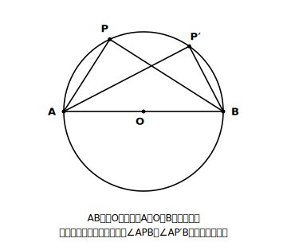
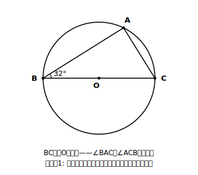
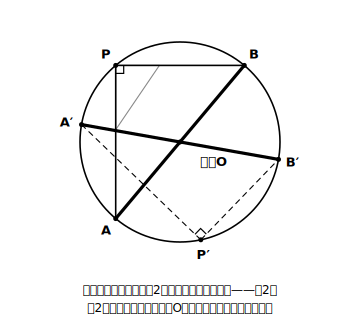
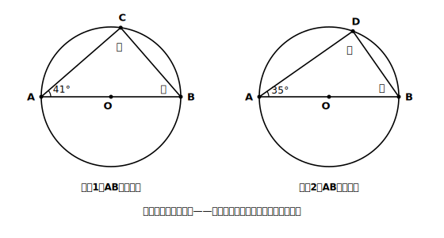
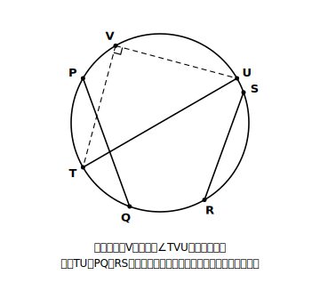

# L03 直径と円周角——半円の弧がつくる90°

## ねらい

- 円周角の定理の特別な場合として、**半円の弧に対する円周角が90°になる**ことを導き、使えるようになる。
- 逆向きの使い方（**円周角が90°なら、その弦は直径**）で、円の中心を見つけられるようになる。

## 主概念1：中心角180°という特別な場合

L01のstretchで予想した人もいるだろう。円周角の定理のいちばん有名な「特別な場合」を正面から扱おう。

円Oの直径をABとする。このとき、弧AB（半円の弧）に対する中心角∠AOBは、A、O、Bが一直線に並ぶから**180°**。円周角の定理(1)より、円周角は中心角の半分。だから、

**半円の弧に対する円周角 ＝ 180° × 1/2 ＝ 90°**

> **半円の弧に対する円周角**
> ABが円の直径のとき、円周上の点P（A、B以外）について、**∠APB＝90°**である。

新しい定理を覚えたというより、「中心角180°のときに定理(1)を使っただけ」という出どころごと覚えてほしい。出どころを覚えていれば、忘れても30秒で再現できる。

### 例題1　直径がつくる直角三角形

BCが円Oの直径で、∠ABC＝32°のとき、∠BACと∠ACBを求めよう。

（考え方）BCは直径だから、弧BC（半円）に対する円周角∠BAC＝**90°**。△ABCの内角の和より、
∠ACB ＝ 180° − 90° − 32° ＝ **58°**

直径が図にあったら「どこかに90°が隠れている」と疑う。これがこのレッスンの合言葉だ。

## 主概念2：逆向きに使う——90°を見たら直径を疑う

この性質は、逆向きにも使える。円周上の点Pについて∠APB＝90°ならば、対応する中心角は2倍の180°。中心角が180°ということは、A、O、Bが一直線、つまり**弦ABは中心Oを通る直径**だということだ。

**円周角が90° → その角に対する弦は直径（中心を通る）**

これが役に立つのは、「**中心がどこか分からない円**」を相手にするときだ。

### 例題2　円の中心を見つける

丸い形の紙がある。折り目を付けずに、この円の中心を見つけたい。三角定規の直角だけを使って見つける方法を考えよう。

（手順）
1. 三角定規の直角の頂点を円周上の1点Pに当て、直角をはさむ2辺が円周と交わる点をA、Bとする。
2. AとBを結ぶ。∠APB＝90°だから、**ABは直径**——中心はこの線分の上にある。
3. Pの位置を変えてもう一度同じことをすると、直径がもう1本引ける。
4. **2本の直径の交点が中心O**だ。

道具は三角定規1つ。定規で測った長さも、コンパスも使っていないのに、直角を2回当てるだけで中心が正確に見つかる。90°と直径の結びつきの強さが、そのまま道具になっている。

:::zatsudan
大工さんの道具に「さしがね」という直角に曲がった金属の物差しがある。学習指導要領の解説には、中心の分からない丸い木材の直径を、このさしがねで見積もる方法が活用例として載っている。使っている性質は、いまみんなが学んだ「円周角が直角になる場合」そのもの。教室の外で、しかもプロの現場で使われている中3の数学だ。くわしい使い方はL06でもう一度出てくる。
:::

:::guide
**「90°」は、この章と次章をつなぐ蝶番（ちょうつがい）**

半円の弧に対する円周角90°は、この章の中では接線（せっせん）の作図（L06）の理由として働く。そして次の章「三平方の定理」は直角三角形の定理だから、「円の中に直角三角形を見つける」このレッスンの見方は、章をまたいで効き続ける。円と直角三角形が同じ図に現れたら、「直径はどれか」をまず探す——この習慣を今のうちに作っておくと、あとの伸びが違う。
:::

:::guide
**「見た目が直角っぽい」と「90°と言い切れる」の区別**

例題1で∠BAC＝90°と書けるのは、見た目ではなく「BCが直径だから」という根拠があるからだ。逆に、図がどんなに直角っぽく見えても、対する弦が直径だと確認できなければ90°とは書けない。答案では「BCは直径だから∠BAC＝90°」のように、**直径であることを根拠として一言添える**習慣をつけよう。根拠を書く習慣は、L04の証明、そしてstretchの相似の証明（L07）でそのまま生きる。
:::

## 練習

1. ABが直径で∠CAB＝41°のとき、∠ACBと∠CBAを求めよう。求めたら内角の和で検算しよう。
2. ABが直径で∠DAB＝35°のとき、∠ADBと∠DBAを求めよう。
3. 円周上の点Vから見て∠TVU＝90°のとき、弦TU・PQ・RSのうち、この円の直径といえるものはどれか。理由も書こう。
4. 円形の板の中心を、三角定規の直角だけを使って見つける手順を、自分の言葉で2〜3行にまとめよう（例題2の再構成。ノートに図もかいてみよう）。

:::stretch
**S1** ABを直径とする円の周上で点Pを動かすと、∠APBはつねに90°だった。では、点Pが円の**外**にあるとき、∠APBは90°と比べて大きいか小さいか。円の**内部**にあるときはどうか。図をかいて予想し、Pと円周の交わりに補助線を引いて説明を試みよう（ヒント: Pが外にあるとき、線分PAが円と交わる点をQとすると、∠AQBは△QPBの外角になっている）。この「円周上か・内か・外か」で角が変わる感覚は、L05「円周角の定理の逆」の伏線になる。
:::

---

対応解答: answer_key_L01-04.md

<!-- gen_nav:nav:start（自動生成・手編集しない） -->

---

[← 前のレッスン](lesson_02.md)｜[単元の目次](README.md)｜[解答](answer_key_L01-04.md)｜[次のレッスン →](lesson_04.md)

<!-- gen_nav:nav:end -->
