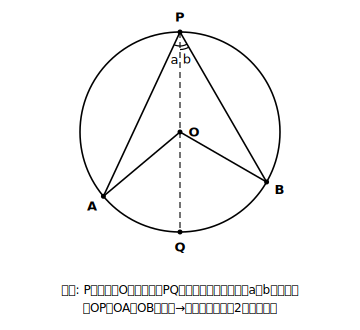
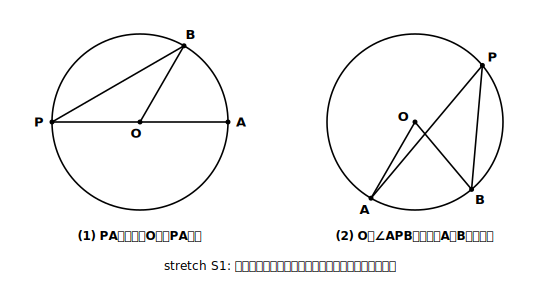

# L04 証明のよさ——「いつでも」と言い切るために

## ねらい

- 実験による推測と、証明された定理の違い（**証明のよさ**）を実感する。
- 円周角の定理の証明の**筋道**と、その**根拠**（二等辺三角形の底角・三角形の外角）を説明できるようになる。

## 主概念1：なぜ証明がいるのか

L01の最後に残した宿題を思い出そう。実験で分かったのは「測った場所では、円周角は中心角の半分だった」ということ。でも、円周上の点は無限にあり、円の大きさも中心角も無限に変えられる。全部を測ることは、誰にもできない。

測っていない場所でも本当に成り立つのか？　この疑いに完全に答える方法が、**証明**だ。証明は、具体的な数値に頼らず、**すでに正しいと分かっていること**だけを根拠に組み立てるので、一度できあがれば「いつでも・どんな円でも」成り立つと言い切れる。

今回の証明で使う根拠は、どちらも中2で証明済みの道具だ。

- **二等辺三角形の2つの底角は等しい。**
- **三角形の外角は、それととなり合わない2つの内角の和に等しい。**

道具の点検はこれだけ。意外なほど少ない装備で、あの不思議な性質が説明できてしまう。

## 主概念2：証明の筋道——直径を引くと二等辺三角形が現れる

円Oの周上に3点A、P、Bがあり、中心Oが∠APBの内部にある場合で証明しよう。

**作戦: 点Pから中心Oを通る直径PQを引く。**

なぜ直径を引くのか。半径OP、OA、OBはすべて等しいから、直径PQで角を2つに分けると、**二等辺三角形が2つ**（△OPAと△OPB）現れるからだ。二等辺三角形が現れれば、中2の道具が使える。

**証明**（∠APQ＝a、∠QPB＝b とおく）

1. △OPAで、OP＝OA（半径）だから二等辺三角形。底角は等しいので ∠OAP＝∠OPA＝a。
2. ∠AOQは△OPAの頂点Oにおける**外角**だから、∠AOQ＝∠OPA＋∠OAP＝a＋a＝**2a**。
3. △OPBでも同じように、∠BOQ＝**2b**。
4. よって
   ∠APB ＝ a＋b
   ∠AOB ＝ ∠AOQ＋∠BOQ ＝ 2a＋2b ＝ 2(a＋b)
5. したがって **∠APB＝∠AOBの1/2**。（証明おわり）

文字aとbには、どんな角度でも入れられる。だからこの証明は、測っていないすべての場所を一気にカバーする。たとえばa＝25°、b＝30°なら円周角55°・中心角110°。L01の実験結果も、この式の1例にすぎなかったわけだ。

そして定理(2)「同じ弧に対する円周角は等しい」は、ここからすぐに出る。同じ弧に対する円周角は、どれも**同じ中心角の半分**なのだから、互いに等しい。

:::zatsudan
「実験で何度も確かめたんだから、もう証明はいらないんじゃない？」——この気持ちは、実はとても大事なところを突いている。実験で分かるのは「調べた範囲では成り立つ」まで。証明が与えてくれるのは「調べていない無限の場合でも成り立つ」という、実験では絶対に手に入らない保証だ。たった数行の推論が無限の測定に勝つ。ここが数学のいちばん贅沢（ぜいたく）なところだと思う。
:::

:::guide
**この証明で「覚える」べきものは、実は3つだけ**

証明の全文を暗唱する必要はない。手元に再現するための骨組みは、①**直径PQを引く**（作戦）②**半径だから二等辺三角形**（道具1）③**外角で中心角に乗り換える**（道具2）——この3つだ。このレッスンの到達目標は、証明を一字一句書き写せることではなく、「なぜ直径を引くのか」「どこで二等辺三角形と外角を使うのか」を自分の言葉で説明できること。筋道と根拠が言えれば、細部は図を見ながら組み立て直せる。
:::

:::guide
**「中心が角の内部にある場合」と断ってあるのはなぜか**

本文の証明は、中心Oが∠APBの内部にある図で進めた。実は、Pの位置によっては中心が∠APBの辺の上にきたり、外側にきたりする。図の配置が変わると、証明の式の組み立ても少し変わる。そこを考えるのがstretchだ。ただし、本線として大切なのは場合を数え尽くすことではなく、「二等辺三角形と外角で中心角に結びつける」という**証明の背骨**が見えていること。背骨がつかめていれば、残りの場合は同じ発想の変奏として追いかけられる。
:::

## 練習

1. 本文の証明の空欄をうめよう。
   「△OPAはOP＝OAの二等辺三角形だから、（　ア　）は等しく、∠OAP＝∠OPA。∠AOQは△OPAの（　イ　）だから、∠AOQ＝∠OPA＋∠OAP＝2a。」
2. この証明で、点Pから**直径PQを引く**のはなぜか。「二等辺三角形」という言葉を使って1〜2文で説明しよう。
3. a＝32°、b＝25°のとき、証明の式に従って∠APBと∠AOBを求め、∠AOBが∠APBの2倍になっていることを確かめよう。
4. 「同じ弧に対する円周角は等しい」（定理(2)）が、定理(1)からどうして言えるのかを、1〜2文で説明しよう。

:::stretch
**S1 場合分けに挑む：中心が角の外にあるとき**

本文の証明は、中心Oが∠APBの内部にある場合だった。次の2つの場合について、同じ結論∠APB＝∠AOB×1/2が成り立つことを、自分で証明してみよう。

(1) 中心Oが∠APBの**辺PA上**にある場合（PAが直径の場合）。
　ヒント: 二等辺三角形は1つしか現れない。外角1回で決まる。
(2) 中心Oが∠APBの**外部**にある場合。
　ヒント: やはり直径PQを引く。今度は∠APB＝∠QPB−∠QPA、つまり**和ではなく差**になる。

3つの場合を並べてみると、「1つの証明では図のすべての配置をカバーできないことがある」という、証明のもう一歩深い世界が見えてくる。どんなとき場合分けが必要になるのか、自分の言葉でまとめてみよう。調べるフレーズ例:「円周角の定理 証明 場合分け」
:::

---

対応解答: answer_key_L01-04.md

<!-- gen_nav:nav:start（自動生成・手編集しない） -->

---

[← 前のレッスン](lesson_03.md)｜[単元の目次](README.md)｜[解答](answer_key_L01-04.md)｜[次のレッスン →](lesson_05.md)

<!-- gen_nav:nav:end -->
