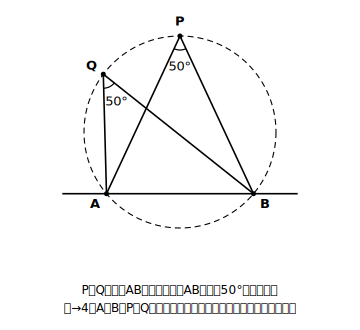
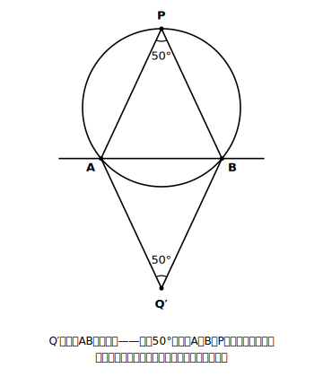
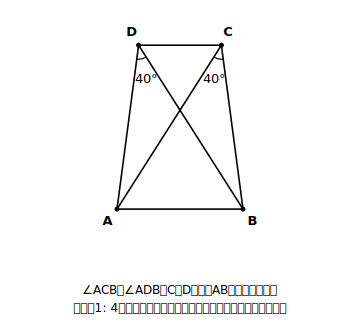
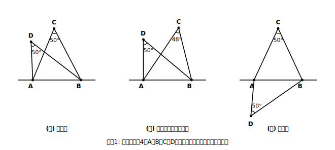
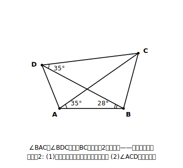

# L05 円周角の定理の逆——「同じ側」がカギ

## ねらい

- **円周角の定理の逆**を、「同じ側」という条件を落とさずに言えるようになる。
- 逆を使って「4点が一つの円周上にあるか」を判定し、そこから**新しい等角を見つける**活用ができるようになる。

## 主概念1：矢印を逆向きにしてみる

円周角の定理(2)は、こういう形をしていた。

**4点A、B、P、Qが一つの円周上にある（P、Qは直線ABについて同じ側） → ∠APB＝∠AQB**

では、この矢印を逆向きにしたらどうだろう？　角が等しいと分かっているとき、「4点は一つの円周上にある」と言ってよいのだろうか。答えは——条件を1つ付ければ、言ってよい。

> **【ことば】円周角の定理の逆**
> ２点Ｐ，Ｑが**直線ＡＢの同じ側にあり**、∠ＡＰＢ＝∠ＡＱＢ ならば、４点Ａ，Ｂ，Ｐ，Ｑは一つの円周上にある。

この定理のありがたさは、「**円がまだ図にないのに、円を出現させられる**」ことだ。等しい角を2つ見つけたら、破線の円がふっと浮かび上がる。そして円が現れた瞬間、その円の上で円周角の定理(1)(2)がまるごと使えるようになる。

## 主概念2：「同じ側」を落とすと、どうなるか

定理文の「直線ABの同じ側にあり」は、飾りではない。落とすと定理が壊れる。

図のように、ABの**反対側**にも、ABを50°の角で見る点はいくらでもある。しかし、その点Q′は、A、B、Pを通る円の上には乗らない。乗らない理由も円周角の定理で言い切れる。もしQ′がこの円の上にあるなら、∠AQ′Bは**Pを含む側の弧AB**に対する円周角、つまり中心角（360°−100°）÷2＝130°になるはずで、50°にはならないからだ。角が等しくても、直線ABをはさんで別々の側にいる2点については、この定理は何も言ってくれない——判定の前に、**2点が同じ側にあるかを必ず目で確認する**。これがこのレッスンの型だ。

なお、この教材では逆の証明には立ち入らず、正しく使えるようになることに集中する。

### 例題1　一つの円周上にあるか判定する

図で、∠ACB＝∠ADB＝40°のとき、4点A、B、C、Dは一つの円周上にあるといえるか。

（考え方）C、Dはどちらも直線ABの**上側**、つまり同じ側にある。そして∠ACB＝∠ADB。円周角の定理の逆の条件がそろったので、**4点A、B、C、Dは一つの円周上にある**といえる。

### 例題2　円を出現させて、等角を収穫する

例題1の続き。さらに∠DAC＝25°のとき、∠DBCを求めよう。

（考え方）例題1で4点は一つの円周上にあると分かった。ならば今度は、この円の上で円周角の定理(2)が使える。∠DACと∠DBCは、塗ってみるとどちらも**弧DC**（A、Bを含まない側）に対する円周角。よって
**∠DBC ＝ ∠DAC ＝ 25°**

逆で円を出現させる → その円で定理を使う。この2段コンボが、逆の活用のいちばん典型的な形だ。

:::zatsudan
じつはこの「円周角」、昔は中2の単元だった時代がある。平成10年告示の学習指導要領では第2学年の内容で、しかも「円周角の定理の逆は取り扱わないものとする」と明記されていた。それが平成20年告示で第3学年に移り、逆の扱いも「取り扱うものとする」へ、正反対にひっくり返った。いまみんなが学んでいるこの定理の逆は、学習指導要領の標準的な扱いでは示されない時期があった内容だ（実際にどう教えられていたかは、学校によって様々だっただろう）。カリキュラムも、時代とともに動いているのだ。
:::

:::guide
**「逆」を使う前のチェックリストは2項目**

①2点は直線ABの**同じ側**にあるか（図で確認）②2つの角は**等しい**か（値で確認）。この2つがそろって初めて「一つの円周上にある」と言える。答案でも「C、Dは直線ABの同じ側にあり、∠ACB＝∠ADBだから」のように、**条件2つを両方書く**のがよい書き方だ。数学の定理には、こうした「小さいけれど外せない条件」が付いているものがあり、条件ごと覚える習慣は高校以降ますます効いてくる。
:::

:::guide
**定理と逆は「向き」が違う別の道具**

「AならばB」が正しくても、「BならばA」が自動で正しいとは限らない。中2の逆の学習で出会った原則だ。円周角の定理の逆は、たまたま（条件付きで）成り立つ幸運な例で、だからこそ独立した定理として名前が付いている。使うときも向きを意識しよう。**円がすでにある**なら定理（円→等角）、**円を出現させたい**なら逆（等角→円）。図に円が描いてあるかどうかで、どちらの道具を持つべきかが決まる。
:::

## 練習

1. 次の(ア)〜(ウ)で、4点A、B、C、Dが一つの円周上にあるといえるか。「いえる」「いえない」「この定理だけでは判定できない」から選び、理由を書こう（C、Dの位置は各図のとおり）。 
   (ア)
   (イ)
   (ウ)
2. ∠BAC＝∠BDC＝35°である。
   (1) 4点A、B、C、Dが一つの円周上にあるといえる理由を書こう。
   (2) ∠ACDを求めよう。
3. 例題2までの流れを、自分の言葉で「2段コンボ」として2行にまとめよう（1段目に使う定理・2段目に使う定理をはっきり書くこと）。

:::stretch
**S1** 直線AB上にない点Pで、∠APB＝50°となるものを考える。直線ABの上側だけで見ると、そのような点Pの集まりはどんな図形になるだろうか。L03のstretch（円周上・内・外での角の大小）を手がかりに予想し、コンパスと分度器でいくつか点を打って確かめてみよう。さらに、下側も合わせると全体はどんな形になるかも考えてみよう。調べるフレーズ例:「ABを見込む角 軌跡」
:::

---

対応解答: answer_key_L05-08.md

<!-- gen_nav:nav:start（自動生成・手編集しない） -->

---

[← 前のレッスン](lesson_04.md)｜[単元の目次](README.md)｜[解答](answer_key_L05-08.md)｜[次のレッスン →](lesson_06.md)

<!-- gen_nav:nav:end -->
