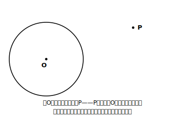
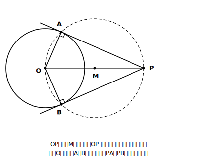
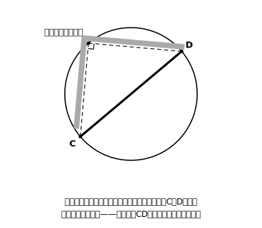

# L06 接線の作図——90°が道具になる

## ねらい

- 円外の点から円への**接線を、コンパスと定規だけで作図**できるようになる。
- その作図が正しい理由を、**半円の弧に対する円周角90°**で説明できるようになる。

## 準備運動：中1の道具の回収

このレッスンでは中1の道具を2つ使う。点検しておこう。

1. **円の接線は、接点を通る半径に垂直である。**（中1・円とおうぎ形）
2. **線分の垂直二等分線の作図**：線分の両端から等しい半径で弧を交わらせ、交点どうしを結ぶ。垂直二等分線上の点は、線分の**両端から等しい距離**にあり、線分の**中点**を通る。（すでに学んだ作図）

1がゴールの条件、2が途中で使う技になる。

## 主概念1：作図の課題——円の外の点から接線を引く

円Oと、その外部の点Pがある。Pを通る円Oの接線を引きたい。

フリーハンドなら「円にすれすれに触る線」を何となく引けるが、作図でやるとなると急に難しく感じないだろうか？　接点の位置が分からないからだ。接点をAとすると、条件は「OA⊥PA」（接線⊥半径）。つまり、**∠OAP＝90°になる円周上の点A**を探せばよい。

90°、と聞いて思い出すものがある。半円の弧に対する円周角だ。∠OAP＝90°ということは、Aから見て**OPを直径とする円**の上にAが乗っていればよい。ここまで見えれば、作図の手順は自然に決まる。

> **接線の作図の手順**
> ① 線分OPを引き、その**垂直二等分線**を作図して、OPの中点Mを求める。
> ② Mを中心に、半径MO（＝MP）の円をかく。この円はOPを直径とする円になる。
> ③ ②の円と円Oとの交点をA、Bとする。
> ④ 直線PA、PBを引く。この2本が、Pを通る円Oの接線である。

**この作図が正しい理由**を、根拠つきで言えるようにしよう。

1. 点Aは、OPを直径とする円（②の円）の周上にある。
2. 半円の弧に対する円周角だから、**∠OAP＝90°**。
3. OAは円Oの半径で、PAはその半径に垂直。
4. 接線は接点を通る半径に垂直な直線だから、**PAは円Oの接線**である。（PBも同じ）

作図の手は①〜④の4手。理由の骨は「**直径OP→円周角90°→接線⊥半径**」の3段。手順と理由をセットで持っておくと、忘れても組み立て直せる。

## 主概念2：さしがね型——直角を当てて直径を見つける

L03で「三角定規の直角で円の中心を見つける」活動をやった。あの方法の実用版が、大工道具の**さしがね**（直角に曲がった金属の物差し）による、丸い木材の直径の見積もりだ。

断面の円周上の1点に、さしがねの直角の頂点を当てる。直角をはさむ2辺が円周を横切る2点をC、Dとすると、∠が90°の円周角だから——**CDはこの円の直径**。つまり、さしがねを当てて2つの交点の間を測れば、それがそのまま直径の長さだ。中心がどこかを知る必要すらない。

L03の「中心探し」・今日の「接線の作図」・この「さしがね」。3つとも、**90°と直径の結びつき**という同じ1つの性質が、姿を変えて働いている。

:::zatsudan
作図の道具がコンパスと定規（目盛りは使わない）だけに限られているのは、考えてみれば不思議なルールだ。分度器を使えば一瞬なのに、わざわざ道具を縛る。でもこの縛りがあるからこそ、「なぜこの手順で正しいのか」という理由の部分が主役になる。制限のきついゲームほど、攻略の筋が美しくなる。作図は、そういう遊びだと思ってやると楽しい。
:::

:::guide
**「作図できた」の確認方法（独習用）**

自分の作図が正しいかを確かめるには、①作図した接線PAと半径OAの角を分度器で測って90°に近いか見る（作図の線の太さぶんの誤差は出る）②Pの位置や円の大きさを変えてもう一度作図し、同じ手順で毎回接線らしい線が引けるか試す、の2つが手軽だ。測って確認するのは検算であって、理由の説明の代わりにはならない。「なぜ90°になるのか」は本文の3段の理由で言えるようにしておこう。
:::

:::guide
**なぜ「OPを直径とする円」という発想が出てくるのか**

この作図の急所は、手順②の円を思いつけるかどうかに見える。しかし発想の順序は逆で、「∠OAP＝90°にしたい」→「90°の円周角を作る道具は半円の弧」→「ではOPを直径とする円をかこう」と、**ゴールの条件から逆算**している。作図の問題では「求める図形が満たすべき条件を先に式や言葉で書き、その条件を作れる道具を既習から探す」という順で考えると、手順の丸暗記から抜け出せる。この逆算の考え方自体が、入試の作図問題へのいちばんの備えになる。
:::

## 練習

1. コンパスと定規で、円Oと外部の点Pをノートにかき（OPは半径の2〜3倍）、本文の手順①〜④で接線を2本作図しよう。作図後、∠OAPを分度器で測って確かめよう。
2. 本文の「作図が正しい理由」の空欄をうめよう。
   「点AはOPを（　ア　）とする円の周上にあるから、半円の弧に対する円周角より∠OAP＝（　イ　）°。PAは半径OAに垂直だから、PAは円Oの（　ウ　）である。」
3. さしがね（または三角定規の直角）で丸い筒の直径を測る方法を、「円周角」という言葉を使って2〜3行で説明しよう。
4. 接線は、1つの外部の点Pから何本引けるか。本文の作図の図を根拠に答え、その2本の接点A、Bがどうやって決まっていたかを一言そえよう。

:::stretch
**S1** 本文の作図で引いた2本の接線について、接点までの距離PAとPBが等しくなることを証明してみよう。
ヒント: △OPAと△OPBに注目する。∠OAP＝∠OBP＝90°、OA＝OB（半径）、OPは共通。すでに学んだ**直角三角形の合同条件**が使える。証明できたら、コンパスでPA・PBの長さを写し取って等しいことを確かめよう。
:::

---

対応解答: answer_key_L05-08.md

<!-- gen_nav:nav:start（自動生成・手編集しない） -->

---

[← 前のレッスン](lesson_05.md)｜[単元の目次](README.md)｜[解答](answer_key_L05-08.md)｜[次のレッスン →](lesson_07.md)

<!-- gen_nav:nav:end -->
