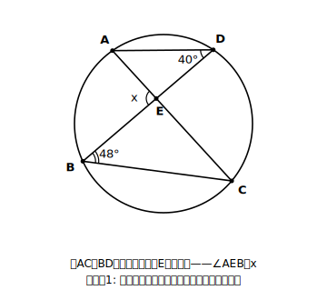
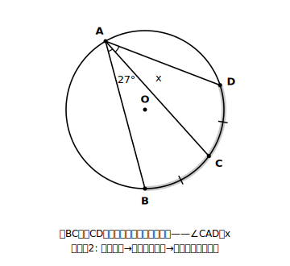
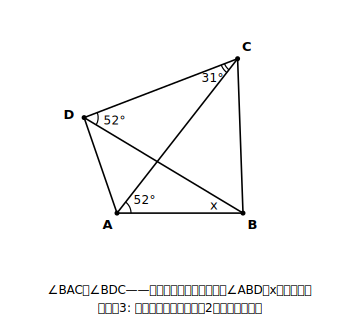
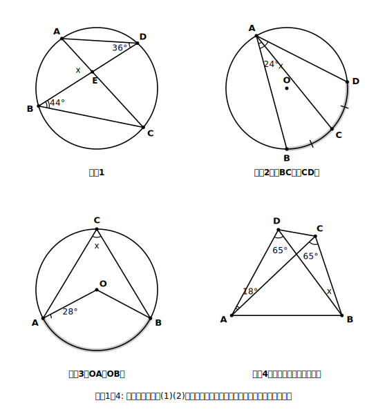
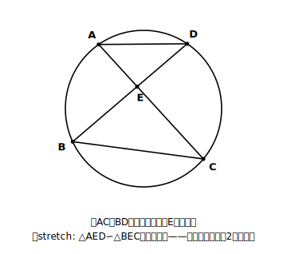

# L07 総合演習——少ない道具を組み合わせる

## ねらい

- 定理・半円90°・逆を、1つの図の中で**組み合わせて**使えるようになる。
- **等しい弧に対する円周角は等しい**ことを、中1の「おうぎ形の中心角」経由で理解して使えるようになる。

## この章の道具箱（ここまでの棚卸し）

道具は、たった4つしかない。

| 道具 | 使いどころ |
|---|---|
| 定理(1) 円周角＝中心角×1/2 | 中心角⇔円周角の乗り換え |
| 定理(2) 同じ弧→円周角は等しい | 円周角どうしをつなぐ |
| 半円の弧→円周角90° | 直径を見たら／90°を見たら |
| 定理の逆（同じ側＋等角→一つの円周上） | 円を出現させる |

総合問題のコツは、道具を増やすことではなく、「いまどの道具が使える形になっているか」を図から読み取ること。読み取りの手は、いつもの**弧を塗る4ステップ**だ。

## 例題1　弦の交点のまわりの角

弦ACとBDが円の内部の点Eで交わっている。∠ADB＝40°、∠DBC＝48°のとき、∠AEB＝x を求めよう。

（考え方）
1. まず塗る。∠ADB（頂点D）→ 弧AB。同じ弧ABに対する円周角だから **∠ACB＝40°**。
2. xの正体を考える。∠AEBは△EBCの頂点Eにおける**外角**（AとCはEをはさんで一直線上）。外角はとなり合わない2つの内角の和だから、
   **x ＝ ∠ECB＋∠EBC ＝ 40°＋48° ＝ 88°**

円周角の定理だけで完結しない。三角形の外角（L04の証明でも主役だった中2の道具）との合わせ技になっている。総合問題の「総合」とは、章をまたいだ道具の総動員のことだ。

## 例題2　等しい弧には等しい円周角

弧BCと弧CDの長さが等しいとき、∠BAC＝27°ならば∠CAD＝x はいくらだろう。

（考え方）すでに学んだとおり、1つの円では、**等しい弧に対する中心角は等しい**（おうぎ形の中心角と弧の関係）。弧BC＝弧CDだから中心角も等しく、円周角はその半分どうしなので、やはり等しい。
**x ＝ 27°**

つまり「**等しい弧に対する円周角は等しい**」。定理(2)（同じ弧）の親戚として、道具箱に追加しておこう。根拠が「中心角経由」であることまでセットで。

:::zatsudan
複雑な図の問題が解ける人は、実は「ひらめいて」いないことが多い。やっているのは、角を1つずつ塗って、分かる角から芋づる式にたどる地道な作業だ。補助線にしても、「天才的な1本」ではなく「直径を引く」「中心と結ぶ」のような定番の数手から試している。手品の種明かしと同じで、種は思ったより地味。だからこそ、練習した人がちゃんと強くなる分野だといえる。
:::

## 例題3　逆で円を出してから、収穫する

∠BAC＝∠BDC＝52°、∠ACD＝31°のとき、∠ABD＝x を求めよう。

（考え方）
1. A、Dは直線BCの同じ側にあり、∠BAC＝∠BDC。**円周角の定理の逆**より、4点A、B、C、Dは一つの円周上にある。
2. 円が出現したので、定理(2)が解禁される。∠ACDと∠ABDは同じ**弧AD**に対する円周角。
   **x ＝ 31°**

:::guide
**手が止まったときの再起動リスト**

総合問題で固まったら、次を上から順に試すとよい。①まだ塗っていない角を全部塗る（対応する弧の見落とし探し）②直径があるか探す（あれば90°）③等しい角の組がないか探す（あれば逆で円が出せないか）④三角形の内角の和・外角で「円周角以外の道」を探す。⑤それでも詰まったら、分かっている角をすべて図に書き込み、機械的に「計算できる角」を増やす。ひらめきを待つのではなく、リストを回す——これが試験場でも再現できる、いちばん実戦的な型だ。
:::

:::guide
**例題2をわざわざ「中心角経由」で導いた理由**

「等しい弧→等しい円周角」を、新しい公式として丸暗記させることもできた。そうしなかったのは、この単元の性質がすべて**中心角を経由してつながっている**構造を見せたかったからだ。円周角の定理(1)も(2)も、半円の90°も、そしてこの性質も、根っこは「円周角は中心角の半分」の1本。道具が増えて見えるときほど、根元でつながっていることを確認すると、記憶の負担が急に軽くなる。
:::

## 練習

1. ∠AEB＝x を求めよう（例題1の型）。
2. 弧BC＝弧CDで∠BAC＝24°のとき、∠BAD＝x を求めよう。
3. OA＝OBを使って、∠ACB＝x を求めよう（ヒント: 中心角を先に。L02練習5の型）。
4. ∠ACB＝∠ADB＝65°、∠DAC＝18°のとき、∠DBC＝x を求めよう（例題3の型）。

:::stretch
**S1 円周角×相似：入試へつながる融合**

弦ACとBDが円の内部の点Eで交わっている。このとき、**△AED ∽ △BEC** であることを証明しよう。

ヒント: 相似条件は「2組の角がそれぞれ等しい」。等しい角の組を2つ探す。①∠AED と∠BEC（対頂角）②∠DAE（＝∠DAC）と∠CBE（＝∠CBD）は、どちらも同じ**弧DC**に対する円周角。

円周角の定理は、このように**相似の証明の根拠**として使われることで、前の章（相似）と手をつなぐ。「等しい角の組を円周角の定理が供給し、相似条件がそれを受け取る」——この連係の形は、この先いろいろな図で繰り返し現れるので、証明の筋を自分の言葉で言えるようにしておこう。調べるフレーズ例:「円周角 相似 証明 問題」
:::

---

対応解答: answer_key_L05-08.md

<!-- gen_nav:nav:start（自動生成・手編集しない） -->

---

[← 前のレッスン](lesson_06.md)｜[単元の目次](README.md)｜[解答](answer_key_L05-08.md)｜[次のレッスン →](lesson_08.md)

<!-- gen_nav:nav:end -->
