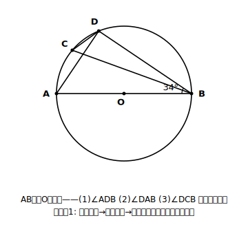
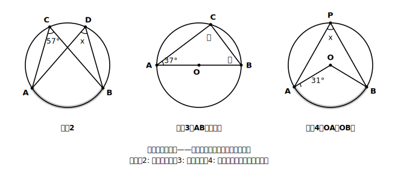
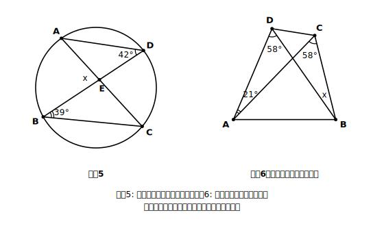
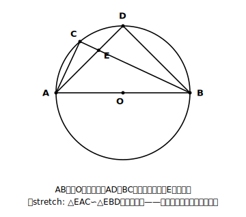

# L08 章末まとめ——相似と三平方のあいだで

## ねらい

- この章の道具を総整理し、混合問題で「いまどの道具を使うか」を自分で選べるようになる。
- この章が前章「相似」・次章「三平方の定理」とどうつながるかを知り、融合問題への入り口に立つ。

## 主概念1：道具箱の最終形——6つの道具と2つの型

9〜10時間かけて学んだこの章の中身を、全部並べてみよう。驚くほど少なくないだろうか？

| 道具 | 中身 | 生まれた場所 |
|---|---|---|
| 定理(1) | 同じ弧に対する円周角＝中心角×1/2 | L02 |
| 定理(2) | 同じ弧に対する円周角は等しい | L02 |
| 半円の弧 | 直径に対する円周角は90°（90°なら弦は直径） | L03 |
| 定理の逆 | 同じ側＋等角 → 4点は一つの円周上 | L05 |
| 接線の作図 | 円外の点から円への接線をコンパスと定規で作図（理由＝半円の弧→90°） | L06 |
| 等しい弧 | 等しい弧に対する円周角は等しい（中心角経由） | L07 |

そして、道具を図の中で使うための型が2つ。

- **弧を塗る4ステップ**（L02）: どの弧に対する角かを、塗って特定してから定理を使う。
- **検算の習慣**（L02）: 答えを出したら、中心角との2倍・半分の対応か、三角形の内角の和180°で確かめる。

道具はこれで全部だ。章末の演習で試されるのは、新しい知識ではなく、図を見て「どの道具が使える形になっているか」を読み取る力。読み取りの入り口は、いつもどおり塗ることから。

### 例題1　道具を乗り継ぐ

ABは円Oの直径で、∠DBA＝34°。次の角を順に求めよう。
(1) ∠ADB　(2) ∠DAB　(3) ∠DCB

（考え方）
1. **(1)** ABは直径。半円の弧に対する円周角だから **∠ADB＝90°**。直径を見たら、まず90°を疑う。
2. **(2)** △ABDの内角の和より、∠DAB＝180°−90°−34°＝**56°**。
3. **(3)** ∠DCBを塗る。頂点Cを含まない側の**弧DB**。∠DABも同じ弧DBに対する円周角だ。定理(2)より **∠DCB＝∠DAB＝56°**。

半円の90°→内角の和→同弧等角。1問の中で道具を3回乗り継いだ。章末の問題は、こうして「1つの道具では終わらない」形をしていることが多い。乗り継ぎの各駅で、根拠を一言ずつ言えるかを自分で点検しよう。

:::zatsudan
章のはじめに戻って眺めると、この章で増えた道具はほんのひと握りしかない。それなのに、解ける図形の幅は目に見えて広がった。道具の数と実力は比例しない——少ない道具を深く使い込むほうが、たくさんの道具を浅く持つより強い。この章は、そのことを実感するのにちょうどいい大きさだと思う。
:::

## 主概念2：この章はどこへつながるのか

この章は、図形の学習のちょうど「あいだ」に立っている。

- **前の章「相似」とのつながり**: 円周角の定理は、**等しい角の組を供給する装置**になる。L07のstretchで見たとおり、「同じ弧に対する円周角は等しい」が見つけた等角を、相似条件「2組の角がそれぞれ等しい」が受け取る。この連係は、このあとのstretchでもう一度体験できる。
- **次の章「三平方の定理」とのつながり**: 次章は、直角三角形の辺の長さについての定理だ。そして、円の中に直角三角形を作り出す装置が、この章の「直径→90°」。円と長さの計算が同じ問題に現れたら、「直径はどれか」を探すこの章の合言葉が、そのまま次章への入り口になる。

円と相似の融合問題は、公的な学力調査で実際に出題された実例がある（円周角の定理を根拠に相似を証明する形）。三平方も加わって円・相似・三平方が1つの図に組み合わさる形も、高校入試ではよく見られると言われる（講師の経験則）。そこで円周角の定理は、角を供給して全体をつなぐ**接着剤**の役割を受け持つ。いま道具の数は少なくても、この章を確実にしておくことが、融合問題への一番の備えになる。

:::guide
**まちがえた問題の「戻り先」マップ**

章末演習は、できなかった問題から「どこへ戻るか」が分かるように並べてある。練習1・2でつまずいたらL02（定理の運用と弧を塗る型）へ、練習3はL03（半円の90°）へ、練習4はL02練習5とL07練習3（半径→二等辺→中心角の経由）へ、練習5はL07例題1（外角との合わせ技）へ、練習6はL05とL07例題3（逆の2段コンボ）へ。章末で全問正解する必要はなく、「自分の穴がどのレッスンにあるか」を特定できれば、この1時間の目的は果たされている。
:::

:::guide
**「予告」をわざわざ1節使って書いた理由**

三平方の定理はまだ学んでいないのに、つながりだけ先に見せた。これは、次章の学習中に「あ、あの直径の90°がここで効くのか」と**思い出せる釘（くぎ）を打っておく**ためだ。単元をまたぐ融合問題が難しいのは、個々の道具が難しいからではなく、「別々の引き出しに入れた道具を同じ図の上で開ける」経験が足りないからであることが多い、と本教材は見ている（講師の経験則）。予告→再会→融合、と段階を踏めば、引き出しは自然につながっていく。stretchの融合証明は、その最初の一歩として置いてある。
:::

## 練習（混合——道具の指定なし）

1. 次の角を求めよう。
   (1) 中心角146°の弧に対する円周角　(2) 円周角29°の弧に対する中心角
2. ∠ACB＝57°のとき、∠ADB＝x を求め、どの弧に対する円周角の組かも書こう。
3. ABが直径で∠CAB＝37°のとき、∠ACBと∠CBAを求めよう。求めたら内角の和で検算しよう。
4. OA＝OBであることを使って、∠APB＝x を求めよう。求めたら中心角との対応で検算しよう。
5. ∠AEB＝x を求めよう。
6. ∠ACB＝∠ADB＝58°、∠DAC＝21°のとき、∠DBC＝x を求めよう。使った定理を2つ、順番に書くこと。
7. 何も見ずに、この章の道具6つ（定理(1)(2)・半円の弧・定理の逆・接線の作図・等しい弧）を書き出し、それぞれに「使いどころ」を一言そえよう。書けなかった道具が、章の復習の最優先だ。

:::stretch
**S1 直径×相似：融合証明に挑む**

ABは円Oの直径で、弦ADとBCが円の内部の点Eで交わっている。このとき、**△EAC ∽ △EBD** であることを証明しよう。

ヒント: 相似条件は「2組の角がそれぞれ等しい」。①∠AECと∠BEDは対頂角。②∠ECA（＝∠BCA）と∠EDB（＝∠ADB）は、どちらも**直径ABに対する円周角**。半円の弧だから、ともに90°。

証明できたら、もう一歩。相似から∠EAC＝∠EBD、つまり∠DAC＝∠CBDが出てくるが、この2つの角は塗ってみると同じ**弧CD**に対する円周角でもある。定理(2)で直接示しても同じ結論に着地する。別の道具で答え合わせができるのは、道具たちが根元でつながっている証拠だ。この「直径が90°を供給し、相似が形をつなぐ」連係は、次章で三平方の定理が加わると、長さの計算まで届くようになる。調べるフレーズ例:「円周角 直径 相似 証明 入試」
:::

---

対応解答: answer_key_L05-08.md

<!-- gen_nav:nav:start（自動生成・手編集しない） -->

---

[← 前のレッスン](lesson_07.md)｜[単元の目次](README.md)｜[解答](answer_key_L05-08.md)

<!-- gen_nav:nav:end -->
