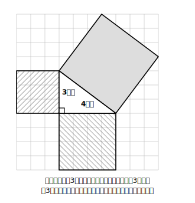
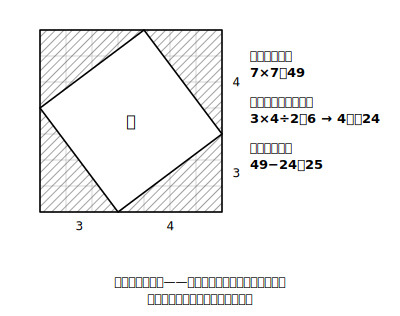
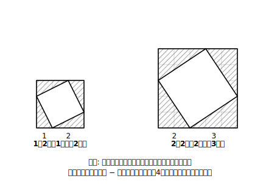

# L01 定理を見いだす——3つの正方形

## ねらい

- 方眼の上で、傾いた正方形の面積を数え上げ・切り分けで求められるようになる。
- 直角三角形の3つの辺の上にかいた正方形の面積を調べ、**そこにひそむ関係を自分で見つける**。

## 導入：直角三角形のまわりに正方形をかくと？

図形の章もいよいよ最後。この章の主役は、たった1つの、しかしおそろしく働き者の関係式だ。ただし最初は式を教わるのではなく、**自分で見つける**ところから始めよう。用意するのは方眼紙（ノートのマス目でもよい）と鉛筆だけ。

直角三角形の3つの辺それぞれを1辺として、外側に正方形を3つかく。この3つの正方形の面積の間に、何か関係はないだろうか？

## 主概念1：傾いた正方形の面積を求める

上の図で、直角をはさむ2辺（3マスと4マス）の上の正方形は、面積がすぐ分かる。3×3＝9、4×4＝16だ。

問題は、斜めの辺——**直角の向かい側にある一番長い辺**——の上の正方形。マス目に対して傾いているから、そのままでは数えにくい。そこで、次の手を使う。

**囲んで引く**: 傾いた正方形を、マス目に沿った大きい正方形でぴったり囲む。すると、すき間には合同な直角三角形が4つできる。

大きい正方形の面積は 7×7＝49。四すみの直角三角形は1つが 3×4÷2＝6 だから4つで24。よって傾いた正方形の面積は

49 − 24 ＝ 25

数えにくい面積も、「囲んで引く」で正確に求められる。この技はこのあとも使うので、手になじませておこう。

:::guide
**「囲んで引く」がこのレッスンの隠れた主役**

傾いた正方形の面積は、マスを1つずつ数えても求められるが、欠けたマスの寄せ集めで誤差や数えまちがいが出やすい。「マス目に沿った図形で囲み、余分を引く」という方法は、どんな傾きの正方形にも通用する一般的な手であり、実はこの先（L02）で紹介する定理の証明のアイデアにも、この「囲む」発想がそのまま登場する。ここで手を動かして囲んでおくことが、証明のアイデアを「知る」ときの実感につながる。
:::

## 主概念2：3つの面積を比べる

さて、3つの正方形の面積が出そろった。9、16、25。ここで手を止めて、じっと見てほしい。何か気づかないだろうか？

9 ＋ 16 ＝ 25

**小さい2つの正方形の面積の和が、一番大きい正方形の面積にぴったり等しい**。偶然だろうか？ それを確かめるのが、次のやってみようだ。

### やってみよう（1人でできる実験）

方眼紙に、直角をはさむ2辺が次の長さの直角三角形をかき、3つの辺の上に正方形をかいて、面積を調べよう（傾いた正方形は「囲んで引く」で）。

1. 直角をはさむ2辺が 1マスと2マス
2. 直角をはさむ2辺が 2マスと3マス
3. 自分で好きな2辺を決めて、もう1例

結果を表にまとめてみよう。

| 直角をはさむ2辺 | 小さい正方形 | 中くらいの正方形 | 一番大きい正方形 |
|---|---|---|---|
| 3と4 | 9 | 16 | 25 |
| 1と2 | 1 | 4 | ？ |
| 2と3 | 4 | 9 | ？ |

どの直角三角形でも「小さい2つの和＝一番大きい1つ」になっていれば、これはもう偶然とは思えない。**直角三角形の3つの辺の上の正方形の面積には、いつでも成り立つ関係がありそうだ**——この発見を、次のレッスンで定理の形にする。

:::guide
**なぜ1辺の「長さ」でなく正方形の「面積」から入るのか**

一番大きい正方形の面積が5や13になったとき、その1辺の長さは√5、√13——平方根の章で学んだ、2乗すると5や13になる数だ。つまり長さから出発すると、いきなり√の計算に足を取られてしまう。面積から出発すれば、数え上げと足し算だけで関係が**見える**。「まず面積で関係をつかみ、長さの話に翻訳するのは次のレッスンで」という2段構えは、√への不安と発見の喜びを切り分けるための設計である。
:::

:::zatsudan
古代エジプトには「縄張り師」と呼ばれる測量の専門家がいて、等間隔に結び目をつけたロープで土地に直角を作っていた、と伝えられているよ。数学の道具が定規もコンパスもないころから、直角三角形の辺の関係は現場で使われていたのかもしれないね。今日きみが方眼で見つけた関係は、そういう何千年ものスケールの話につながっている！
:::

## 練習

1. 方眼上で、直角をはさむ2辺が2マスと4マスの直角三角形をかいた。一番長い辺の上の正方形の面積を「囲んで引く」で求めよう（囲む正方形は1辺6マス）。
2. 練習1の結果について、「小さい2つの正方形の面積の和＝一番大きい正方形の面積」が成り立っているか確かめよう。
3. 直角をはさむ2辺の上の正方形の面積が16と49のとき、一番大きい正方形の面積はいくつになると予想できるか。また、そのときの直角をはさむ2辺の長さを答えよう。

:::stretch
**S1** 「囲んで引く」を文字で確かめてみよう。直角をはさむ2辺が a マスと b マスの直角三角形で、傾いた正方形を1辺（a＋b）マスの正方形で囲むと、四すみに直角三角形が4つできる。傾いた正方形の面積を a、b の式で表し、整理するとどんな式になるか。

（この計算がそのまま、次のレッスンで出会う「証明のアイデア」の1つになっている。先に自力でやってみたい人向け。）
:::

---

対応解答: answer_key_L01-05.md

<!-- gen_nav:nav:start（自動生成・手編集しない） -->

---

[単元の目次](README.md)｜[解答](answer_key_L01-05.md)｜[次のレッスン →](lesson_02.md)

<!-- gen_nav:nav:end -->
