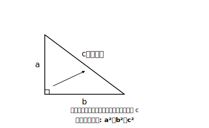
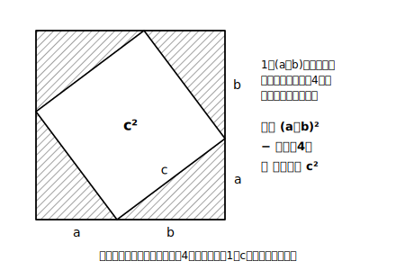
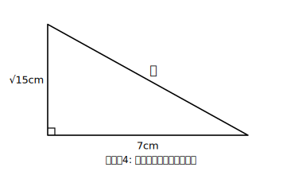

# L02 三平方の定理——意味・証明を知る・基本計算

## ねらい

- L01で見つけた面積の関係を、**三平方の定理**として式で言えるようになる。
- 定理が「面積の関係」と「長さの関係」の両方を表していることを理解する。
- 定理が証明**できる**ことを知る（証明のアイデアに触れる）。
- 直角三角形の2辺の長さから、残りの辺の長さを求められるようになる。

## 主概念1：三平方の定理

L01の発見を、文字で書き表そう。その前に、辺の呼び名を1つ確認しておく。直角三角形で、**直角の向かい側にある一番長い辺**を**斜辺**という（中2の「直角三角形の合同条件」で出てきた言葉だ）。

> **三平方の定理**
> 直角三角形の直角をはさむ2辺の長さを a、b、斜辺の長さを c とすると
>
> **a²＋b²＝c²**

この式は、2つの顔を持っている。

- **面積の関係**: a²、b²、c²は、それぞれの辺の上の正方形の面積そのもの。「小さい2つの正方形の面積の和＝斜辺の上の正方形の面積」——L01で数えて見つけた、あの関係だ。
- **長さの関係**: 3つの辺の**長さ**の間に成り立つ等式。2つの辺の長さが分かれば、残りの1辺が計算で求められる。

「三平方」という名前は、3つの平方（2乗・正方形）の関係、という意味そのままだ。図形（面積）と式（長さ）が1つの定理でつながる——中学の図形の学習の、いわば集大成にあたる。

:::guide
**「面積の顔」を忘れると何に困るのか**

a²＋b²＝c²を「計算の公式」としてだけ覚えると、使ううちに「なぜ2乗するのか」が抜け落ちていく。2乗の正体は正方形の面積である。この見方を保っておくと、①式の形を忘れかけても図をかけば復元できる、②L06で√の長さを作図するとき「面積5の正方形の1辺が√5」という理屈がすっと通る、③高校で定理を拡張するときにも土台になる。式と面積、2つの顔を行き来できることが、この定理を「理解している」ということだ。
:::

## 主概念2：証明できることを知る

L01の実験は3例ほど。「どんな直角三角形でも必ず成り立つ」と言い切るには、証明が要る。三平方の定理には、面積の並べかえを使うもの、相似を使うもの、実に多くの証明が知られている。ここでは代表的なアイデアを1つだけ、絵で味わおう。

**アイデア: 4枚の直角三角形を並べる**

合同な直角三角形（直角をはさむ2辺a、b・斜辺c）を4枚用意し、1辺（a＋b）の正方形の中に、風車のように並べる。すると真ん中に1辺cの正方形が残る。

「真ん中に残るのは本当に正方形？」と疑えたら鋭い。4つの辺はどれも斜辺cで長さが等しい。さらに各頂点の角は、一直線の180°から直角三角形の2つの鋭角を引いた残り——直角三角形の2つの鋭角の和は90°だから、残りの角は180°−90°＝90°。4辺が等しく、4つの角がすべて直角——確かに正方形だ。

全体の面積から4枚の三角形の面積を引くと、真ん中の正方形の面積c²が出る。一方、同じ計算を式でやると（L01のS1でやった人はもう知っている）、(a＋b)²−4×(ab÷2) ＝ a²＋b²。同じ面積を2通りに表しただけで、c²＝a²＋b²が現れる——L01の「囲んで引く」が、そのまま証明のアイデアになっているわけだ。

この単元で身につけてほしいのは、証明を暗記して書き上げることではなく、**「この定理はきちんと証明できるのだ」と知っていること**。他の証明のアイデアも気になったら、「三平方の定理 証明 いろいろ」で調べてみよう。動画で図が動くものを見ると、並べかえの意味がよく分かる。

:::zatsudan
神社やお寺に、数学の問題を書いた「算額」という額を奉納する文化が江戸時代の日本にあったと伝えられているよ。美しい彩色の図形問題が掲げられ、解けた喜びを報告する場でもあった——ともいわれる。数学が娯楽であり誇りだったことをうかがわせる話だね。「算額 三平方」で検索すると、今も残る実物の写真に出会えるよ。
:::

## 主概念3：2辺から残りの辺を求める

長さの関係としての定理を、道具として使えるようにしよう。

### 例題1（斜辺を求める）

直角をはさむ2辺が 3cm と 4cm の直角三角形の斜辺の長さ x cm を求めよう。

**考え方**: 定理にあてはめる。x²＝3²＋4²＝9＋16＝25。x＞0 だから x＝5。**斜辺は 5cm**。

### 例題2（斜辺を求める・√が出る場合）

直角をはさむ2辺が 2cm と 3cm の直角三角形の斜辺の長さ x cm を求めよう。

**考え方**: x²＝2²＋3²＝4＋9＝13。x＞0 だから x＝√13。**斜辺は √13 cm**。

答えが√のままでも、まったくかまわない。√13は「2乗すると13になる数」という、れっきとした長さだ。ここで√の検算の型を導入する。

> **√の検算の型**: √を含む答えを出したら、2乗してもとの式に戻るかを確かめる。
> （例: x＝√13 → x²＝13 → 4＋9＝13 ✓）

### 例題3（斜辺以外の辺を求める）

斜辺が 6cm、直角をはさむ辺の1つが 4cm の直角三角形の、残りの辺の長さ x cm を求めよう。

**考え方**: どの辺が斜辺かをまず確認！ 斜辺は6cmだから、x²＋4²＝6²。x²＝36−16＝20。x＞0 だから x＝√20＝**2√5**。答えは√の中をできるだけ簡単にして書く（平方根の章の約束どおり）。検算: (2√5)²＋16＝20＋16＝36 ✓

:::guide
**式を立てる前の10秒——「斜辺はどれ？」**

例題3のように斜辺の長さが与えられている問題では、うっかり x²＝6²＋4² と「足す側」に置いてしまうまちがいが起こりやすい（塾の現場でもよく見かけるつまずきだ）。防ぎ方は単純で、式を立てる前に**斜辺に印をつける**こと。斜辺の見つけ方は2通りある——①直角の向かい側の辺、②（長さが全部見えているなら）一番長い辺。c²の席に座れるのは斜辺だけ、と手順に組み込んでしまうのが、この種のミスを減らす定番の手当てだ（塾実務の観察にもとづく工夫で、効果の大きさを実証したデータがあるわけではない）。
:::

:::guide
**答えが√になったときの心構え**

「答えに√が出ると、合っているか不安になる」——そう感じたとしても、恥ずかしいことでも何でもない。不安の正体は「検算のしかたを知らないこと」であることが多い。上で導入した検算の型（2乗して戻す）を毎回やれば、√の答えは整数の答えと同じくらい安心できるものになる。さらに言えば、√5や√13が「きたない数」なのではない。定規の目盛りにないだけで、L06で見るとおり、数直線上にきちんと居場所を持つ正確な長さである。
:::

## 練習

1. 直角をはさむ2辺が次の長さの直角三角形の、斜辺の長さを求めよう。
   (1) 6cm と 8cm　(2) 1cm と 1cm　(3) 4cm と 5cm
2. 斜辺が 10cm、直角をはさむ辺の1つが 6cm の直角三角形の、残りの辺の長さを求めよう。
3. 斜辺が 8cm、直角をはさむ辺の1つが 5cm の直角三角形の、残りの辺の長さを求めよう（答えは√の中をできるだけ簡単に）。
4. の斜辺の長さを求めよう。

:::stretch
**S1** 三平方の定理の証明には、本文の「4枚並べ」のほかに、直角三角形の直角の頂点から斜辺に垂線を下ろし、**相似**を使って示す方法も知られている（前の章で学んだ相似がここで再登場する）。垂線を下ろすと、もとの三角形と相似な小さい直角三角形が2つできる。図をかき、どの三角形とどの三角形が相似になりそうか、対応する頂点を書き出してみよう（証明の完成までは求めない。「相似でも証明できそうだ」という見通しが立てば十分）。

**S2** 直角をはさむ2辺が 5cm と 12cm の直角三角形の斜辺を求め、3辺がすべて整数になることを確かめよう。3辺がすべて整数になる直角三角形は、ほかにもあるだろうか——「辺が整数の直角三角形」で調べてみるのもおもしろい。
:::

---

対応解答: answer_key_L01-05.md

<!-- gen_nav:nav:start（自動生成・手編集しない） -->

---

[← 前のレッスン](lesson_01.md)｜[単元の目次](README.md)｜[解答](answer_key_L01-05.md)｜[次のレッスン →](lesson_03.md)

<!-- gen_nav:nav:end -->
