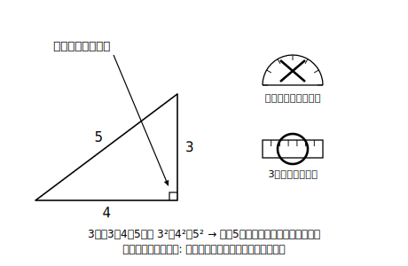

# L03 三平方の定理の逆

## ねらい

- 「3辺の長さの関係だけで、直角三角形かどうかが決まる」ことに着目する。
- 3辺の長さから、直角三角形かどうかを判定できるようになる。

## 導入：角度を測らずに直角が分かる？

三平方の定理は「直角三角形**ならば** a²＋b²＝c²」という向きの主張だった。中2で学んだとおり、仮定と結論を入れかえたものを**逆**という。では逆——「a²＋b²＝c² **ならば**直角三角形」——は成り立つだろうか？

中2では「逆は必ずしも成り立たない」ことも学んだ。だから、これは確かめる価値のある問いだ。

## 主概念：三平方の定理の逆

結論から言うと、この逆は**成り立つ**。

> **三平方の定理の逆**
> 三角形の3辺の長さ a、b、c の間に a²＋b²＝c² が成り立つならば、その三角形は長さ c の辺を斜辺とする直角三角形である。

このことの証明はここでは深入りしない。それより大事なのは、この事実が意味していることだ——**三角形が直角三角形かどうかは、角度を測らなくても、3辺の長さの関係だけで決まっている**。辺の長さが角の情報を握っている、と言ってもいい。

### 例題1

3辺の長さが次のような三角形は、直角三角形といえるだろうか。

(1) 3cm、4cm、5cm　(2) 4cm、5cm、6cm　(3) 1cm、√3cm、2cm

**考え方**: 手順は毎回同じ。①**一番長い辺を見つけて c の席に置く**（斜辺の候補は最長辺しかありえない）。②残り2辺で a²＋b² を計算。③c² と比べる。

(1) 最長は5。3²＋4²＝9＋16＝25＝5² → **直角三角形といえる**（5cmの辺が斜辺）。
(2) 最長は6。4²＋5²＝16＋25＝41、6²＝36。41≠36 → **直角三角形とはいえない**。
(3) 最長は2。1²＋(√3)²＝1＋3＝4＝2² → **直角三角形といえる**（2cmの辺が斜辺）。

(3)のように√を含む辺でも、2乗すれば普通の数に戻るから判定は少しもこわくない。むしろ√の辺を持つ直角三角形はこの先どんどん出てくる——3辺が整数の直角三角形（3,4,5など）は、直角三角形の世界のほんの一部にすぎないのだ。

:::guide
**「一番長い辺をcに」——判定手順のかなめ**

(2)で、もし 4²＋6²＝52 と 5²＝25 を比べてしまったら、比較そのものが意味を失う。a²＋b²＝c² の c は斜辺、つまり**最長辺**の席である。判定のときは「最長辺を探す→2乗して右辺に置く→残りの2辺の2乗の和と比べる」を機械的に守る。なお最長辺が2つある場合（二等辺）でも、どちらをcにしても結果は同じになるので心配はいらない。
:::

:::guide
**「逆が成り立つ」ことの重み**

中2では「逆は必ずしも成り立たない」例（「合同ならば面積が等しい」の逆など）を学んだ。だからこそ、三平方の定理の逆が成り立つのは当たり前ではなく、証明に値する事実である。この教材では証明そのものには踏み込まないが、「定理とその逆は別の主張で、それぞれに確かめが要る」という中2以来の視点をここで思い出しておくことは、高校での論証の土台になる。
:::

:::zatsudan
L01の雑談で出てきた縄張り師のロープ。等間隔の結び目でロープを12等分し、両端を結んで輪にする（輪の上の結び目は12か所）。この輪を、辺が3区間・4区間・5区間になるようにぴんと張れば3・4・5の三角形が作れる（3＋4＋5＝12区間）——こうして道具のない野外でも直角を作っていた、と伝えられているよ。きみも古代の測量士の気分で、ひもと結び目で試してみるのも一興だよ。
:::

## 練習

1. 3辺の長さが次のような三角形は、直角三角形といえるか。いえる場合は、どの辺が斜辺かも答えよう。
   (1) 6cm、8cm、10cm　(2) 5cm、6cm、8cm　(3) 2cm、2cm、2√2cm　(4) √5cm、√11cm、4cm
2. 3辺の長さが 9cm、12cm、x cm の三角形が、x cm の辺を斜辺とする直角三角形になるとき、x の値を求めよう。
3. 花だんの角を直角にしたい。ひもで3辺が 6歩・8歩・10歩の三角形を作る方法で直角が作れる理由を、「三平方の定理の逆」という言葉を使って一言で説明しよう。

:::stretch
**S1** 3辺が 5、12、13 の三角形と、3辺が 6、8、11 の三角形について直角三角形かどうか判定しよう。後者について、a²＋b² と c² の大小から、長さ11の辺の向かいの角は90°より大きいか小さいか、図をかいて予想してみよう（予想まででよい。角の大小と辺の関係を詳しく調べるのは高校の楽しみに取っておこう）。
:::

---

対応解答: answer_key_L01-05.md

<!-- gen_nav:nav:start（自動生成・手編集しない） -->

---

[← 前のレッスン](lesson_02.md)｜[単元の目次](README.md)｜[解答](answer_key_L01-05.md)｜[次のレッスン →](lesson_04.md)

<!-- gen_nav:nav:end -->
