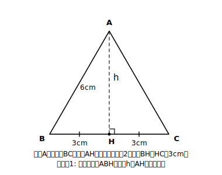
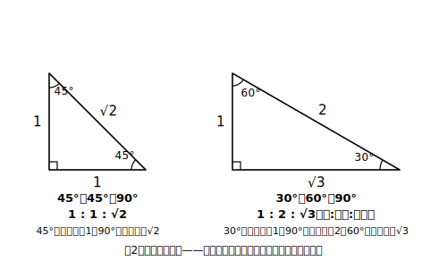

# L04 正三角形の高さと三角定規の3辺の比

## ねらい

- 二等辺三角形・正三角形の高さを、**自分で直角三角形を作り出して**求められるようになる。
- 45°、30°、60°の角を持つ直角三角形の3辺の比（1:1:√2、1:2:√3）を、三平方の定理から**導いて**使えるようになる。

## 導入：直角がない図形にどう使う？

三平方の定理が使えるのは直角三角形だけ。では、正三角形の高さを求めたいときはどうする？ 正三角形に直角は1つもない——**なければ、作ればいい**。これがこの章の後半をつらぬく合言葉になる。

## 主概念1：高さの補助線で直角三角形を作る

### 例題1（正三角形の高さ）

1辺が 6cm の正三角形の高さ h cm と面積を求めよう。

**考え方**: 頂点から底辺へ垂線（高さ）を下ろすと、直角三角形が2つ現れる。正三角形は左右対称だから、垂線は底辺をちょうど半分ずつに分ける。片方の直角三角形に注目すると、斜辺6cm・底辺3cm・高さh cm。

h²＋3²＝6² → h²＝36−9＝27 → h＝√27＝**3√3**（cm）

検算: (3√3)²＋9＝27＋9＝36 ✓。面積は 6×3√3÷2＝**9√3**（cm²）。

高さの補助線1本で、直角のなかった図形が三平方の定理の守備範囲に入った。二等辺三角形でも同じ手が使える（頂点からの垂線が底辺を2等分する——これは中2で証明済みの性質だ）。

:::guide
**「底辺が半分になる」を素通りしない**

例題1のかなめは、実は h²＋3²＝6² の「3」のほうにある。垂線の足が底辺の中点に来るのは、正三角形・二等辺三角形の対称性（中2の二等辺三角形の性質）あってのことで、一般の三角形では成り立たない。「なぜ半分にしてよいのか」を一度自分の言葉で言えるようにしておくと、あてずっぽうで半分にする癖（一般の三角形でもやってしまう誤り）を防げる。
:::

## 主概念2：三角定規の3辺の比

筆箱の三角定規は2種類ある。45°・45°・90°のものと、30°・60°・90°のもの。この2つの形は、辺の比がとても美しいことで特別あつかいされている。

### 45°・45°・90°（直角二等辺三角形）

直角をはさむ2辺がどちらも1のとき、斜辺cは c²＝1²＋1²＝2 → c＝√2。

**3辺の比は 1 : 1 : √2**

### 30°・60°・90°

正三角形を高さの線で半分に切ると、この形が現れる（例題1の図の片割れ！）。1辺2の正三角形で作ると、斜辺2・一番短い辺1、残りの辺hは h²＝2²−1²＝3 → h＝√3。

**3辺の比は 1 : 2 : √3**（短い辺 : 斜辺 : 中間の辺）

比が分かっていれば、1辺の長さから残りの辺が一気に出せる。

### 例題2

(1) 直角二等辺三角形の斜辺が 8cm のとき、直角をはさむ辺の長さを求めよう。
(2) 30°・60°・90°の直角三角形の斜辺が 10cm のとき、一番短い辺と残りの辺の長さを求めよう。

**考え方**:
(1) 比は 1:1:√2 で、√2にあたる辺が8cm。1にあたる辺を x とすると x:8＝1:√2 → x＝8/√2＝8√2/2＝**4√2**（cm）。検算: (4√2)²＋(4√2)²＝32＋32＝64＝8² ✓
(2) 比は 1:2:√3 で、2にあたる辺が10cm。比の1つ分は5cm。一番短い辺は**5cm**、残りの辺は**5√3 cm**。検算: 5²＋(5√3)²＝25＋75＝100＝10² ✓

:::guide
**比で解くか、三平方で解くか**

例題2は、比を使わず三平方の定理を直接立てても解ける（(1)なら x²＋x²＝64）。どちらでもよい——ただし、比を「暗記した呪文」として使うのは危うい。おすすめは、**比は覚えるが、いつでも三平方から作り直せる状態にしておく**こと。試験中に「1:2:√3だっけ、1:√3:2だっけ？」と迷ったら、正三角形を半分に切った図を10秒でかけば確認できる。導出できる暗記は、忘れても壊れない。
:::

:::guide
**√つきの辺との付き合いが本格化する**

この先、答えや途中の値に√が出るのが標準になる。3・4・5のような整数の直角三角形だけが「使いやすい三角形」なのではない。1:1:√2 も 1:2:√3 も、整数の組に負けないくらい頻繁に登場する主役たちだ。√を見た瞬間に検算の型（2乗して戻す）を回す習慣が、ここからの全レッスンの安全網になる。
:::

:::zatsudan
三角定規がこの2種類の形なのは偶然じゃない。45°・45°・90°は正方形の半分、30°・60°・90°は正三角形の半分——どちらも、いちばん基本的な図形を対角線や高さですぱっと切った形なんだ。しかも2枚を組み合わせると15°きざみのいろいろな角度が作れる。文房具の中に、こんなに考え抜かれた数学が入っているって、ちょっとうれしくない？
:::

## 練習

1. 1辺が 10cm の正三角形の高さと面積を求めよう。
2. 底辺が 8cm、等しい辺が 5cm の二等辺三角形の高さと面積を求めよう。
3. 直角二等辺三角形の直角をはさむ辺が 7cm のとき、斜辺の長さを求めよう。
4. 30°・60°・90°の直角三角形で、一番短い辺が 4cm のとき、残りの2辺の長さを求めよう。
5. 1辺が 6cm の正方形の対角線の長さを求めよう（対角線が正方形をどんな三角形2つに分けるかを考えて）。

:::stretch
**S1** 1辺が a cm の正三角形について、高さと面積を a の式で表そう（例題1と同じ手順を文字のままたどる）。できた式に a＝6 を代入して、例題1の答えと一致するか確かめよう。

**S2** 三角定規2枚（45°定規と30°・60°定規）を、長さの等しい辺どうしでぴったり並べると、いろいろな四角形や三角形が作れる。斜辺どうしの長さが等しい2枚を斜辺で貼り合わせた場合にできる四角形の、4つの角の大きさをすべて求めてみよう。角度の組み合わせ遊びが好きなら「三角定規 組み合わせ 角度」で調べると奥が深いよ。
:::

---

対応解答: answer_key_L01-05.md

<!-- gen_nav:nav:start（自動生成・手編集しない） -->

---

[← 前のレッスン](lesson_03.md)｜[単元の目次](README.md)｜[解答](answer_key_L01-05.md)｜[次のレッスン →](lesson_05.md)

<!-- gen_nav:nav:end -->
