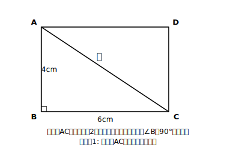
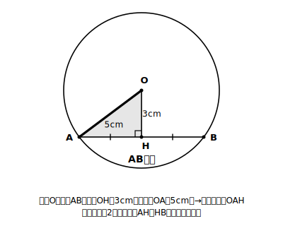
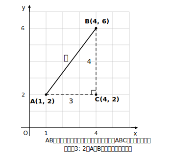

# L05 対角線・弦・2点間の距離——直角三角形を見つける

## ねらい

- 長方形の対角線・円の弦・座標上の2点間距離を、三平方の定理で求められるようになる。
- **一見して直角三角形が見当たらない場面で、直角三角形を見つける・作り出す**目を鍛える。

## 導入：直角三角形はどこにかくれている？

L04の合言葉——直角がなければ作ればいい——を、今日は3つの場面で使い込む。三平方の定理を使いこなす力の正体は、計算力よりむしろ「**この図のどこに直角三角形をひそませるか**」を見抜く力だ。今日の3場面は、その代表選手たちだと思ってほしい。

## 主概念1：長方形の対角線

### 例題1

縦 4cm、横 6cm の長方形の対角線の長さを求めよう。

**考え方**: 対角線を1本引くと、長方形は合同な直角三角形2つに分かれる。長方形の角はすべて直角だから、対角線は「縦4cm・横6cmを直角をはさむ2辺とする直角三角形」の斜辺そのものだ。

対角線²＝4²＋6²＝16＋36＝52 → 対角線＝√52＝**2√13**（cm）

検算: (2√13)²＝52＝16＋36 ✓

## 主概念2：円の弦——半径を斜辺にする

円の周上の2点を結ぶ線分を**弦**という（中1の復習）。円の中の弦にも、直角三角形がかくれている。

### 例題2

半径 5cm の円で、中心Oから弦ABまでの距離が 3cm のとき、弦ABの長さを求めよう。

**考え方**: 中心Oから弦に垂線OHを下ろす。ここで半径OAを1本引くと——直角三角形OAHの完成！ 斜辺は半径の5cm、1辺は3cm。

AH²＋3²＝5² → AH²＝25−9＝16 → AH＝4（cm）

垂線OHは弦ABを2等分するから（円の対称性による性質）、AB＝2×AH＝**8cm**。

ポイントは「**半径を自分で1本引いた**」こと。もとの図に直角三角形はなかった。垂線と半径、2本の補助線で自分から作り出したのだ。

:::guide
**円の問題での「三種の神器」——中心・垂線・半径**

円の中の長さの問題では、①中心から弦への垂線（弦を2等分し、直角を供給する）②中心と円周上の点を結ぶ半径（長さの分かっている斜辺を供給する）の2本が定番の補助線になる。「直角はどこから来る？」「斜辺はどこから来る？」と自問すると、引くべき線が見えてくる。前の章（円）で学んだ性質と三平方の定理が、ここで初めて共同作業をしている——章をまたいで道具が連携する感覚を味わってほしい。
:::

## 主概念3：座標平面上の2点間の距離

### 例題3

座標平面上の2点 A(1, 2)、B(4, 6) の間の距離を求めよう。

**考え方**: AとBを結ぶ線分を斜辺として、**横の線と縦の線で直角三角形を作る**。横方向のずれは 4−1＝3、縦方向のずれは 6−2＝4。

AB²＝3²＋4²＝9＋16＝25 → AB＝**5**

座標平面は、目に見えないだけで全体が方眼だ。だから2点間の距離は、いつでも「横のずれ」「縦のずれ」を2辺とする直角三角形で求められる。グラフの章で学んだ座標と、図形の章の三平方が、ここでつながる。

:::guide
**「ずれ」を数えるときの引き算**

横のずれはx座標どうしの差、縦のずれはy座標どうしの差。座標に負の数が混ざるとき（例: A(−2, 1)とB(3, 4)なら横のずれは 3−(−2)＝5）に計算ミスが出やすいので、図をかいて「何マスずれているか」を目で確かめる習慣をつけたい。ずれは長さなので、引き算の結果が負になったら向きを気にせず絶対値で考えてよい——2乗すれば符号は消えるから、実は式の上でも困らないようにできている。
:::

:::guide
**この3場面に共通する「型」**

例題1〜3は舞台こそ違うが、やったことは1つ——**求めたい線分を斜辺とする直角三角形を、図の中にこしらえた**。①求めたい長さに印をつける ②それを斜辺と見立てる ③直角を供給してくれる線（長方形の辺・弦への垂線・座標の縦横）を探すか引く。この3手順は空間図形（L07以降）でもそっくりそのまま使う。「図を自分でかき直す」ことをおっくうがらないのが、結局いちばんの近道だ。
:::

:::zatsudan
地図の上で——縮尺が一様な平面の地図なら——2地点の直線距離を知りたいとき、やっていることは例題3と同じだ。地図に方眼（メッシュ）をかぶせれば、東西のずれと南北のずれから距離が出せる。ちなみに緯線・経線は角度の目盛りだから、同じ1度分でも実際の距離は緯度によって変わり、そのまま方眼としては使えない。測量や地図作りの世界では、三平方の定理は「たまに使う公式」ではなく毎日の主食みたいなものなんだよ。
:::

## 練習

1. 縦 5cm、横 7cm の長方形の対角線の長さを求めよう。
2. 対角線の長さが 10cm、縦の長さが 6cm の長方形の、横の長さを求めよう。
3. 半径 6cm の円で、中心から弦までの距離が 4cm のとき、弦の長さを求めよう。
4. 半径 10cm の円で、長さ 16cm の弦がある。中心からこの弦までの距離を求めよう（例題2と、分かっているもの・求めるものが入れかわっている）。
5. 座標平面上の2点 A(2, 1)、B(5, 5) の間の距離を求めよう。
6. 座標平面上の2点 C(−3, 2)、D(1, −1) の間の距離を求めよう。

:::stretch
**S1** 3点 O(0, 0)、P(4, 2)、Q(2, 6) を頂点とする三角形について、3辺の長さをそれぞれ求め、△OPQがどんな三角形か（二等辺か・直角三角形か）を判定しよう。L03の「逆」がここで再登場する——座標・距離・判定の3つ巴の総合問題だ。
:::

---

対応解答: answer_key_L01-05.md

<!-- gen_nav:nav:start（自動生成・手編集しない） -->

---

[← 前のレッスン](lesson_04.md)｜[単元の目次](README.md)｜[解答](answer_key_L01-05.md)｜[次のレッスン →](lesson_06.md)

<!-- gen_nav:nav:end -->
