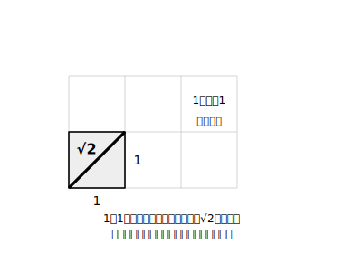
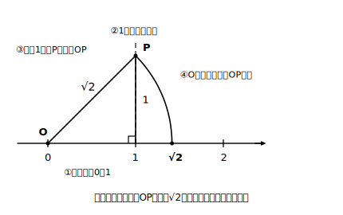
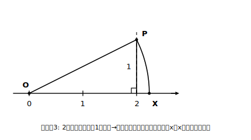

# L06 √の長さを作図する——数直線上の平方根

## ねらい

- √2 や √5 の長さを持つ線分を、定規とコンパスで**正確に**作図できるようになる。
- 数直線上に √2 や √5 の点を定め、「平方根は数直線上に確かな居場所を持つ数だ」と実感する。

## 準備運動：√の復習を1分だけ

平方根の章の要点を思い出そう。次の3つがすらすら言えれば準備OK。

1. √5 とは？ ——「2乗すると5になる正の数」。
2. √4 は？ ——2（√がはずれる場合もある）。
3. √2 はおよそいくつ？ ——約1.41（1.4²＝1.96、1.5²＝2.25 だから1.4と1.5の間。さらに細かく、1.41²＝1.9881、1.42²＝2.0164 だから1.41と1.42の間）。

平方根の章では、√2 を「2乗すると2になる、小数では書き切れない数」として学んだ。今日は、その√2に**長さとして会いに行く**。

## 主概念1：√2 は正方形の対角線

1辺が1の正方形の対角線の長さ x を、三平方の定理で求めると

x²＝1²＋1²＝2 → x＝√2

つまり **√2 は、1辺1の正方形の対角線の長さ**として、目の前に実物を作れる。小数では 1.41421…と果てしなく続く数なのに、作図なら一発で「正確な√2」がかける——このギャップこそ今日の主役だ。

同じように、直角をはさむ2辺が1と2の直角三角形の斜辺は √(1²＋2²)＝√5。直角三角形をうまく選べば、いろいろな平方根の長さが作れることになる。

## 主概念2：数直線の上に √2 の点を打つ

手順を1つずつ確かめながら進もう。使うのは定規（直線を引く用）とコンパスだけ。

**手順（√2 の場合）**

1. 数直線をかき、0と1の点をとる。
2. 1の点から、数直線に**垂直な**線を上へ引く（垂線の作図は中1の方法で。方眼紙ならマス目の縦線を使ってよい）。
3. その垂線上に、1の点から長さ1の点をとる。この点をPとする。——これで「0の点・1の点・P」を頂点とする直角三角形ができた。直角をはさむ2辺は1と1だから、斜辺OPの長さは√2。
4. コンパスの針を0の点に置き、鉛筆側をPに合わせて、半径OPの円（の一部）をかく。数直線と交わった点が、**ちょうど√2 の位置**だ。

コンパスは「長さを写し取る道具」。斜辺の長さ√2を、そのまま数直線の上に倒してきた、というわけだ。なお「正確に」とは考え方の上での話——理想の作図なら誤差ゼロという意味で、実際の鉛筆とコンパスがかく線には、当然わずかな誤差が入る。

### 例題1

数直線上に √5 の点を作図する手順を考えよう。

**考え方**: √5＝√(1²＋2²) だから、直角をはさむ2辺が1と2の直角三角形を作ればいい。数直線の**2の点**から垂直に高さ1の点をとれば、原点からの斜辺が √(2²＋1²)＝√5。あとはコンパスで原点を中心に斜辺の長さを数直線へ写すだけ。√2のときと違うのは「垂線を立てる位置」と「高さ」だけで、手順の骨格は同じだ。

:::guide
**「どの直角三角形を選ぶか」の考え方**

√n を作図したいときは、a²＋b²＝n となる2辺 a、b を探す。たとえば √5 なら 1²＋2²、√8 なら 2²＋2²。候補が思いつかないときは、n から 1²、2²、3²…を順に引いてみて、残りが平方数になるかを調べればよい（5−1＝4＝2² ✓）。練習1・2の√10・√13も、この探し方で自分の手で見つけてほしい。さらに、√3 のように「2つの平方数の和」で書けない数には、いったん√2を作ってからそれを1辺に使う2段作図という手がある——stretchで挑戦してみよう。
:::

:::guide
**この作図が教えてくれること——√は「あいまいな数」ではない**

小数表示（1.41421…）だけ見ていると、√2 はどこか正体不明の数に思える。しかし作図してみれば、√2 の点は数直線上に**ぴったり1点**、揺るぎなく決まる。あいまいなのは数のほうではなく、小数という書き表し方が追いつかないだけなのだ。平方根の章で「なぜこんな数を考えるのか」と感じた人ほど、この1時間で見方が変わるはず。三平方の定理は、平方根に「長さ」という実体を与える定理でもある。
:::

:::zatsudan
定規の目盛りをどれだけ細かくしても、√2 の長さは「ぴったり」は測れない。なのにコンパスと定規なら正確な√2 が作れてしまう。「測る」ではかなわないことが「作図する」ではできる——古代ギリシャの人たちは作図という方法をとても大切にした、と言われることがある。その気持ち、ちょっと分かる気がしない？
:::

## 練習

1. 数直線上に √10 の点を作図したい。直角をはさむ2辺をいくつにすればよいか。また、作図の手順を√2の手順にならって1〜4の番号つきで書こう。
2. 数直線上に √13 の点を作図するには、直角をはさむ2辺をいくつにすればよいか。
3. この作図で数直線上に定まる点 x はどんな数か。理由とともに答えよう。
4. −√2 の点は、数直線上にどうやって定めればよいだろうか。一言で説明しよう。

:::stretch
**S1** √3 の点を作図しよう。ヒント: まず√2 を作図し、その√2 の線分を「直角をはさむ辺」の1つに使う。1²＋(√2)²＝3 になることを確かめてから、手順を組み立てること。

**S2** S1の考えを繰り返すと、√2、√3、√4、√5、…の長さが、直角三角形を1枚ずつ貼り足すうずまき模様として次々に作図できる。実際に√6あたりまでかいてみよう。この美しいうずまきには名前もついている——「平方根 らせん 作図」で調べてみると、思わずかきたくなる図に出会えるよ。
:::

---

対応解答: answer_key_L06-10.md

<!-- gen_nav:nav:start（自動生成・手編集しない） -->

---

[← 前のレッスン](lesson_05.md)｜[単元の目次](README.md)｜[解答](answer_key_L06-10.md)｜[次のレッスン →](lesson_07.md)

<!-- gen_nav:nav:end -->
