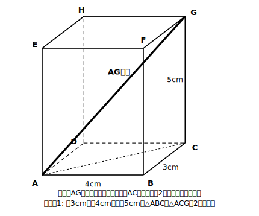
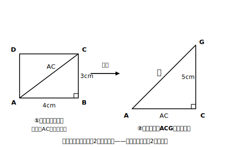

# L07 直方体の対角線——3段階法

## ねらい

- 空間図形の問題を「①直角を探す→②平面に取り出す→③三平方を適用」の**3段階法**で解けるようになる。
- 直方体・立方体の対角線の長さを求められるようになる。

## 導入：空間の中の直角三角形は、見えにくい

ここから舞台は空間図形に移る。正直に言おう——空間の問題は、平面より**難しく感じやすい**。理由ははっきりしている。見取図の中では、直角が直角に見えないし、直角三角形が図形たちの奥にかくれてしまうからだ。

だから、見えないものを見えるようにする型を最初に決めてしまう。

> **3段階法**
> ① **直角を探す**——使えそうな直角（垂直の関係）がどこにあるか、図の中で指差す。
> ② **平面に取り出す**——直角三角形を含む平面だけを、**別の図としてかき直し**、分かっている長さを書き込む。
> ③ **三平方を適用する**——取り出した直角三角形で a²＋b²＝c²。

かなめは②だ。見取図の中で解こうとせず、**平らな紙の上に直角三角形を引っぱり出してくる**。ひと手間に見えて、これが最短ルートになる。

## 主概念：直方体の対角線

### 例題1

縦 3cm、横 4cm、高さ 5cm の直方体の対角線（頂点Aから、Aと同じ面にない頂点Gまでの線分AG）の長さを求めよう。

**手順どおりに:**

**① 直角を探す。** 対角線AGを斜辺にできそうな直角はどこか。高さの辺CGは底面に垂直——そして、底面に垂直な直線は、その足（底面と交わる点）を通る底面上の**どの直線とも**垂直になる。CGは足Cを通る底面上の直線ACとも垂直、つまり CG⊥AC。ここに直角がある！

**② 平面に取り出す。** 直角三角形ACGだけを平面にかき直す。……ところが、辺ACの長さがまだ分からない。ACは**底面の長方形の対角線**だ。そこで先に、底面だけを取り出してACを求める。

底面の直角三角形ABCで AC²＝3²＋4²＝25 → AC＝5（cm）。

**③ 適用する。** 直角三角形ACGで

AG²＝AC²＋CG²＝25＋5²＝50 → AG＝√50＝**5√2**（cm）

検算: (5√2)²＝50＝25＋25 ✓。三平方の定理を**2回**使った——1回目で底面の対角線、2回目で本命の対角線。空間の問題は、平面の問題の2階建てなのだ。

### 例題2（立方体の対角線）

1辺 4cm の立方体の対角線の長さを求めよう。

**考え方**: 例題1と同じ2階建て。底面の対角線は √(4²＋4²)＝√32＝4√2（cm）。対角線²＝(4√2)²＋4²＝32＋16＝48 → 対角線＝√48＝**4√3**（cm）。

:::guide
**②で手が止まる人へ——「かき直す」ことへの抵抗をほどく**

「見取図をにらんでいれば分かるはず」と思って、平面図をかかずに済ませたくなる。しかし空間の問題でまちがえるときの多くは、計算ではなく**どの長さとどの長さが直角をはさんでいるかの見誤り**で起こる。見取図の中では、直角でない角が直角に見え、直角が直角に見えない。取り出した平面図は、その錯覚を消すための道具だ。フリーハンドの雑な図で十分——「直角マーク」と「分かっている長さ」さえ書き込めば仕事をする。図をかくのは遠回りではなく、答案の一部だと考えよう。
:::

:::guide
**AC²＝25 のまま使う小さな工夫**

例題1では AC＝5 ときれいな値になったが、底面対角線はふつう√つきになる（例題2のように）。そのときは、ACを√にほどかず **AC²＝32 のまま**2回目の式に入れてよい。AG²＝AC²＋CG² が欲しいのは AC² であって AC ではないからだ。実は一般に、直方体の対角線²＝縦²＋横²＋高さ²（3つの2乗の和）になっている——stretchで文字を使って確かめてみよう。
:::

:::zatsudan
細長い荷物が箱に入るかどうか、箱の辺の長さだけ見てあきらめていないかな？ 箱の中でいちばん長い直線は、今日求めた対角線だ。例題1の箱（3×4×5cm）には、5cmの辺よりずっと長い5√2≒7cmの棒まで斜めに収まる。引っ越しや収納で「斜めに入れたら入った！」は、三平方の定理の勝利の瞬間なんだよ。
:::

## 練習

1. 縦 6cm、横 8cm、高さ 5cm の直方体の対角線の長さを求めよう（3段階法の①②③を明記しながら）。
2. 1辺 6cm の立方体の対角線の長さを求めよう。
3. 縦 2cm、横 3cm、高さ 4cm の直方体の対角線の長さを求めよう。
4. 直方体の底面が1辺 4cm の正方形で、対角線（空間の対角線）の長さが 8cm のとき、この直方体の高さを求めよう（今度は逆向き——対角線から高さへ）。

:::stretch
**S1** 縦 a、横 b、高さ c の直方体の対角線の長さを、a、b、c の式で表そう（例題1の2階建てを文字のままたどる）。できた式が「3つの2乗の和の平方根」というきれいな形になることを確かめ、例題2（a＝b＝c＝4）で検算しよう。

**S2** 1辺 a の立方体の対角線は S1 の式から √3 a になる。立方体の「1辺・面の対角線・空間の対角線」の3つの長さの比を求めてみよう。どこかで見た数が並ぶはず！
:::

---

対応解答: answer_key_L06-10.md

<!-- gen_nav:nav:start（自動生成・手編集しない） -->

---

[← 前のレッスン](lesson_06.md)｜[単元の目次](README.md)｜[解答](answer_key_L06-10.md)｜[次のレッスン →](lesson_08.md)

<!-- gen_nav:nav:end -->
