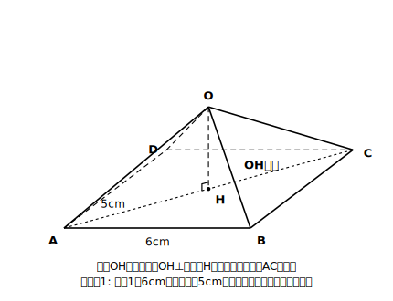
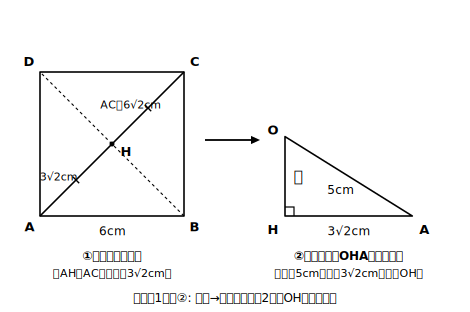
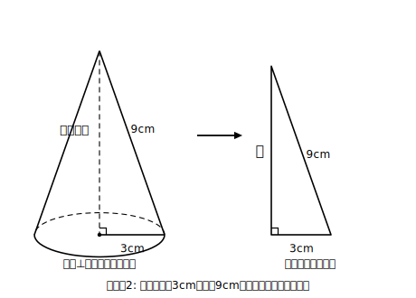

# L08 錐体の高さと体積

## ねらい

- 正四角錐・円錐の高さを、3段階法で直角三角形を取り出して求められるようになる。
- 求めた高さから体積の計算へつなげられるようになる。

## 導入：体積の式には「高さ」がいる

中1で学んだとおり、錐体の体積は「底面積×高さ×1/3」。ところが錐体の問題では、高さそのものはたいてい与えられない。与えられるのは、底面の辺や、頂点から底面のふちへ向かう辺（や母線）の長さだ。高さは図の**内部**にかくれている——さあ、3段階法の出番だ。

## 主概念1：正四角錐の高さ

### 例題1

底面が1辺 6cm の正方形で、頂点から底面の頂点までの辺（側面の辺）がすべて 5cm の正四角錐がある。この立体の高さと体積を求めよう。

**手順どおりに:**

**① 直角を探す。** 正四角錐の高さは、頂点Oから底面の**中心H**（対角線の交点）へまっすぐ下りる線分OH。OHは底面に垂直で、底面に垂直な直線はその足を通る底面上のどの直線とも垂直になる（L07で使ったのと同じ理屈）から、OH⊥HA。直角はここだ。

**② 平面に取り出す。** 直角三角形OHA——斜辺OA＝5cm、直角をはさむ2辺がOH（求めたい高さ）とHA。HAは底面の対角線の半分だから、まず底面を取り出す。

底面の対角線 AC＝√(6²＋6²)＝√72＝6√2（cm）。よって AH＝3√2（cm）。

**③ 適用する。** 直角三角形OHAで

OH²＝5²−(3√2)²＝25−18＝7 → OH＝**√7**（cm）

検算: (√7)²＋18＝25 ✓。体積は

(1/3)×(6×6)×√7＝**12√7**（cm³）

√7 のような値でも、体積の式にそのまま乗せてよい。もし「およそ何cm³か」が必要なら、(12√7)²＝144×7＝1008 を使って挟み撃ちにする——31.7²＝1004.89、31.75²＝1008.0625 だから 31.7＜12√7＜31.75、つまり 12√7≒**31.7**（cm³）。ここでもし√7≒2.65 を先に代入すると 12×2.65＝31.8 となって小数第1位がずれてしまう（2.65は√7よりわずかに大きく、12倍するとその差もふくらむため）。**近似値を使うのは最後の一手だけ**にし、しかも**求める桁の精度を保証できる細かさの近似値（または挟み撃ち）を使う**——途中計算は√のまま進めるのが精度を守るコツだ。

## 主概念2：円錐の高さ——母線・半径・高さ

円錐では、頂点から底面の円のふちまでの線分を**母線**という（中1の復習）。母線・底面の半径・高さの3つが、そのまま直角三角形を作る。

### 例題2

底面の半径 3cm、母線 9cm の円錐の高さと体積を求めよう。

**考え方**: 高さ⊥半径で、斜辺は母線。

高さ²＝9²−3²＝81−9＝72 → 高さ＝√72＝**6√2**（cm）

検算: (6√2)²＋9＝72＋9＝81 ✓。体積は

(1/3)×π×3²×6√2＝**18√2 π**（cm³）

:::guide
**「斜辺の席」にいるのは側面の辺・母線**

例題1・2とも、直角三角形の斜辺になったのは頂点から底面のふちへ向かう線分（側面の辺OA・母線）で、高さは「直角をはさむ辺」の側だった。つまり式は必ず「引き算」——高さ²＝斜辺²−底面側の長さ²——になる。もし計算して高さのほうが側面の辺より長くなったら、どこかで席を取り違えている合図。答えのオーダー（高さ＜斜辺）を最後に一瞥する習慣が、取り違えの検出器になる。
:::

:::guide
**正四角錐の「3√2」はどこから来たか、を言えるように**

例題1でつまずくとしたら、√7の計算ではなく「HA＝3√2」の段だ。ここには L07 の底面対角線（正方形の対角線＝1辺×√2、L04の1:1:√2の再登場）と「中心は対角線の交点＝対角線を半分にする点」という2つの既習が折りたたまれている。解けなかったときは、③の計算ではなく②の平面取り出しまで戻ってやり直す——どの段でつまずいたかを自分で特定できることが、空間問題の実力そのものだ。
:::

:::zatsudan
実際にものの長さを測って計算するとき、測定値には必ず誤差が入り込む。だから途中でどんどん四捨五入すると、誤差が雪だるま式にふくらんでしまう。今日やった「√のまま最後まで運び、近似はラストの一手だけ」は、測量や工作の世界でも通用する誤差との付き合い方の基本。数学のていねいさは、現場のていねいさでもあるんだね。
:::

## 練習

1. 底面が1辺 4cm の正方形で、側面の辺がすべて 6cm の正四角錐の高さと体積を求めよう（3段階法の①②③を明記しながら）。
2. 底面の半径 5cm、母線 13cm の円錐の高さと体積を求めよう。
3. 底面の半径 4cm、高さ 8cm の円錐の母線の長さを求めよう（今度は母線が未知数）。
4. 例題1の正四角錐について、体積の近似値を小数第1位まで求めよう（√7≒2.6458 とする。√7≒2.65 のような粗い近似では、12倍したときに小数第1位の精度が保証できないことに注意）。

:::stretch
**S1** 底面が1辺 a cm の正方形で、側面の辺がすべて b cm の正四角錐の高さを a、b の式で表そう。また、この式が意味を持つためには a と b の間にどんな大小関係（不等式）が必要か、図の意味から考えよう（ヒント: 高さ²＞0。不等号は ≦・≧ ではなく厳密な不等号になるはずだ——なぜか？）。

**S2** 例題1の正四角錐で、頂点Oから底面の辺ABの中点Mへ引いた線分OM（側面の二等辺三角形の高さ）を求めよう。OHとOMはどちらが長い？ 立体の中の「いろいろな高さ」を区別できたら、空間感覚はかなりのものだ。
:::

---

対応解答: answer_key_L06-10.md

<!-- gen_nav:nav:start（自動生成・手編集しない） -->

---

[← 前のレッスン](lesson_07.md)｜[単元の目次](README.md)｜[解答](answer_key_L06-10.md)｜[次のレッスン →](lesson_09.md)

<!-- gen_nav:nav:end -->
