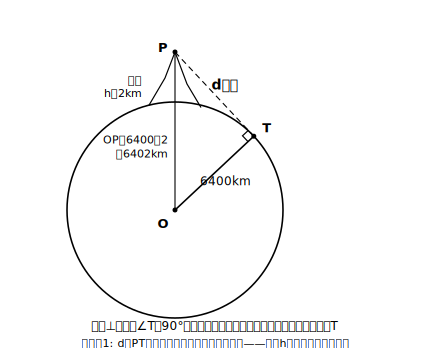

# L09 見渡せる距離——理想化と限界

## ねらい

- 「山頂からどこまで見えるか」という現実の問いを、**理想化・単純化**して図形の問題に直し、三平方の定理で解けるようになる。
- 出した答えが**どこまで信用できるか（適用範囲の制約）** を振り返る姿勢を身につける。

## 導入：数学の問題は、最初から数学の形をしていない

標高2000mの山の頂上に立ったら、どこまで遠くを見渡せるだろう？ この問いには、辺も三角形も出てこない。現実の問いを数学で解くには、まず**自分の手で図形の問題に翻訳する**必要がある。今日はその翻訳の全工程を体験する——この章、いや中学図形の総仕上げにふさわしい仕事だ。

## 主概念1：理想化して、図形の問題に直す

**翻訳の手順**

1. **単純化する**: 地形のでこぼこ、建物、空気のかすみ——遠くの見え方に関わる事情は山ほどあるが、思い切っていったん無視する。また、**光はまっすぐ進むものとする**（実際の大気は光の道すじをわずかに曲げるが、これも無視する）。
2. **理想化する**: 地球をまん丸の**球**とみなし、その半径を約6400kmとする（実際の地球は完全な球ではないが、球とみなして考える——これが理想化だ）。
3. **図形の言葉で言い直す**: 「見渡せる限界」とは、目からの視線が地球の表面すれすれをかすめる点——つまり視線が球（断面で考えれば円）の**接線**になる点だ。

断面図をかくと、こうなる。

中1で学んだとおり、**円の接線は接点を通る半径に垂直**。だから三角形OTPは∠T＝90°の直角三角形——直角三角形が現れた瞬間、あとは三平方の定理の仕事だ。

### 例題1

標高 2000km…ではなく 2000m＝**2km** の山頂から見渡せる距離（山頂から接点までの長さ d km）を求めよう。地球は半径 6400km の球とみなす。

**考え方**: 直角三角形OTPで、斜辺は OP＝6400＋2＝6402（km）、1辺は OT＝6400（km）。

d²＝6402²−6400²

大きな数の2乗を正直に計算してもよいが、ここは平方根の章で学んだ因数分解 x²−y²＝(x＋y)(x−y) がまぶしく光る。

d²＝(6402＋6400)(6402−6400)＝12802×2＝25604

d＝√25604 ≒ **160**（km）（160²＝25600 だから √25604 は160より少し大きい程度）

標高2kmの山頂からは、およそ160km先まで見渡せる計算になる。なお、いま求めた d は目（山頂）から接点までの**直線距離**であって、「地表に沿って測った距離」とは厳密には別物だ——ただし、この程度の高さでは両者はほとんど同じ値になる。

:::guide
**単位の足並みをそろえてから式へ**

この問題で実際にやりがちなのは、計算ミスよりも**単位の混在**——半径はkm、標高はm、のまま足してしまう事故だ。式を立てる前に「全部kmにそろえる」（2000m＝2km）と宣言してから始める。単位の確認は、現実の問題を扱うときにだけ発生する、教科書の計算問題にはない工程。逆に言えば、これができることが「活用できる」ということの一部である。
:::

## 主概念2：答えの「使える範囲」を振り返る

d≒160km。この数字はどこまで信用できるだろうか？

思い出そう、私たちは計算の前にたくさんのことを**無視した**。実際には、途中に山や建物があれば視界はさえぎられるし、空気のかすみで遠くは見えにくい。地球も完全な球ではない。だからこの160kmは「さえぎるものが何もなく、空気が完全に澄んでいれば、幾何学的にはここまで見える」という**上限の目安**であって、明日の登山で保証される実測値ではない。

数学で現実を扱うときは、**単純化した分だけ、答えに但し書きがつく**。答えを出して終わりではなく、「この答えはどんな条件つきか」まで言えて、初めて解けたことになる。

### 例題2

高さ 1km まで上がった気球から見渡せる距離を、例題1と同じ理想化で求めよう。

**考え方**: d²＝6401²−6400²＝(6401＋6400)(6401−6400)＝12801×1＝12801 → d＝√12801≒**113**（km）（113²＝12769、114²＝12996 だから113と114の間で113寄り）。

高さが半分になっても、見渡せる距離は半分にはならない——この「比例しない感じ」に気づいただろうか？ 高さと距離の関係の正体はstretchで。

:::guide
**「答え≒160km」の検算をどうするか**

√25604 のような数は、検算の型（2乗して戻す）をそのまま使えばよい。160²＝25600 と 161²＝25921 の間に25604があるから、√25604 は160と161の間で160寄り——この「はさみうち」の見積もりは、電卓が使えない場面での標準装備だ。なお、d² の計算に使った (x＋y)(x−y) の変形は、数が大きいときほど威力を増す。6402²＝40985604 を計算してから6400²＝40960000 を引いても同じ25604に着くが、どちらの道が事故りにくいかは一目瞭然だろう。
:::

:::zatsudan
同じ計算を、もっともっと高いところでやったらどうなる？ たとえば人工衛星の高さから見える範囲を計算すれば、「1機の衛星が地球のどれくらいをカバーできるか」の見積もりになる。放送や気象観測の衛星が何機で地球全体を見張れるか——その設計の出発点も、今日の直角三角形と同じなんだ。気になったら「人工衛星 見える範囲 計算」で調べてみて！
:::

## 練習

1. 標高 0.5km（500m）の丘の上から見渡せる距離を、例題1と同じ理想化（地球＝半径6400kmの球）で求めよう。√6400.25 の近似は「6400.25 が 80²＝6400 のすぐ上」であることを使ってよい。
2. 高さ 0.3km（300m）の展望タワーから見渡せる距離を、同じ理想化で求めよう（√3840.09 は 62²＝3844 と 61²＝3721 を手がかりに、一の位まで見積もればよい）。
3. 例題1の答え「約160km」に必ずつけるべき但し書きを、「実際には」で始めて1〜2文で書こう。
4. この問題で「地球を球とみなす」ことにした理由を、理想化という言葉を使って一言で説明しよう。

:::stretch
**S1** 高さ h km の地点から見渡せる距離 d km について、d²＝(R＋h)²−R²（R＝6400）を展開して、d² を R と h の式で表そう。h² は 2Rh に比べてきわめて小さいことに注目すると、d はおよそ何に比例すると言えそうか（h に？ それとも √h に？）。例題1・2と練習1の結果（h＝2, 1, 0.5 で d≒160, 113, 80）がその予想と合っているか確かめよう。

**S2** 見渡せる距離を2倍にするには、高さを何倍にすればよいか。S1の結果から予想してみよう。
:::

---

対応解答: answer_key_L06-10.md

<!-- gen_nav:nav:start（自動生成・手編集しない） -->

---

[← 前のレッスン](lesson_08.md)｜[単元の目次](README.md)｜[解答](answer_key_L06-10.md)｜[次のレッスン →](lesson_10.md)

<!-- gen_nav:nav:end -->
