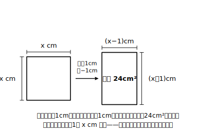

# L01 方程式の物語・第3幕——二次方程式とその解

## ねらい

- 既習の一次方程式・連立方程式では解けない問題が存在することを体感する。
- **二次方程式**の定義と、その**解**の意味（代入して成り立たせる値）を理解する。二次方程式には**一般に解が二つ**あることに気づく。

## 準備運動：道具箱の点検（前提診断）

この章は、中学3年間の「数と式」の総決算だ。これまでの道具が全部そろっているか、5問で点検してみよう。

1. 一次方程式 3x−7＝8 を解こう。
2. 連立方程式 x＋y＝7、x−y＝1 を解こう。
3. 次を因数分解しよう。 (1) x²＋7x＋12　(2) x²−9
4. (1) 7の平方根を答えよう。 (2) √16 の値を求めよう。
5. (x＋5)(x−2) を展開しよう。

3の因数分解と4の平方根は、この章の主役級の道具になる。あやしかった人は、前の2つの章の該当ページに一度戻っておこう。ここで点検しておくと、この先がぐっと楽になる。

## 主概念1：一次方程式や連立方程式では解けない問題

次の問題を考えてみよう。

> ある正方形の一方の辺を1cm長くし、他方の辺を1cm短くして長方形を作ったら、面積が24cm²になった。もとの正方形の1辺の長さは何cmだろうか。

もとの正方形の1辺を x cmとすると、長方形の縦は (x＋1)cm、横は (x−1)cm。面積の関係から、

(x＋1)(x−1)＝24

左辺を展開すると x²−1＝24、整理すると

**x²−25＝0**

さて、この式をよく見てほしい。文字は x の1種類だけなのに、**x²（2乗）の項**が消えずに残っている。中1の一次方程式の解き方（移項して ax＝b の形へ）では、x² をどうにもできない。中2の連立方程式の道具（文字を消す）も、文字が1つしかない今回は出番がない。つまりこの問題は、**既習の一次方程式や連立方程式では解けない**。

ふり返れば、方程式の学びは物語のように進んできた。中1では文字が1つの一次方程式。中2では**文字を増やした**連立方程式。そして中3のいま、目の前にあるのは**次数を増やした**方程式——2乗の項をもつ方程式だ。新しい相手には、新しい名前と新しい作戦がいる。

## 主概念2：二次方程式とその「解」

> **【ことば】二次方程式**
> 移項して整理すると「（xの二次式）＝0」の形になる方程式を、xについての**二次方程式**という。一般に、a、b、cを定数（aは0でない）として
> **ax²＋bx＋c＝0**
> の形で表される。

さきほどの x²−25＝0 は、a＝1、b＝0、c＝−25 の二次方程式だ。

では、この方程式の「答え」とは何だろう。一次方程式のときと考え方は同じで、**代入すると方程式が成り立つ値**のことだ。

> **【ことば】二次方程式の解**
> 代入すると二次方程式を成り立たせる文字の値を、その二次方程式の**解**という。解をすべて求めることを、二次方程式を**解く**という。

試しに、x²−25＝0 に x＝5 を代入してみよう。5²−25＝25−25＝0。成り立つ。だから **5はこの方程式の解**だ。

では x＝−5 はどうだろう。(−5)²−25＝25−25＝0。こちらも成り立つ！ つまり −5 **も**この方程式の解である。

- 一次方程式の解は（ふつう）1つだった。
- 二次方程式には、**一般に解が二つある**。

ここで最初の問題に戻ろう。x は正方形の1辺の長さだったから、x＝−5 は長さとしてありえない。**方程式の解は5と−5の二つ、問題の答えは5cmだけ**——「方程式の解」と「問題の答え」は、いつも同じとは限らない。この区別はこの章の後半（L08）で主役になるので、頭の片すみに置いておこう。

:::zatsudan
方程式の3年間は、敵がだんだん強くなるゲームに似ている。中1の一次方程式が第1幕、中2で文字が2つに増えて第2幕、そして今回は文字は1つのまま「2乗」という新しい技をもった第3幕の相手だ。歴代の主人公がそうだったように、私たちも前の幕で手に入れた道具（因数分解と平方根）を全部持って挑むことになる。
:::

## 作戦会議：どう解くか（予告）

連立方程式を解くときの作戦は「文字を**消して**、一次方程式に持ちこむ」だった。二次方程式の作戦はこうだ。

**次数を減らして、一元一次方程式に持ちこむ。**

x²のままでは扱えないが、次数を1に下げてしまえば、あとは中1の技術で解ける。「どうやって次数を下げるか」——その方法がこの章の1節で学ぶ3つの解き方であり、実はどれも、この一つの作戦の変奏だ。次のL02では、前章で学んだばかりの平方根が、さっそく次数下げの主役として登場する。

:::guide
**「解く前に、解を確かめられる」ことの価値**

このレッスンでは、まだ二次方程式の解き方を1つも学んでいない。それでも「x＝5が解かどうか」は代入すれば判定できる——ここが重要なポイントだ。解の定義（代入して成り立つ値）は、解き方を知らなくても使える**検算の道具**である。この章のすべての練習で「解いたら代入して確かめる」を締めの習慣にすると、符号ミスや計算ミスを自分で発見できるようになる。独習ではまちがいを指摘してくれる人がいないぶん、この自己検算の型がそのまま「先生の代わり」になる。
:::

:::guide
**なぜ「＝0の形」で定義するのか**

(x＋1)(x−1)＝24 も x²＝25 も二次方程式なのに、定義では「整理するとax²＋bx＋c＝0の形」とわざわざ右辺を0にそろえている。これは、形がバラバラの方程式を**同じ土俵で比べる**ための共通様式だ。右辺を0にそろえておくと、「左辺が因数分解できるか」「どの解き方が使えるか」の判断が一目でできるようになる（L05・L06で効いてくる）。「まず＝0の形に整理する」は、この章の共通の第一歩として覚えておくとよい。
:::

## 練習

1. 次のうち、xについての二次方程式であるものをすべて選ぼう。
   (ア) x²−3x＋2＝0　(イ) 2x＋1＝0　(ウ) x²＝x²＋4x−1　(エ) x(x＋2)＝3
2. 二次方程式 x²−x−6＝0 について、−3、−2、2、3 のうち、解であるものを代入してすべて見つけよう。
3. x＝−3 が解である二次方程式を、次からすべて選ぼう。
   (ア) x²−9＝0　(イ) x²＋3x＝0　(ウ) x²−x−6＝0
4. 1辺x cmの正方形の面積が、1辺の長さの4倍より12大きいという関係を式に表すと x²＝4x＋12 となる。x＝6 がこの方程式の解であることを、代入して確かめよう。

:::stretch
**S1** 二次方程式 x²＝x を考える。−1、0、1、2 を代入して、解をすべて見つけてみよう。そのあとで、次の解き方のどこがまずいか考えてみよう。
「両辺をxで割って x＝1。よって解は1だけ。」
（ヒント: 割ってよいのは、割る数が0でないと分かっているときだけ。）
:::

---

対応解答: answer_key_L01-04.md

<!-- gen_nav:nav:start（自動生成・手編集しない） -->

---

[単元の目次](README.md)｜[解答](answer_key_L01-04.md)｜[次のレッスン →](lesson_02.md)

<!-- gen_nav:nav:end -->
