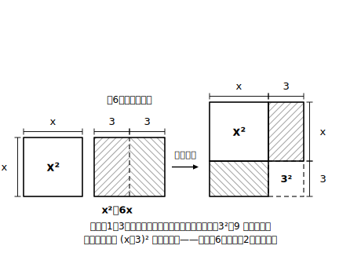

# L03 平方の形に変形して解く——x²＋px＋q＝0

## ねらい

- x²＋px＋q＝0 の形の二次方程式を、**平方の形 (x＋■)²＝● に変形**して解けるようになる。
- 変形のねらいが「**平方の形を作って、方程式の次数を下げる**」というアイデアそのものであることを、自分の言葉で言えるようになる。

## 主概念1：解ける形は、自分で作れる

L02では、(x−2)²＝3 のような「もう平方の形になっている」方程式を解いた。でも、いつも親切にその形で出題されるとは限らない。たとえば、

x²＋6x＋2＝0

左辺は因数分解の4公式にも当てはまらない（和が6・積が2になる整数の組はない）。手持ちの解ける形は「（かたまり）²＝数」だけ。ならば話は決まりだ——**その形を自分で作ってしまおう**。

手順を追いながらやってみよう。

**手順1** 数の項を右辺へ移項する。
x²＋6x＝−2

**手順2** 左辺 x²＋6x を (x＋■)² の一部とみる。展開公式 (x＋a)²＝x²＋2ax＋a² と見比べると、2a＝6 だから a＝3、つまり **xの係数6の半分**。(x＋3)²＝x²＋6x＋9 なので、あと **9（＝半分の2乗）** があれば平方の形が完成する。等式だから、加えるなら両辺に。
x²＋6x＋9＝−2＋9

**手順3** 左辺を平方の形にまとめる。
(x＋3)²＝7

これで L02 の形になった。あとは流れ作業だ。
x＋3＝±√7　よって **x＝−3±√7**

この変形を「**平方の形に変形する**」という（**平方完成（へいほうかんせい）** と呼ばれることもある）。ポイントはただ一つ。

> **【ことば】平方の形に変形**
> x²＋px の式に「**xの係数pの半分の2乗**」を加えると、平方の形 (x＋p/2)² が作れる。この変形で二次方程式を「（かたまり）²＝数」に持ちこみ、**次数を下げて**解く。

なぜこの変形をするのか、目的を一言で言えるようにしておこう——「**平方の形を作れば、平方根の考えで次数が下げられるから**」。手順の暗記より、この一言のほうが値打ちがある。

:::guide
**面積の図で見る「半分の2乗」**

上の【図】のからくりを言葉にしておこう。x²＋6x は「1辺xの正方形」と「縦x・横6の長方形」の面積の合計だ。長方形を縦に半分（横3ずつ）に切って、正方形の右と下にはり付けると、右下に1辺3の小さな正方形ぶんの**すき間**ができる。そこに 3²＝9 を埋めれば、全体が1辺 (x＋3) の大きな正方形になる——これが「xの係数の**半分**（両側に分けるから）の**2乗**（すき間は正方形だから）を加える」ことの図形的な意味だ。式の操作が意味を持って見えると、手順を忘れても自力で復元できる。
ひとつ注意。この図は、xを正の長さとみなして描いた **「形のたとえ」** だ。式の変形そのもの（両辺に9を加えて平方の形にまとめる）は等式の性質によるもので、**xの符号によらず成り立つ**。実際、この方程式 x²＋6x＋2＝0 の解 x＝−3±√7 は、どちらも負の数だ。図は覚えるための足場、変形の正しさは式が保証する。
:::

**例1** x²−8x＋3＝0 を解く。
x²−8x＝−3。xの係数は−8、半分は−4、その2乗は16。両辺に16を加えて
(x−4)²＝13　よって **x＝4±√13**

係数が負でも、手順はまったく同じ（(x−4)²＝x²−8x＋16 を展開で確認できる）。

**例2** x²＋4x−3＝0 を解く。
x²＋4x＝3。半分の2乗＝4を両辺に加えて (x＋2)²＝7。よって **x＝−2±√7**。

:::zatsudan
「解ける形に、自分で作りかえる」——今回の主役は、じつは方程式そのものより、この発想のほうかもしれない。与えられた問題が手持ちの型に合わないとき、問題のほうを変形して型に合わせにいく。パズルでも料理でも、材料を下ごしらえして「いつもの手順」に乗せてしまうのが上手な人のやり方だ。数学の式変形は、その下ごしらえの技術だと思うと少し親しみがわく。
:::

## 壁：xの係数が奇数だったら？

x²＋5x＋2＝0 ではどうなるか、入り口だけのぞいてみよう。xの係数5の半分は 5/2。その2乗 25/4 を両辺に加えて……と、ここから先は**分数の計算が続く**（やりきれるかどうか、stretchで挑戦できる）。

手順は同じでも、毎回この計算をするのは骨が折れる。こういうとき、数学の世界では「**手順の反復を、一般的な式で一度だけやっておいて、結果を公式として使い回す**」という手が使われる。それが次のL04、解の公式だ。

:::guide
**このレッスンの練習が「係数が偶数のもの中心」である理由**

学習指導要領は、平方の形に変形して解く二次方程式について「xの係数が偶数のものを中心に扱う」と定めている。奇数係数では上のとおり分数計算が重くなり、変形の**アイデア**を学ぶという目的から手段の計算術へ重心がずれてしまうからだ、と読める。奇数係数を切り捨てるのではなく、「同じ手順で解けるが、能率（のうりつ）が悪い→だから解の公式へ」という**接続点**として使う。本教材のL03→L04の並びはその設計になっている。
:::

## 練習

1. 空らんをうめて、平方の形に変形しよう。
   x²＋10x＝1 → x²＋10x＋〔　〕＝1＋〔　〕 → (x＋〔　〕)²＝〔　〕
2. 次の二次方程式を、平方の形に変形して解こう。
   (1) x²＋2x−5＝0　(2) x²−6x＋4＝0　(3) x²＋8x＋9＝0　(4) x²−4x−1＝0
3. x²＋12x＋2＝0 を解こう。係数が大きくなっても、手順は変わらない。

:::stretch
**S1** 本文でのぞいた x²＋5x＋2＝0 を、分数を恐れず平方の形に変形して最後まで解いてみよう。（半分は5/2、その2乗は25/4。答えは x＝(−5±√17)/2 の形になる。やりとげると、次のレッスンの解の公式のありがたみが体でわかる。）
:::

---

対応解答: answer_key_L01-04.md

<!-- gen_nav:nav:start（自動生成・手編集しない） -->

---

[← 前のレッスン](lesson_02.md)｜[単元の目次](README.md)｜[解答](answer_key_L01-04.md)｜[次のレッスン →](lesson_04.md)

<!-- gen_nav:nav:end -->
