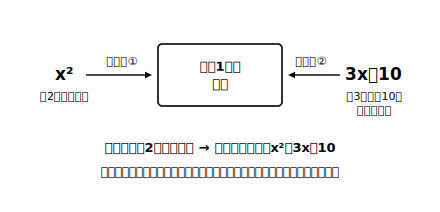
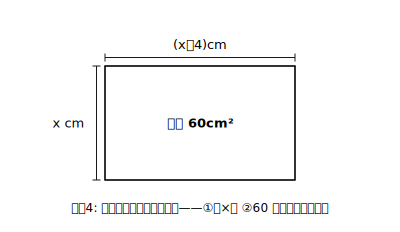

# L07 方程式を「つくる」——二通りに表して等号で結ぶ

## ねらい

- 文章や場面から二次方程式を**つくる**（立式する）技術を、解く技術から切り離して集中的に練習する。
- 立式の核となる型「**ある数量に着目して、それを二通りに表して、等号で結ぶ**」を使えるようになる。

## 主概念1：等号の正体——同じものの、2つの表し方

ここまでの6レッスンで、二次方程式を「解く」道具はそろった。この節のテーマは、その一歩手前、**方程式を自分でつくる**ことだ。解くことよりつくることのほうが難しい、と感じる人は少なくない（筆者の講師としての経験則でも、つまずきが集まりやすいのはつくる側だ）。だからこのレッスンでは、あえて解くのをいったん忘れて、つくる練習だけをする。

まず、方程式とは何だったかに立ち返ろう。等号「＝」で結ばれた式。では、その等号はどこから来るのか。

> **【ことば】立式（りっしき）の型**
> **ある1つの数量に着目し、それを二通りの式（または式と数）で表して、等号で結ぶ。**
> 等号の左右は「別のもの」ではなく、**同じ数量の2つの表し方**である。

例で確かめよう。

> ある正の数を2乗すると、もとの数を3倍して10を加えた数になる。

着目する数量は「計算の結果できる数」。もとの数をxとすると、この数量は

- 1つめの表し方: **x²**（2乗すると、の側から）
- 2つめの表し方: **3x＋10**（3倍して10を加える、の側から）

同じ数量の2つの表し方だから、等号で結べる:

**x²＝3x＋10**

これで方程式は完成だ。解くのは後の練習に回すとして、まず味わってほしいのは、**等号は「答えを出す記号」ではなく「同じものの言いかえを結ぶ記号」だ**ということ。この見方さえあれば、立式は「翻訳」の作業になる。

## 主概念2：練習の第一歩は「式→場面」から

いきなり「場面→式」に挑む前に、逆向きの練習をしよう。**式を見て、場面を語る**練習だ。式を読み取る側の練習のほうが相対的に取り組みやすい傾向があることを参考に、本教材ではこちらを立式の目を養う足場として先に置いている（取り組みやすさには個人差がある。あくまで足場の置き方についての、設計上の判断だ）。

**例2** x(x＋2)＝35 に合う場面を作ってみよう。
左辺は「xと、xより2大きい数の積」。右辺は35。たとえば、こうだ。
「縦がx m、横が縦より2m長い長方形の面積が35m²」
「連続する2つの奇数（小さい方がx）の積が35」
どちらも正解だ。1つの式に合う場面は1つではない。**式は場面の骨組みだけを抜き出したもの**だから、肉付けは何通りもある。

「場面から骨組みを抜く（立式）」と「骨組みに肉を付ける（場面づくり）」の往復ができるようになると、文章題は「未知の敵」ではなく「翻訳の練習問題」になる。

:::zatsudan
立式は、日本語から数学語への翻訳だと思うとよい。翻訳のコツが「単語の対応表を作ること」であるように、立式にも対応表がある。「〜より2大きい」は「＋2」、「積が」は「×」、「〜になった」は等号の合図になっていることが多い。外国語の翻訳と違うのは、数学語の文法が世界共通で、例外がほとんどないと言われること。こんなに律儀な言語は、ほかになかなかないかもしれないね。
:::

## 主概念3：場面→式——手順を型にする

いよいよ本丸。手順を3段階の型にしておこう。

**手順1** 問題文から**数量を抜き出して整理**し、求めたいものを x とおく（「ある数」「1辺の長さ」など）。
**手順2** 1つの数量に着目し、それを**二通りの式（または式と数）で表す**。
**手順3** **等号で結ぶ**。

**例3** 連続する2つの正の整数があり、その積は72である。
手順1: 小さい方の整数をxとおく。大きい方は x＋1。
手順2: 着目する数量は「2数の積」。表し方①: x(x＋1)。表し方②: 72（問題文が直接教えてくれている）。
手順3: 等号で結んで **x(x＋1)＝72**

**例4** 縦がx cm、横が縦より4cm長い長方形の面積が60cm²である。
着目する数量は「面積」。①縦×横で x(x＋4)。②問題文から 60。
**x(x＋4)＝60**

**例5** 正方形の1辺を3cm長くしたら、面積が100cm²になった。
もとの1辺をx cmとおく。着目する数量は「新しい正方形の面積」。①1辺が(x＋3)cmだから (x＋3)²。②問題文から100。
**(x＋3)²＝100**

どの例でも、やっていることは同じだ。**1つの数量・2つの表現・1本の等号**。問題文が長くなっても複雑になっても、探すものはこれだけだ。

:::guide
**等号の隠れ場所——「〜になった」「等しい」「同じ」**

場面→式でつまずくときの多くは、「どの数量を二通りに表せばよいか」が見つからないことによる。探すコツは、問題文の中の**等しさを表す言葉**に印をつけることだ。「〜になった」「〜に等しい」「同じ面積」「合わせて〜」。これらの語の周りに、等号で結ぶべき数量が隠れている。例5なら「面積が100cm²に**なった**」の一文がそれで、「なった」の左側（新しい面積の式）と右側（100）が等号の両辺になる。文章題は全文を一度に式にするのではなく、**等号1本ぶんの一文**を見つけて式にする。
:::

:::guide
**xのおき方——「求めたいもの」が基本、でも例外もある**

手順1の「求めたいものをxとおく」は基本形だが、絶対の規則ではない。例3で「大きい方をxとおく」と、2数は x−1 と x になり、式は x(x−1)＝72。これも正しい立式で、解けば同じ答えに着く（stretchで実際に確かめられる）。選ぶ基準は「**式が簡単になる方**」。慣れてきたら、おき方を変えると式がどう変わるかを試してみるとよい。どうおいても答えが変わらないという体験は、方程式という道具への信頼感を育ててくれる。
:::

## 練習

**A. つくるだけ（解かなくてよい）** 次の場面を二次方程式に表そう。着目した数量（何を二通りに表したか）も一言そえること。

1. 連続する2つの正の整数の積が72である。（小さい方をxとする）
2. ある正の数の2乗は、その数の5倍より24大きい。
3. 縦がx cm、横が縦より4cm長い長方形の面積が60cm²である。
4. 正方形の1辺を3cm長くしたら、面積が100cm²になった。（もとの1辺をx cmとする）
5. 和が14である2つの数があり、その積は45である。（一方をxとする）

**B. 式から場面へ** 二次方程式 x(x−5)＝24 に合う場面を、自分で1つ作ってみよう。

**C. つくって解く** Aの1と4について、方程式を解いて答えを求めよう（答えが問題に合うかの確認は、次のL08でくわしく扱う。ここでは「正の整数」「長さ」という条件に合う解を選べば十分）。

:::stretch
**S1** Aの5「和が14・積が45の2つの数」を、(ア)一方をxとおく式 x(14−x)＝45 と、(イ)もう一方をxとおく式（自分で立ててみよう）の両方で解き、どちらのおき方でも同じ2数（5と9）に着くことを確かめよう。
:::

---

対応解答: answer_key_L05-07.md

<!-- gen_nav:nav:start（自動生成・手編集しない） -->

---

[← 前のレッスン](lesson_06.md)｜[単元の目次](README.md)｜[解答](answer_key_L05-07.md)｜[次のレッスン →](lesson_08.md)

<!-- gen_nav:nav:end -->
