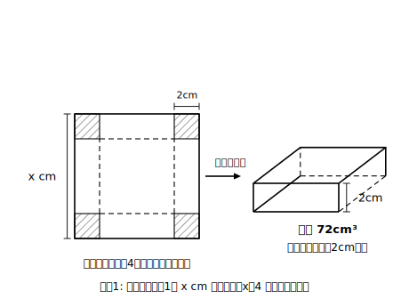

# L09 利用の総仕上げ——図形と数の問題

## ねらい

- 立式（L07）・解法の選択（L06）・解の吟味（L08）を1本につないで、図形や数の問題を解けるようになる。
- 図形の問題では、**式を立てる段階で x の範囲の条件を書き留める**習慣をつける。

## 主概念1：箱の問題——平方根の考えが活用でも効く

**例1** 正方形の厚紙がある。4すみから1辺2cmの正方形を切り取り、点線で折り曲げてふたのない箱を作ったら、容積が72cm³になった。もとの厚紙の1辺の長さを求めよう。

① もとの厚紙の1辺を x cmとおく。4すみから2cmずつ切り取るから、箱の底面は1辺 (x−4)cm の正方形、深さは2cm。ここで**場面からの条件**を先にメモしておく。底面の辺は正の長さだから **x＞4**。

② 着目する数量は「容積」。表し方その1: 底面積×深さ＝2(x−4)²。表し方その2: 72。

③ **2(x−4)²＝72**。さて、解き方を選ぼう。展開したくなるところだが、L06の目安を思い出してほしい——(かたまり)²＝数 の形が目の前にある。**展開したら損**だ。
両辺を2で割って (x−4)²＝36。x−4＝±6。よって x＝10、x＝−2。

④ x＞4 の条件から、x＝−2 は不適。x＝10 を場面に戻すと、底面は1辺6cmで底面積36cm²、容積は 36×2＝72cm³ ✓。**答え 10cm**。

活用の場面でも、解法選択の目は手数を大きく変える。展開して x²−8x−20＝0 としても解けるが、平方根の考えなら3行だ。

**例2** 大きさの異なる2つの正方形があり、1辺の長さの差は3cm、面積の和は89cm²である。2つの正方形の1辺をそれぞれ求めよう。

① 小さい方の1辺を x cm（x＞0）とおくと、大きい方は (x＋3)cm。
② 着目する数量は「面積の和」: x²＋(x＋3)² と 89。
③ x²＋(x＋3)²＝89。展開して x²＋x²＋6x＋9＝89、整理して 2x²＋6x−80＝0。**両辺を2で割って** x²＋3x−40＝0（係数を小さくしてから解くのがコツ）。因数分解して (x＋8)(x−5)＝0。x＝−8、x＝5。
④ x＞0 より x＝5。戻して確かめ: 1辺5cmと8cm、面積の和は 25＋64＝89cm² ✓。**答え 5cmと8cm**。

:::guide
**「x＞4」を先にメモする理由**

例1で、範囲の条件を④まで温存せず①の段階で書いたのには訳がある。図形の問題では、**式より先に場面が x の範囲を決めている**（切り取れるためには1辺が4cmより長くないと箱にならない）。この条件を立式の時点で書き留めておくと、④の吟味が「あらかじめ用意した基準と照合するだけ」の作業になり、不適な解を見落としにくくなる。あとから「え、どっちの解もありそう…」と迷う答案は、範囲のメモを取り損ねたときに出やすい、というのが筆者の講師としての経験則だ。なお、範囲は不等号で書く練習も兼ねる: 底面の1辺なら x−4＞0、切り取りが「1辺2cm**以上**」のような条件なら ≧ を使う。
:::

## 主概念2：数の問題——「まちがえた計算」まで式にできる

**例3** ある正の整数を2乗するつもりが、まちがえて2倍してしまったので、正しい答えより63小さくなった。この整数を求めよう。

① その整数をxとおく（xは正の整数）。
② 着目する数量は「2つの計算結果の差」: x²−2x と 63。
③ x²−2x＝63。整理して x²−2x−63＝0、因数分解して (x−9)(x＋7)＝0。x＝9、x＝−7。
④ xは正の整数だから x＝−7 は不適。x＝9 の検算: 9²＝81、9×2＝18、差は 81−18＝63 ✓。**答え 9**。

「まちがい」さえも数量関係として式にできる。立式の型（1つの数量・2つの表現・1本の等号）の守備範囲の広さを感じてほしい。

:::guide
**整理のひと手間——「係数を小さくしてから解く」**

例2の途中に置いた「両辺を2で割って x²＋3x−40＝0」の1行は、飛ばしても答えは同じだが、飛ばさないほうが得だ。2x²＋6x−80＝0 のまま因数分解や公式に進むと、探す整数の組が大きくなったり、√の中の計算が膨らんだりして、ミスの入り口が増える。文章題では立式直後の式が整っていないことが多いので、「①＝0の形に整理 ②**全部の項に共通の数があれば割って係数を小さくする** ③それから解き方を選ぶ」を通し手順にしておくとよい。②で割ってよいのは**0でない数**だけ。文字xで割ってはいけない理由（L05）とセットで覚えておくと、判断がぶれない。
:::

:::zatsudan
計算が重たい問題に出会ったら、検算には遠慮なく電卓（スマホの標準機能で十分）を使ってよい。この章で鍛えたいのは、立式の目と解法を選ぶ判断、つまり頭の仕事のほうで、指の仕事は道具に任せる場面があっていい。ただし方程式を解く過程そのものは自分の手で。道具に任せてよい部分と任せてはいけない部分の線引きも、学びのうちだ。
:::

## 練習

4ステップ＋「選んだ解き方と理由の一言」＋吟味つきで解こう。

1. 底辺が高さより4cm長い三角形があり、面積は48cm²である。高さと底辺を求めよう。
2. 正方形の厚紙の4すみから1辺3cmの正方形を切り取り、折り曲げてふたのない箱を作ったら、容積が108cm³になった。もとの厚紙の1辺を求めよう。
3. ある正の整数を2乗するつもりが、まちがえて2倍してしまい、正しい答えより63小さくなった。この整数を求めよう。（例3を見ずに、自力で4ステップを再現してみよう）

:::stretch
**S1** 練習1を「高さをxとおく」で解いた人は「底辺をxとおく」で、「底辺をxとおく」で解いた人は「高さをxとおく」で、もう一度解いてみよう。式は変わるのに、三角形は同じものに決まる。xのおき方は答えを変えない（L07 guideの続きの実験だ）。
:::

## 次の章への予告

この章で手に入れた二次方程式は、これで出番終了ではない。次の章は**関数y＝ax²**。そして、そのさらに先の**三平方の定理**の章では、図形の長さを求める場面で二次方程式（特に x²＝数 の形）が道具としてたびたび登場する。「解く」はここで完成、「使う」はむしろこれから本番だ。

---

対応解答: answer_key_L08-10.md

<!-- gen_nav:nav:start（自動生成・手編集しない） -->

---

[← 前のレッスン](lesson_08.md)｜[単元の目次](README.md)｜[解答](answer_key_L08-10.md)｜[次のレッスン →](lesson_10.md)

<!-- gen_nav:nav:end -->
