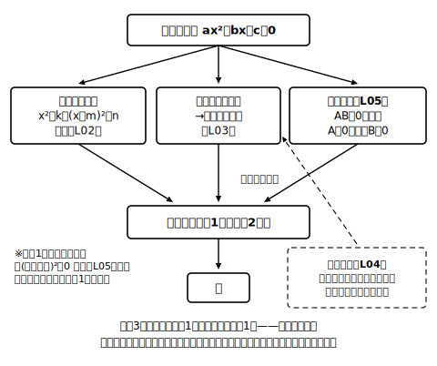

# L10 章末まとめ——「数と式」三年間の到達点

## ねらい

- 3つの解き方が「次数を減らして一元一次方程式に帰着させる」一本の系統であることを、地図として整理する。
- つくる・選ぶ・解く・吟味する、を通しで使う総合演習で章を締めくくる。

## 1. 解き方の地図——ぜんぶ、同じ一手だった

言葉でもたどっておこう。道具は**3つ**だ。

- **①平方根の考え**（L02）: x²＝k や (x＋m)²＝n を、平方根の定義で「かたまり＝±√k」という**一次方程式2本**にほどく。その形になっていない式は、半分の2乗を加えて**平方の形に自分で変形**（L03）してからほどく（変形も①の仲間だ）。
- **②因数分解**（L05）: 積の形＝0 に直して「AB＝0ならばA＝0またはB＝0」で**一次方程式2本**に分ける。
- **③解の公式**（L04）: 「平方の形に変形」を文字係数で一度だけやった結果を使い回す**時短ルート**。中身は①と同じ。

道具は3つ。でも行き先の駅は1つ、**一次方程式**だ。連立方程式が「文字を減らして」一次方程式に帰着させたように、二次方程式は「**次数を減らして**」一次方程式に帰着させる。中学で学んだ方程式はすべて、最後は中1の一次方程式に流れこむ。

## 2. 文章題の型——行きと帰り

- **行き（立式）**: ある数量に着目して、二通りに表して、等号で結ぶ（L07）。
- **中継（解く）**: 解き方を選ぶ。選んだ理由を一言（L06）。
- **帰り（吟味）**: 求めた解を問題に即して解釈し、もとの事象に戻して調べる（L08）。

:::zatsudan
中1の最初、「a＋3」のような文字式に出会ったときのことを覚えているだろうか。あのささやかな一歩から、展開、因数分解、平方根とつないで、二次方程式までたどり着いた。中学の「数と式」の学びは、文字を用いた式の入門から二次方程式に至るまでの、一続きの道になっている。いま解いている1問には、3年ぶんの道具が全部入っている。ちょっとした集大成だ。
:::

## 3. 総合演習

**A. 解く（解き方は自分で選び、理由を一言そえる）**

1. x²−64＝0
2. x²＋x−20＝0
3. 2x²−3x−4＝0
4. (x＋2)²＝18

**B. つくる（解かなくてよい）** 次の場面を二次方程式に表そう。

5. ある正の数xの2乗は、その数の7倍より30大きい。
6. 縦x m、横が縦の2倍より1m長い長方形の花だんの面積が10m²である。

**C. つくって、解いて、吟味する（4ステップ・吟味必須）**

7. 連続する3つの正の整数がある。いちばん小さい数といちばん大きい数の積は、真ん中の数の3倍より3大きい。この3つの整数を求めよう。（真ん中の数をxとおくとよい）

**D. まちがい直し**

8. 次の答案のまちがいを見つけて、正しく直そう。
   「x²＝6x を解く。両辺をxで割って x＝6。」

:::guide
**章末演習の使い方——「できた」の判定基準を上げる**

総合演習は、答えが合っていれば終わり、ではもったいない。この章の到達点は3段階で自己点検できる。
第1段階: 解ける（Aが全問正解）。
第2段階: 選べる・つくれる（Aで理由の一言が書けた／Bで着目した数量が言えた）。
第3段階: 戻れる（Cで吟味を書いてから答えた／Dで「なぜまちがいか」を人に説明できる言葉で書けた）。
第2・第3段階こそ、この章がいちばん鍛えたかった力だ。あやしい段階が見つかったら、対応するレッスン（選ぶ=L06・つくる=L07・戻る=L08）だけ読み直せばよい。全部やり直す必要はない。
:::

:::guide
**この先の風景——二次方程式は「使う道具」になる**

次の章は関数y＝ax²。そして本章の内容は、その先の三平方の定理の章で「長さを求めるための常備道具」として使い続けることになる（特に x²＝数 の形）。逆に言えば、この章の技能があやしいまま進むと、図形の章で方程式の復習を同時にやるはめになる。いまのうちに、Aの4問レベルが迷いなく解ける状態にしておくのが、いちばん安上がりな先行投資だ。
:::

:::stretch
**S1（発展への導線）** ここまで学んだ解の公式は、この章で出会う二次方程式なら**どれでも**解けてしまう、頼れる道具だった。では、三次方程式（x³の項をもつ方程式）にも、そんな公式はあるのだろうか？ 気になる人は「三次方程式 解の公式 あるのか」で調べてみよう。数学の歴史の、かなりドラマチックな一章に出会えるはずだ。また、解の公式の導出をもう一段深く味わいたい人は「二次方程式 解の公式 導出」で検索すると、いろいろな説明の流儀が見つかる。本文の対比表と見比べてみるのもおもしろい。
:::

---

対応解答: answer_key_L08-10.md

<!-- gen_nav:nav:start（自動生成・手編集しない） -->

---

[← 前のレッスン](lesson_09.md)｜[単元の目次](README.md)｜[解答](answer_key_L08-10.md)

<!-- gen_nav:nav:end -->
