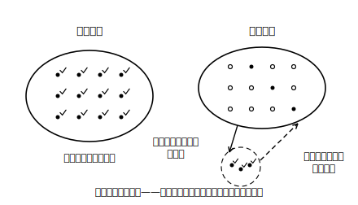

# L01 全部は調べられない——全数調査と標本調査

## ねらい

- **全数調査**と**標本調査**の意味を知り、目的に応じてどちらが適するかを判断できる。
- 「一部だけ調べて、全体について何が言えるか」という、この単元を貫く問いをつかむ。

## 準備運動：道具箱の点検（前提診断）

この章は、中学3年間の「データの活用」の最終章だ。前に学んだ道具がそろっているか、3問で点検してみよう。

1. 1個のさいころを1回投げるとき、3の目が出る確率を求めよう。また「どの目が出ることも同様に確からしい」とはどういう意味か、一言で説明してみよう。
2. 次のデータの中央値・四分位範囲（しぶんいはんい）を求めよう。
   データ: 2, 3, 5, 6, 8, 9, 11, 12
3. あるクラス40人のうち、通学時間が20分未満の生徒は14人だった。20分未満の階級の相対度数を求めよう。

1の確率はL02（無作為抽出）で、2の箱ひげ図の道具はL04（この単元の山場）で、そのまま主役になる。あやしかった人は中2の該当ページに一度戻っておこう。

## 主概念1：全部調べたら、売り物がなくなる

缶詰（かんづめ）工場の品質検査を考えてみよう。中身が基準どおりか確かめるには、缶を開けるしかない。では、出荷する缶詰を**全部**開けて調べたらどうなるだろうか。品質は完全に分かるが、売る物が1つもなくなってしまう。だから工場では、**一部の缶詰だけを開けて調べ、その結果から全体の品質を判断する**。

一方で、学校で行う進路希望調査を考えよう。クラスの一部だけに聞いて「うちのクラスの進路希望はだいたいこうだ」と済ませるわけにはいかない。一人ひとりの進路がそのまま必要な情報だから、**全員を調べる**必要がある。

調べ方には、この2つの型があるのだ。

> **【ことば】全数調査（ぜんすうちょうさ）・標本調査（ひょうほんちょうさ）**
> 対象となる集団の**すべて**について調べることを**全数調査**という。
> 集団の**一部分**を取り出して調べ、その結果から集団全体のようすを推測する調査を**標本調査**という。

国が行う**国勢調査（こくせいちょうさ）** は、国内のすべての世帯を対象とする全数調査の代表例だ。逆に、新聞やテレビの **世論調査（よろんちょうさ）** は、一部の人に質問して社会全体の意見のようすを推測する標本調査である。

## 主概念2：どちらで調べるかを決める目安

全数調査と標本調査は、どちらが偉いというものではない。**目的と事情に合わせて選ぶ**ものだ。判断の目安を2つ挙げよう。

1. **全部調べることに意味があるか、可能か**。缶詰の開封検査のように「調べると対象がこわれる・なくなる」場合や、対象が多すぎて時間や費用がかかりすぎる場合は、全数調査は現実的でない。
2. **一人ひとり（1個1個）の結果そのものが必要か**。進路希望調査のように、全体の傾向ではなく各自の答えが必要な調査は、全数調査でなければ意味がない。

つまり標本調査は「手抜き」ではなく、**全数調査ができない・適さない場面で、一部から全体を賢く推測するための方法**である。

:::guide
**「全数調査の方が常に正確」とは限らない、という視点**

全数調査は理屈のうえでは完全に見えるが、対象が何百万にもなる調査を実際にやり切るのは大変な仕事で、調べもれや回答もれ、集計のミスが入りこむ余地も大きくなる。だからこそ標本調査は、世論調査など規模の大きい調査で使われる方法として紹介される（本文の分類例で見たとおりだ）。「全部調べる＝いつでも最良」と思い込まないことは、この単元の最後（L07・調査を批評する目）につながる大事な感覚だ。ここでは「標本調査は、全数調査の劣化版ではなく独立した方法」とだけつかんでおこう。
:::

:::zatsudan
世論調査は、社会全体の意見を知りたいのに全員には聞かない。缶詰の検査は、品質を知りたいのに全部は開けない。よく考えると不思議な話だが、「全部は調べられない。それでも全体を知りたい」という場面は、世の中のあちこちにある。この「それでも」を数学の力でどこまで支えられるか——それがこの章のテーマだ。
:::

## 一部から全体へ——この章の問い

標本調査には、生まれつきの弱点がある。**調べていない部分については、直接には何も分かっていない**ということだ。それなのに全体について語ろうというのだから、次の問いから逃げられない。

- 一部を**どうやって選べば**、全体の代わりとして信用できるのか（→L02）
- 一部から出した値は、**どのくらいあてになる**のか（→L03・L04）
- 一部の結果から、全体の数量を**どう見積もる**のか（→L05・L06）
- 世の中の調査結果を、**どう読み、どこを疑えばよい**のか（→L07）

この章では、架空の中学校や架空の辞典を舞台にした**実データ風の架空設定**で、これらの問いに順番に答えていく。登場するデータはすべて教材用に作ったものだ。

:::guide
**なぜ「架空データ」と最初に断るのか**

この教材の調査データは、すべて架空である。本物の調査結果を使わないのは、数値の正確さやデータの権利をこの教材が保証できないからだ。そしてこの「出どころを確かめる」という姿勢自体が、実は標本調査の学習内容そのものである。世の中で本物の調査結果を見るときは、誰がどう調べた数値なのかを確かめてから信用する——L07でその練習をする。教材が自分のデータの出どころを明示するのは、その手本のつもりでもある。
:::

## 練習

1. 次の調査は、全数調査と標本調査のどちらが適していると考えられるか。理由を一言そえて答えよう。
   (ア) 国勢調査
   (イ) 缶詰工場で行う、中身の品質の開封検査
   (ウ) 学校で行う進路希望調査
   (エ) ある県の中学生全体の、1日の読書時間の調査
2. 電池工場で、製品の寿命（じゅみょう）を調べる検査を全数調査で行うことには、どんな問題があるか説明しよう。
3. 「標本調査より全数調査の方が、いつでもよい調査だ」という意見に対して、そうとは言えない理由を1つ挙げよう。

:::stretch
**S1** 身のまわりで「標本調査が使われていそうな場面」を1つ挙げ、(a)なぜ全数調査にしないのか、(b)その調査で「全体」にあたるのは何か、を書いてみよう。思いつかないときは「品質検査」「意識調査」などを手がかりに考えてみよう（調べるフレーズ例:「標本調査 身近な例」）。
:::

---

対応解答: answer_key_L01-04.md

<!-- gen_nav:nav:start（自動生成・手編集しない） -->

---

[単元の目次](README.md)｜[解答](answer_key_L01-04.md)｜[次のレッスン →](lesson_02.md)

<!-- gen_nav:nav:end -->
