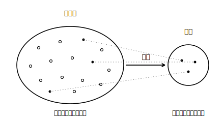

# L02 公平に選ぶ——母集団・標本・無作為抽出

## ねらい

- **母集団**・**標本**・**標本の大きさ**の意味を知り、具体的な調査で言い分けられる。
- **無作為に抽出する**とはどういうことか（個々の要素が取り出される確率が等しい）を、中2の確率と結びつけて理解し、乱数を使った選び方を実行できる。

## 主概念1：調査の登場人物に名前をつける

標本調査を正確に語るために、まず用語をそろえよう。

> **【ことば】母集団（ぼしゅうだん）・標本（ひょうほん）**
> 標本調査で、調べたい対象**全体**の集団を**母集団**という。
> 母集団から取り出された**一部分**を**標本**といい、標本にふくまれるものの個数を**標本の大きさ**という。母集団から標本を取り出すことを、標本を**抽出（ちゅうしゅつ）する**という。

たとえば、架空のみどり市の中学生12,000人の睡眠時間（すいみんじかん）を、400人を選んで調べるとしよう。このとき母集団は「みどり市の中学生12,000人」、標本は「選ばれた400人」、標本の大きさは400である。「400人の調査」と言うだけでは、12,000人について語る調査だということが伝わらない。**何が母集団なのかをいつも意識する**——これが標本調査の読み書きの第一歩だ。

## 主概念2：選び方が悪いと、標本はうそをつく

標本は母集団の「代わり」を務める。では、どう選べば代わりとして信用できるだろうか。まず、まずい選び方から見てみよう。

**例1**: みどり市の中学生の睡眠時間を知りたくて、夜10時に駅前にいた中学生に聞いた。
**例2**: 500ページの本にどんな単語が多いか知りたくて、最初の10ページだけを調べた。

例1は、夜おそくに外にいる人だけが選ばれるから、睡眠時間の短い人にかたよりそうだ。例2は、本の最初の方には前書きや導入が多く、本全体の代表とは言いにくい。どちらも共通する失敗は、**標本の選ばれ方に「くせ」があって、母集団の一部の顔ぶればかりが選ばれる**ことだ。かたよった標本からは、母集団のかたよった姿しか見えない。

そこで、選び方から「くせ」を取り除く。

> **【ことば】無作為（むさくい）に抽出する**
> 母集団のどの要素も、**取り出される確率が等しくなる**ようにかたよりなく標本を取り出すことを、標本を**無作為に抽出する**という（無作為抽出）。

「確率が等しい」という言い方に注目しよう。中2で学んだ「どの目が出ることも同様に確からしい」さいころと同じ考え方だ。誰が選ばれるかは偶然に任せる——ただし、**全員に等しいチャンスがある偶然**に任せる。これが「くじ引きの公平さ」を調査に持ちこむということである。

:::guide
**「わざと選ばない」ではなく「確率が等しい」**

無作為抽出を「適当に選ぶこと」「何も考えずに選ぶこと」と覚えると、あとで足をすくわれる。人間が「適当に」選ぶと、無意識のくせ（目立つ人を選ぶ・近くの人を選ぶ）が入りこんで、確率は等しくならないからだ。定義の核心は気分ではなく**確率**にある。「どの要素が取り出される確率も等しい仕組みを使って選ぶ」。だから次の節のように、さいころや乱数という「くせのない道具」の出番になる。中2の確率が、ここで調査を支える土台として再登場しているわけだ。
:::

## 乱数で選ぶ——無作為抽出のやり方

確率を等しくするには、人間の判断を機械的な偶然に置きかえるのが確実だ。よく使われるのが**乱数（らんすう）**、つまり「どの数字も等しい確率で現れるようにでたらめに並んだ数」である。

架空のみどり中学校の生徒320人から10人を無作為に抽出する手順を示そう。

1. 全校生徒の名簿に001〜320の番号をつける。
2. 乱数を作る。**乱数さい**（0〜9の数字が等しく出るさいころ）を3個使い、百の位・十の位・一の位を決める。コンピュータや電卓の乱数機能で3けたの数を作ってもよい。
3. 出た3けたの数が 001≦番号≦320 ならその番号の生徒を選ぶ。範囲外（000や321〜999）や、すでに選んだ番号が出たら、読み飛ばして次を作る。
4. 10人選べるまでくり返す。

この手順なら、どの生徒が選ばれる確率も等しい。選ぶ人の好みや「くせ」の入りこむすき間がない。

:::guide
**「学年ごとに分けて選びたい」と思った人へ**

「320人からただ10人選ぶより、各学年からバランスよく選ぶ方がかたよらないのでは?」と考えた人は、良いところに目をつけている。「特定の顔ぶれにかたよってほしくない」という、その動機こそが無作為抽出のねらいそのものだからだ。ここで正確におさえておこう。無作為抽出で等しくなるのは、**一人ひとりの生徒が選ばれる確率**である。学年ごとに同じ人数が選ばれることまでは保証されない（たまたまある学年にかたよった10人になることも起こりうる）。それでも「選ぶ人の作為が入りこまない」こと——これが無作為抽出の価値だ。集団の構成をふまえたさらにくふうされた選び方もあるが、中学ではまず「等しい確率で選ぶ」という基本の型をしっかり身につけておこう。この型が、すべてのくふうの土台になる。
:::

:::zatsudan
全数調査の身近な例に、国が行う国勢調査（こくせいちょうさ）がある。日本に住むすべての世帯を対象にする調査だから、国勢調査に「標本」はない。全数調査と標本調査は、ライバルではなく役割分担の関係なのだ。
:::

## 練習

1. 架空のさくら市には中学生が9,000人いる。この中から300人を選んで、平日の家庭学習時間を調べることにした。母集団・標本・標本の大きさをそれぞれ答えよう。
2. みどり中学校の生徒320人の読書量を調べるのに、次の(ア)〜(ウ)の選び方を考えた。無作為抽出といえるものを1つ選ぼう。また、残りの2つはどんなかたよりが心配か、それぞれ一言で書こう。
   (ア) 昼休みに図書室に来ていた生徒10人に聞く
   (イ) 名簿の001〜320に番号をつけ、乱数で10人選ぶ
   (ウ) 3年1組の全員（32人）に聞く
3. 生徒320人（番号001〜320）から5人を無作為に抽出するため、乱数さいで3けたの数を作ったところ、順に次のようになった。
   483, 072, 615, 129, 350, 288, 904, 017, 460, 133
   選ばれる5人の番号を答えよう。
4. 「クラスで一番くわしい友だち5人に聞く方が、乱数で選んだ5人に聞くよりよい調査になる」という意見は、母集団全体のようすを知る目的に対してどんな問題があるか、説明しよう。

:::stretch
**S1** 表計算ソフトや電卓には乱数を作る機能がある。自分の使える道具で「1〜320の整数の乱数」を作る方法を調べて、実際に10個作ってみよう（調べるフレーズ例:「表計算 乱数 整数 作り方」）。同じ操作をもう一度したとき、出てくる10個は前回と同じになるだろうか。
:::

---

対応解答: answer_key_L01-04.md

<!-- gen_nav:nav:start（自動生成・手編集しない） -->

---

[← 前のレッスン](lesson_01.md)｜[単元の目次](README.md)｜[解答](answer_key_L01-04.md)｜[次のレッスン →](lesson_03.md)

<!-- gen_nav:nav:end -->
