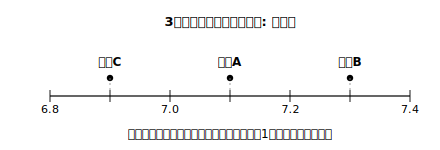

# L03 標本はそのたびに顔が違う——標本平均のばらつき

## ねらい

- 無作為抽出をくり返すと、**標本の平均値が標本ごとに異なる**ことを、架空データの計算で体験する。
- 「1回の標本調査で出た値」と「母集団の本当の値」は別ものだ、という出発点をつかむ。

## 調査の舞台（架空設定）

ここからL04まで、次の**実データ風の架空設定**を舞台にする。数値はすべて教材用に作ったものだ。

> 架空のみどり中学校には生徒が320人いる。保健委員会が、全校生徒の**昨夜の睡眠時間**の**平均値**を知りたい。ただし年度末で時間がなく、全員には聞けない。そこで名簿に001〜320の番号をつけ、乱数で10人を無作為に抽出して調べることにした。

母集団は「みどり中の生徒320人」、標本の大きさは10。L02で学んだ手順そのままの調査だ。

## やってみよう：標本を3回とってみる

保健委員会は、練習のために無作為抽出を3回くり返した。つまり、大きさ10の標本を3組とって、それぞれ昨夜の睡眠時間を聞いた。結果（架空の記録）はこうなった。

**標本A**（単位: 時間）: 6.5, 7.0, 7.0, 7.0, 7.5, 7.5, 7.0, 8.0, 6.5, 7.0

標本Aの平均値を求めてみよう。合計は 71.0 時間だから、

71.0 ÷ 10 ＝ **7.10（時間）**

続いて、残りの2組は自分で計算してみよう。

**標本B**: 7.5, 7.0, 8.0, 7.5, 7.0, 6.5, 7.5, 7.0, 7.5, 7.5
**標本C**: 6.0, 7.0, 7.0, 6.5, 7.5, 7.0, 6.5, 7.0, 7.5, 7.0

（計算結果は練習1で答え合わせをする。先に自分の手で出しておこう。）

計算すると、AとBとCの平均値は**全部ちがう値**になる。どの標本も、同じ母集団から、同じ正しい手順（無作為抽出）でとったのに、である。

## どれが「正しい」のか

ここで、保健委員会は困ってしまった。知りたいのは「全校320人の平均値」という**ただ1つの値**なのに、標本調査の答えが3つも出てきた。どれが正しいのだろう?

答えはこうだ——**どれも「母集団の平均値そのもの」ではない**。それぞれの標本の平均値は、たまたまその10人が選ばれたときの値にすぎない。選ばれる10人が変われば、値も変わる。この「値のゆれ」を、標本の平均値の**ばらつき**という言い方で表そう。

でも、がっかりするのはまだ早い。3つの値はばらばらとはいえ、7時間前後という近い範囲に集まっていた。つまり、**3つの標本の平均値は、たがいに近い値に集まっている**。本当の平均値がこのあたりにありそうだ、という手がかりになる。だとすれば、この「散らばり方」をコントロールできれば、標本調査はもっと頼れる道具になるはずだ。散らばり方をにぎるカギは何か——次のL04で、**標本の大きさ**を変えて確かめる。

:::guide
**「ばらつくから使えない」ではなく「ばらつき方を知って使う」**

このレッスンの内容を「標本調査はあてにならない」と受け取ると、方向を見失う。大事なのは、ばらつくこと自体は無作為抽出の宿命として受け入れたうえで、**ばらつき方には法則性がある**と見抜くことだ。この単元で学ぶ標本調査も、「標本の値はゆれる」ことを前提にした方法である。「1回の調査の値を、ゆるがない真実のように扱わない」——この感覚は、L07で調査結果を批評するときの土台になり、高校の統計の学習にもまっすぐつながっていく。
:::

:::guide
**「もう1回調べたら値が変わった」は失敗ではない**

独習でこの単元を進めるとき、いちばん誤解しやすいのがここだ。計算ドリルでは「答えが毎回変わる」のはミスの印だが、標本調査では**正しくやっても値が変わる**。だから、この単元の「確かめ」の作法も変わる。1つの値が合っているかではなく、「手順が無作為だったか」「値のゆれをふまえた言い方をしているか」を確かめる。答えの検算文化から、手順と言い方の点検文化へ——データの活用領域の総仕上げにふさわしい切りかえだ。
:::

## 練習

1. 本文の標本Bと標本Cの平均値をそれぞれ求めよう（小数第2位まで）。標本Aの平均値7.10もあわせて、3つの値を数直線上に点で表してみよう。
2. 標本A〜Cの結果について、次の(ア)〜(ウ)から**正しいものを1つ**選び、残り2つのどこがまずいかを一言で書こう。
   (ア) 3つの値がちがうのは、抽出の手順のどれかがまちがっていたからだ。
   (イ) 標本の平均値は標本ごとにばらつくものであり、どれも母集団の平均値そのものではない。
   (ウ) 最も大きい値を出した標本が、母集団の平均値に最も近いと判断できる。
3. 別の委員が「3つの標本の平均値をさらに平均すれば、母集団の平均値が**正確に**求められる」と言った。この言い方のどこに問題があるか、「およそ」という言葉を使って指摘しよう。

:::stretch
**S1** 3回の抽出で同じ生徒が重複しなかったとする（もし重複した番号が出たら選び直す約束で抽出したと考える）。このとき標本A・B・Cを合わせると、大きさ30の標本が1つできたとみなせる（30人分のデータ）。この30人分の平均値を求め、A・B・C単独の平均値と比べてみよう。値の位置にどんな印象をもつだろうか。ここで感じたことが、L04のテーマの予告になっている。
:::

---

対応解答: answer_key_L01-04.md

<!-- gen_nav:nav:start（自動生成・手編集しない） -->

---

[← 前のレッスン](lesson_02.md)｜[単元の目次](README.md)｜[解答](answer_key_L01-04.md)｜[次のレッスン →](lesson_04.md)

<!-- gen_nav:nav:end -->
