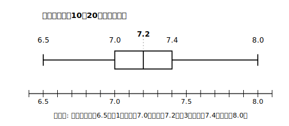
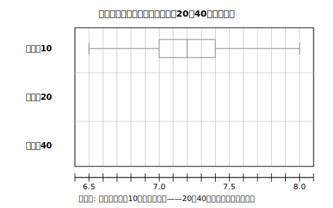

# L04 標本を大きくすると——箱ひげ図でばらつきを見る

## ねらい

- 標本の大きさを10・20・40と変えて標本調査をくり返した記録を、**箱ひげ図**で整理できる。
- 標本の大きさを大きくすると、標本の平均値の**範囲・四分位範囲が小さくなる傾向**があることを、自分の作図から読み取る。
- 同梱の擬似乱数リストと60人の母集団リストを使い、**抽出→観測→整理→推定**の一通りを自分の手で実行する（必須活動）。

## 実験の計画——「くり返しの記録」を箱ひげ図で見る

L03で、標本の平均値は標本ごとにばらつくと分かった。では、そのばらつきの大きさは何で決まるのだろう。あやしいのは**標本の大きさ**だ。10人に聞くのと40人に聞くのとでは、40人の方が母集団に近い気がする。この直感を、実験で確かめてみよう。

保健委員会がコンピュータの乱数を使い、みどり中320人からの無作為抽出をくり返した、という**乱数実験のイメージで作った練習用の記録**を、ここから使う。実際に乱数で生成した値ではなく、傾向がはっきり見えるように教材用に設計した架空の記録である。記録は次の3種類だ。

- 標本の大きさ**10**で抽出→平均値を計算、を**20回**
- 標本の大きさ**20**で抽出→平均値を計算、を**20回**
- 標本の大きさ**40**で抽出→平均値を計算、を**20回**

つまり「標本の平均値」が20個ずつ、3セットある。20個の値の散らばりぐあいを比べるのにぴったりの道具を、私たちは中2で手に入れている。**箱ひげ図**だ。

## まず1セット目——大きさ10の記録を整理する（例）

標本の大きさ10・20回分の平均値の記録を、小さい順に並べるとこうなった（単位: 時間）。

6.5, 6.7, 6.8, 6.9, 7.0, 7.0, 7.1, 7.1, 7.2, 7.2, 7.2, 7.3, 7.3, 7.4, 7.4, 7.4, 7.6, 7.7, 7.8, 8.0

20個のデータだから、中央値は10番目と11番目の平均、第1四分位数は下位10個の中央値（5番目と6番目の平均）、第3四分位数は上位10個の中央値（15番目と16番目の平均）だった（中2の復習）。計算すると、

- 最小値 6.5、最大値 8.0 → **範囲 1.5**
- 中央値 ＝ (7.2＋7.2)÷2 ＝ **7.2**
- 第1四分位数 ＝ (7.0＋7.0)÷2 ＝ 7.0、第3四分位数 ＝ (7.4＋7.4)÷2 ＝ 7.4 → **四分位範囲 0.4**

## やってみよう：大きさ20と40の記録で箱ひげ図をかく

残りの2セットは、記録の順（計算した順）のまま渡す。自分で小さい順に並べかえて、五数（最小値・第1四分位数・中央値・第3四分位数・最大値）を求め、箱ひげ図をかいてみよう。

**標本の大きさ20・20回分の平均値の記録**（単位: 時間）:
7.2, 7.4, 7.1, 7.3, 6.9, 7.5, 7.2, 7.0, 7.4, 7.2, 6.8, 7.3, 7.6, 7.1, 7.2, 7.5, 7.0, 7.4, 7.1, 7.2

**標本の大きさ40・20回分の平均値の記録**（単位: 時間）:
7.2, 7.1, 7.3, 7.2, 7.4, 7.2, 7.0, 7.3, 7.2, 7.1, 7.4, 7.2, 7.3, 7.1, 7.2, 7.0, 7.4, 7.2, 7.1, 7.3

かき終えたら、3本の箱ひげ図を上下に並べてながめてみよう。複数の分布をひと目で比べられるのが箱ひげ図の強みだ。何に気づくだろうか。

## 読み取り——ばらつきは「せまくなる傾向」がある

作図が正しくできていれば、標本の大きさが10→20→40と大きくなるにつれて、**ひげ全体（範囲）も箱（四分位範囲）もせまくなっていく**ようすが見えるはずだ（数値の答え合わせは練習1で）。

つまり——**標本の大きさを大きくすると、標本の平均値のばらつきは小さくなる傾向がある**。

ここで、言葉づかいに1つだけ慎重さを足しておこう。

- 大きさ40の記録の中にも、中央から離れた値は**残っている**（どんな値が残っているかは、練習3で自分の目で確かめよう）。
- だからこれは「大きくすれば必ず正確になる」という**保証**ではなく、くり返しの記録全体をながめたときの**傾向**である。

実は、この架空データの母集団——みどり中320人の睡眠時間の平均値は、教材の設定として**7.2時間**と決めてある。3本の箱ひげ図は、どれも7.2のまわりに散らばりつつ、標本が大きいほど7.2の近くに集まっていた。標本調査は母集団の値をぴたりと当てる道具ではない。しかし標本を大きくすれば、**当たらずとも遠からずの度合いを高くしていける**道具なのだ。

:::guide
**なぜ「範囲・四分位範囲」で語るのか**

ばらつきが小さくなったことを言うのに、この教材は「なんとなく集まってきた」ではなく、範囲と四分位範囲という**中2で学んだ量**で語った。ばらつきは印象で語ると人によって判定が割れるが、量で語れば誰が見ても同じ判定になる。とくに四分位範囲は、はしの1〜2個の極端な値にふり回されにくいので、「記録のまん中の半分（50%）がどれくらいの幅に収まっているか」を安定して表せる。中2の箱ひげ図は、じつはこのレッスンのような「分布どうしの比較」でこそ本領を発揮する道具だった——ここでの再会は偶然ではない。
:::

:::guide
**「20回のくり返し」は誰がやったのか問題**

本文の記録は、乱数実験のイメージで教材用に設計した架空の記録である（実際に乱数で生成した値ではない）。本当は自分の手で20回くり返せれば最高だが、大きさ40の抽出を20回、手作業でやるのは現実的でない。そこで「くり返す部分は機械に任せ、記録の整理と読み取りを人間がやる」という分担にしている。そのかわり、この後の「やってみよう（必須）」では、手で完走できる60人の小さな母集団を用意して、抽出から推定までを自分の手で実行する。手設計の記録で傾向を学んだのだから、今度は自分の手で確かめよう、というわけだ。表計算ソフトが使えるなら、乱数で自分だけのシミュレーション記録を作って同じ整理をしてみると、このレッスンの体験は一段深くなる（調べるフレーズ例:「表計算 乱数 平均 シミュレーション」）。ただし乱数だから、箱ひげ図の細かい形は本文と変わる。**変わってよい**——変わっても「せまくなる傾向」が現れるかを見るのが、この実験の眼目だ。

もう1つ、混同しやすい点を確かめておこう。このレッスンの箱ひげ図が表しているのは、「標本の平均値を20回集めた記録」の散らばりである。1つの標本の中の個々の値の散らばり（L03で見た、10人それぞれの睡眠時間のちらばり）とは別物だし、母集団320人全体の値の散らばりとも別物だ。箱ひげ図を読むときは、「何の値が20個並んでいるのか」をまず確かめよう。
:::

## やってみよう（必須）：自分の手で、抽出から推定まで

ここまで使った記録は、教材が設計したものだった。今度は自分の手で確かめよう。**抽出→観測→整理→推定**の一通りを、さいころもコンピュータもなしで完走できるように、小さな母集団のリストと、抽出に使う擬似乱数（ぎじらんすう）のリスト（このレッスン末尾の付録・50個）を教材に同梱してある。

> 架空のひばり台中学校には、1年生が60人いる。60人全員の「昨夜の睡眠時間」の記録（架空・番号01〜60）を下の表にのせた。この60人を母集団として、大きさ10の標本調査を自分の手で2回行い、2つの標本の平均値を比べてみよう。

母集団が表として丸ごと見えているのは、練習用の特別な舞台である（ふつうの標本調査では、母集団全体は見えないから調査をする）。おかげで、あとから全数調査をして答え合わせができる。

**ひばり台中1年60人の昨夜の睡眠時間**（単位: 時間・すべて架空）:

| 番号 | 時間 | 番号 | 時間 | 番号 | 時間 | 番号 | 時間 | 番号 | 時間 | 番号 | 時間 |
|---|---|---|---|---|---|---|---|---|---|---|---|
| 01 | 8.0 | 02 | 8.0 | 03 | 7.0 | 04 | 7.5 | 05 | 7.5 | 06 | 6.0 |
| 07 | 8.5 | 08 | 7.0 | 09 | 7.0 | 10 | 7.0 | 11 | 7.0 | 12 | 7.5 |
| 13 | 7.0 | 14 | 6.0 | 15 | 6.0 | 16 | 6.0 | 17 | 7.5 | 18 | 7.0 |
| 19 | 7.0 | 20 | 7.0 | 21 | 7.0 | 22 | 8.0 | 23 | 7.5 | 24 | 7.0 |
| 25 | 6.5 | 26 | 6.5 | 27 | 8.0 | 28 | 7.5 | 29 | 6.5 | 30 | 6.5 |
| 31 | 6.5 | 32 | 7.0 | 33 | 6.0 | 34 | 6.5 | 35 | 7.5 | 36 | 7.0 |
| 37 | 7.5 | 38 | 7.0 | 39 | 7.5 | 40 | 7.0 | 41 | 5.5 | 42 | 6.0 |
| 43 | 7.5 | 44 | 7.5 | 45 | 6.5 | 46 | 5.5 | 47 | 7.5 | 48 | 8.0 |
| 49 | 7.0 | 50 | 6.5 | 51 | 7.0 | 52 | 7.5 | 53 | 6.5 | 54 | 7.0 |
| 55 | 6.5 | 56 | 8.0 | 57 | 6.0 | 58 | 6.5 | 59 | 7.0 | 60 | 8.5 |

手順は次のとおり。L02で学んだ乱数の読み方を、そのまま実行する。

1. 【抽出】付録の擬似乱数リストを、**左上から右へ、行の終わりで次の行へ**の順に読む。**01〜60**が出たら、その番号の生徒を選ぶ。**00と61〜99は読み飛ばす**。同じ標本の中で同じ番号が2回出たら、2回目は読み飛ばす。10人選べたら、1組目の標本の完成。
2. 【観測】選んだ10人の番号を母集団リストで引き、昨夜の睡眠時間を書き出す。
3. 【整理】10人の合計を出し、合計÷10で標本の平均値を求める（検算: 平均値×10が合計に戻るか）。
4. 【推定】結果を「ひばり台中1年60人の昨夜の睡眠時間の平均値は、**およそ□時間**と考えられる」の形で書く（この「およそ」を付けた言い方は、次のL05でくわしく身につける）。
5. 【もう1回】乱数リストの**続き**から、2組目の標本10人を同じ手順で抽出し、平均値を求める。1組目に選ばれた番号が2組目にまた出るのはかまわない（別の抽出だから）。2組目の中で重複したときだけ読み飛ばす。
6. 【比べる】2つの標本の平均値を並べる。値がちがっても失敗ではない（L03）。ちがうのに、たがいに近い値になっただろうか。仕上げに60人全員の記録で全数調査の平均値を求めて（または解答編で確かめて）、2つの標本平均が本当の値の近くに来ていたかを見よう。

さいころやコンピュータの乱数を使ってもよい。その場合、選ばれる10人も平均値も付属リストのときとは変わる。**変わってよい**。この活動の答え合わせは「値が資料と一致するか」ではなく、「手順が正しく実行できたか」で行う（チェックリストを解答編に用意した）。

## 練習

1. 本文の「大きさ20」「大きさ40」の記録について、それぞれ最小値・最大値・範囲・中央値・四分位範囲を求め、箱ひげ図を完成させよう。
2. 練習1の結果を、本文の「大きさ10」の値（範囲1.5・四分位範囲0.4）と表に並べ、標本の大きさとばらつきの関係を「傾向」という言葉を使って1文で書こう。
3. 「標本の大きさを40にすれば、標本の平均値は母集団の平均値と**必ず**ほぼ一致する」という言い方は、どこが行きすぎか。大きさ40の記録の中の具体的な値を1つ挙げて指摘しよう。
4. 標本の大きさを大きくすると、ばらつきが小さくなる一方で、失われるものもある。標本調査で標本を大きくすることの「代償」を1つ挙げよう（ヒント: そもそもなぜ全数調査をしなかったのだろう）。

:::stretch
**S1** 大きさ10の記録（20個）のうち、7.0以上7.4以下の値は何個あるか数えよう。大きさ40の記録では何個か。「中央値のまわり±0.2時間に収まった回数の割合」という見方で、2つの記録を比べて一言でまとめてみよう。
:::

## 付録：擬似乱数リスト（「やってみよう（必須）」用・50個）

教材用にコンピュータで生成した擬似乱数のリスト（00〜99の2けた・50個）。どの2けたの数も等しい確率で現れるように作った列を、そのまま印刷してある。乱数さいやコンピュータが手元になくても、このリストだけで無作為抽出を実行できる。読む向きは左上から右へ、行の終わりで次の行へ。

**1行目**: 57, 62, 38, 25, 47, 72, 20, 43, 18, 51
**2行目**: 69, 91, 49, 43, 51, 60, 00, 46, 69, 66
**3行目**: 09, 12, 02, 95, 82, 58, 14, 92, 85, 28
**4行目**: 81, 67, 42, 43, 87, 83, 17, 52, 13, 84
**5行目**: 35, 33, 15, 51, 45, 62, 99, 73, 41, 07

（手順どおりに読むと、1〜2組目の抽出で37個を使い、残りは13個。この残りは、読みまちがえた数個をやり直すための予備である。新しい標本10人を最初から作り直すには足りないので、3組目に挑戦したいときは、自分でさいころや別の乱数を使おう。）

---

対応解答: answer_key_L01-04.md

<!-- gen_nav:nav:start（自動生成・手編集しない） -->

---

[← 前のレッスン](lesson_03.md)｜[単元の目次](README.md)｜[解答](answer_key_L01-04.md)｜[次のレッスン →](lesson_05.md)

<!-- gen_nav:nav:end -->
