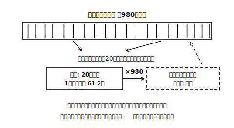

# L05 平均から全体を見積もる——平均値×総数型

## ねらい

- 標本の平均値を使って、母集団全体の数量を「**標本の平均値×総数**」で推定できる。
- 推定の答えを断定せず、「**およそ**」を付けた言い方で表す様式を身につける。

## 問題——辞典の見出し語は全部で何語?

> 架空の「みどり英和辞典」は全980ページ。この辞典に、見出し語（見出しとしてのっている単語）は全部で**およそ何語**あるだろうか。

全数調査なら、980ページ全部の見出し語を数えることになる。できなくはないが、気の遠くなる作業だ。そこで標本調査の出番である。ここまでの道具立てを、そのまま使おう。

1. **母集団を決める**: 辞典の全980ページ。
2. **無作為に抽出する**: 各ページに001〜980の番号がついているとみなし、乱数さいやコンピュータの乱数で3けたの数を作る。001≦番号≦980 ならそのページを選ぶ（範囲外と重複は読み飛ばす）。これを20ページ分くり返す。
3. **標本を調べる**: 選ばれた20ページの見出し語数を数える。

「最初の20ページを調べる」ではだめなのか?——だめだった（L02）。辞典の最初の方はAで始まる語が並ぶ特定の区画で、ページの作りにくせがあるかもしれない。**980ページのどのページも等しい確率で選ぶ**から、標本は辞典全体の代表になれる。

## 標本から全体へ——かけ算ひとつの推定

乱数で選んだ20ページの見出し語数は、次のようになった（架空の記録）。

58, 63, 60, 59, 65, 62, 57, 64, 61, 60, 63, 58, 62, 66, 59, 61, 60, 64, 57, 65

合計は 1224 語。標本の平均値は、

1224 ÷ 20 ＝ **61.2（語/ページ）**

この61.2を「1ページあたりの見出し語数の見積もり」として採用すると、980ページ全体では、

61.2 × 980 ＝ **59976（語）**

つまり、みどり英和辞典の見出し語は**およそ60000語**と推定できる。

## 「およそ」を落とさない——答えの言い方の様式

答えの書き方に注目してほしい。「59976語**である**」ではなく「**およそ60000語と推定できる**」と書いた。この言い方には、2つの理由がある。

1. **標本の平均値はばらつく**（L03〜L04）。別の20ページを引き直せば、61.2は別の値になり、推定値も動く。59976という桁までの数字に、そこまでの精度はない。
2. そもそも標本調査では、**母集団についての確定的な判断は困難**である。標本調査の結論は、原理的に「見積もり」の身分を出ない。

だからこの単元では、次を答えの様式として固定する。

> **推定の答えは、「およそ〜」「〜と推定される」の形で書く。**

計算の途中は正確に、答えの言い方は控えめに。このバランスが、標本調査の「正しい強さ」だ。

:::guide
**どこまで丸めるかに、唯一の正解はない**

「およそ60000語」と書いたのは、59976という値が**一の位まで信用できる値ではない**ので、大きく丸めたからだ（「およそ6万語」でもよい）。大切なのは、推定のもとになった61.2がそこまでの精度を持たないと自覚して、それに見合う粗さで答えることだ。逆にいちばんまずいのは、電卓の表示をそのまま写して「59976語である」と断定すること——計算は合っているのに、値の身分をまちがえている。数値の精度と言い方の精度をそろえる感覚は、高校以降の統計でも、理科の測定でも、一生ものの道具になる。なお、推定がどれくらい確からしいかを数で表す方法は、高校以降で学ぶ（調べるフレーズ例:「標本調査 誤差」）。
:::

:::guide
**この推定が成り立つための、かくれた前提**

「平均×総数」のかけ算が全体の見積もりとして通用するのは、**標本の平均値が母集団の平均値の近くにいる見込みが高い**（L04で観察した性質）からだ。そしてその性質は、**無作為抽出だから**成り立つのだった。もし「見出し語が多そうなページばかり」を選んでいたら、平均61.2は大きい方へかたより、かけ算の結果もまるごとかたよる。推定の式はかけ算ひとつでも、その足元にはこの単元の全部が積まれている——「式だけ覚える」のがもったいない理由である。
:::

:::zatsudan
「辞典の語数を乱数で見積もる」というこの活動、実は指導要領の解説に英和辞典の例としてのっている実験だ。辞典という、動かない・全ページ番号つき・いつでも数え直せる母集団は、標本調査の練習台として理想的なのだ。手元に紙の辞典がある人は、10ページだけの小さな標本で試してみると、「本当に数えられる」という手ごたえが得られる。
:::

## 練習

1. 本文の推定について、次の検算をしよう。
   (1) 20ページの見出し語数の合計が1224語になることを確かめよう。
   (2) 標本の平均値が61.2語、推定値が59976語になることを確かめ、答えを「およそ」を使った形で書こう。
2. 架空のあおば果樹園には、りんごの木が500本ある。無作為に選んだ8本の収穫（しゅうかく）個数は次のとおりだった。
   82, 78, 85, 80, 74, 88, 79, 86（個）
   果樹園全体の収穫個数を推定し、「およそ」を使った形で答えよう。
3. 見出し語数の調査で、「絵や図の多い、にぎやかなページを選んで数えた」としたら、推定値はどちらの向きにかたよると考えられるか。理由とともに答えよう（このページ選びで見出し語数が多くなるか少なくなるかも、考えの中で決めること）。
4. 「標本の平均値が61.2だったのだから、母集団の平均値もぴったり61.2だ」という主張の問題点を、L03〜L04で学んだことを使って1〜2文で説明しよう。

:::stretch
**S1** 問題2で、もし標本が「果樹園の入り口に近い8本」だったら、どんなかたよりがありうるか想像して書いてみよう（正解は1つではない。日当たり・世話のされ方など、木の並びと収穫個数が関係しそうな理由を自分で設定してよい）。
:::

---

対応解答: answer_key_L05-07.md

<!-- gen_nav:nav:start（自動生成・手編集しない） -->

---

[← 前のレッスン](lesson_04.md)｜[単元の目次](README.md)｜[解答](answer_key_L05-07.md)｜[次のレッスン →](lesson_06.md)

<!-- gen_nav:nav:end -->
