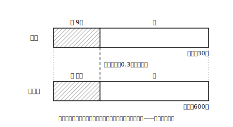

# L06 割合から全体を見積もる——比例配分型

## ねらい

- 標本にふくまれる割合を使って、母集団の中の数量を「**母集団の総数×標本の割合**」で推定できる（比例配分）。
- 推定値を母集団に戻して割合を確かめる**検算の型**を身につける。
- 「しるしをつけて放す」型の問題（標識再捕獲）を、慣用の型として解ける。

## 問題——袋の中の赤玉は何個?

> 袋の中に、赤玉と白玉が合わせて**600個**入っている（架空設定）。よくかき混ぜて30個を無作為に取り出したところ、赤玉が9個ふくまれていた。玉を袋にもどすとき、袋の中の赤玉の個数はおよそ何個と推定できるだろうか。

L05は「平均値」を標本から借りてきた。今回は「**割合**」を借りる。標本30個のうち赤玉は9個だから、標本にふくまれる赤玉の割合は、

9 ÷ 30 ＝ 0.3

標本は無作為に取り出したのだから、母集団（袋の中の600個）でも赤玉の割合はこれと**同じくらい**だとみなせる。そこで、

600 × 0.3 ＝ 180

袋の中の赤玉は**およそ180個**と推定できる。母集団の総数600を、標本で観察した割合0.3で「配分」したわけだ。この型を**比例配分型**の推定と呼んでおこう（呼び名は整理用で、式の中身は「総数×割合」である）。

## 検算の型——推定したら、割合を戻して確かめる

推定は「およそ」の世界の話だが、**計算そのものはきちんと検算できる**。型はこうだ。

> 推定値を母集団に戻して割合を計算し、標本の割合と一致するか確かめる。

さっきの例なら、180 ÷ 600 ＝ 0.3。標本の割合 9÷30＝0.3 と一致した。かけ算の向きをまちがえたり、割合の分母を取りちがえたりすると、ここが合わなくなる。**推定の不確かさ**（標本がゆれる話）と**計算の正しさ**（検算できる話）は別ものだ——「およそ」と言うからといって、計算まで「だいたい」にしない。

## よくある問題の型——しるしをつけて放す（標識再捕獲）

比例配分の考えを使う有名な応用に、こんな問題がある。

> 架空の池にコイがたくさんいる。全部で何匹いるかを調べるため、まず**60匹**をつかまえて全部にしるしをつけ、池にもどした。数日後、コイがじゅうぶん混ざったころに**50匹**をつかまえたところ、しるしのついたコイが**4匹**いた。池のコイの総数を推定してみよう。

池全体のコイの数を x 匹とする。池全体でしるしのついたコイの割合は 60/x。2回目につかまえた50匹を「池からの無作為な標本」とみなせば、標本の中のしるしの割合 4/50 は、池全体の割合と同じくらいのはずだ。そこで、

60/x ＝ 4/50

これを解くと 4x ＝ 3000、x ＝ 750。池のコイは**およそ750匹**と推定できる。

（検算: コイが750匹なら、しるし入りの割合は 60÷750＝0.08。標本の割合 4÷50＝0.08 と一致する。）

この型は**標識再捕獲（ひょうしきさいほかく）** と呼ばれる、よくある問題の型だ。ただし「標識」「再捕獲」は教材の世界の慣用的な呼び名で、指導要領・解説に出てくる用語ではない。覚えるべきは名前ではなく、**「しるしの割合が、池全体と標本とで同じくらいとみなせる」という比例配分の考え**の方だ。

式を立てるときのよくある誤りは、**比例式の項の対応をまちがえる**こと（例: 60/x と 50/4 を等しいと置いてしまう）。「**分子はどちらも“しるしつき”、分母はどちらも“全体”**」と、そろえる相手を言葉で確認してから等号で結ぼう。

:::guide
**この推定の前提を、あえて疑ってみる**

コイの問題には、口に出していない前提がいくつも積んである。しるしをつけたコイが池全体に**よく混ざる**こと。しるしが数日で**取れたり消えたりしない**こと。しるしのせいでつかまえやすさが**変わらない**こと。調査のあいだに池のコイが**増えたり減ったりしない**こと。どれか1つでも大きくくずれると、「割合が同じくらい」というみなしがくずれ、推定はかたよる。教科書の問題ではこれらの前提が成り立つ設定で出題されるが、**現実の調査では前提の点検こそが仕事の本体**になる。この「前提を数え上げる目」は、次のL07の主役だ。
:::

:::guide
**L05の型とL06の型——どう使い分けるか**

平均値×総数型（L05）は、1つ1つの要素が**量**（見出し語数・収穫個数）を持っていて、その合計を知りたいときの型。比例配分型（L06）は、要素が**種類**（赤か白か・自転車通学か否か・しるしの有無）で分かれていて、ある種類の個数を知りたいときの型だ。どちらも心臓部は同じで、「無作為な標本で観察した値（平均値・割合）は、母集団でも同じくらいのはず」というひとつのみなしである。問題文を読んだら、まず「知りたいのは量の合計か、種類の個数か」を確かめると、型選びで迷わない。
:::

## 練習

1. みどり中学校の全校生徒480人（架空設定）から60人を無作為に抽出して通学方法を聞いたところ、自転車通学の生徒が21人いた。全校の自転車通学の生徒の人数を推定し、「およそ」を使った形で答えよう。また、推定値を480人に戻して割合の検算をしよう。
2. 架空の工場で作った製品25000個から300個を無作為に抽出して検査したところ、不良品が6個見つかった。製品全体にふくまれる不良品の個数を推定しよう（検算もつけること）。
3. 架空の湖で魚を90匹つかまえてしるしをつけてもどし、後日60匹をつかまえたところ、しるしのついた魚が5匹いた。湖の魚の総数を推定しよう。比例式を立てるとき、「分子どうし・分母どうしが何をそろえているか」を一言そえること。
4. コイの問題（本文）で、しるしをつけたコイが池のすみの一角に集まったまま、よく混ざっていなかったとする。2回目の捕獲をそのすみの近くで行った場合、推定値は本当の総数より大きくなりやすいか、小さくなりやすいか。理由とともに答えよう。

:::stretch
**S1** 問題3の調査で、「後日つかまえる数」を60匹から120匹に増やしたとする。L04で学んだことをふまえると、推定のどんな点が改善すると期待できるか。また、それでも「総数がぴたりと分かる」とは言えない理由を1文で書こう。
:::

---

対応解答: answer_key_L05-07.md

<!-- gen_nav:nav:start（自動生成・手編集しない） -->

---

[← 前のレッスン](lesson_05.md)｜[単元の目次](README.md)｜[解答](answer_key_L05-07.md)｜[次のレッスン →](lesson_07.md)

<!-- gen_nav:nav:end -->
