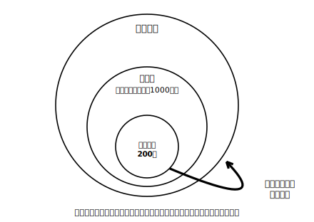

# L07 調査を批評する——結果を疑い、言い方を選ぶ

## ねらい

- 調査の結果を、**母集団の想定・抽出方法・回答率**（＋質問のしかた・実施方法）の観点から批判的に検討できる。
- 調査結果の報告文を、断定を避けた適切な言い方に直せる。自分で調査を設計するとき、批評の観点を裏返して使える。

## 題材——この調査、信じてよい?

次の架空の記事を読んでみよう（登場する調査・数値はすべて教材用の架空設定である）。

> **「市民の9割が図書館の増設を希望」**
> みどり市立図書館が、来館者に配ったアンケートの結果を発表した。配布数は1000枚、回収は200枚。「不便な思いをしなくてすむよう、便利な図書館がもっと増えるとよいと思いませんか」という質問に、回答者の90%が「そう思う」と答えた。図書館は「**市民の9割**が増設を希望している」とまとめている。

割合の計算だけを見れば、200枚の90%＝180枚で、まちがってはいない。それでも、この「市民の9割」というまとめには、立ち止まって考えたくなる点がいくつもある。この単元で身につけた道具で、順番に点検してみよう。

## 批評の観点——3つ＋2つ

**観点1: 母集団の想定はずれていないか。** 結論は「**市民**の9割」と言っている。つまり母集団はみどり市民全体のはずだ。ところがアンケートを受け取ったのは**図書館の来館者**だけ。図書館をよく使う人は、図書館への関心も期待も市民全体より高めだろう。母集団（市民全体）と、標本が実際に取り出された集団（来館者）が、最初からずれている。

**観点2: 抽出方法は無作為か。** 来館者への手渡しは、市民全体から見れば「図書室に来た人に聞く」（L02の失敗例）と同じ型のかたよった抽出である。等しい確率で選ばれていない。

**観点3: 回答率は十分か。** 1000枚配って回収は200枚、回答率20%だ。答えてくれた200人は、答えなかった800人と同じ意見だろうか。わざわざ答えを返す人は、図書館への関心がとくに強い人かもしれない。**「答えなかった人」の存在も、結果をゆがめる**。

**観点4: 質問文が答えを誘導していないか。** 「不便な思いをしなくてすむよう、便利な図書館がもっと増えるとよいと思いませんか」という質問文は、「不便」「便利」という言葉で答えの方向をあらかじめ示し、「思いませんか」と同意をさそう形になっている。中立に聞くなら、たとえば「図書館の数について、あなたの考えに近いものを選んでください（増やすべきだ／今のままでよい／減らしてよい／分からない）」のような形が考えられる。

**観点5: 実施方法は答えやすかったか。** 記名式か無記名式か、その場で職員に手渡す形か、あとで投かんできる形か。「誰にどう見られるか」は、正直な回答のしやすさを変える。

まとめよう。この記事の計算は合っている。しかし **「回答者200人の9割」を「市民の9割」と言いかえたところ**に、母集団のすりかえという最大の飛躍がある。数字は、計算よりも「何の数字か」でうそをつくのだ。

## 言い方を選ぶ——断定を避ける技術

観点の点検と並ぶもう1つの批評の道具が、**言い方の点検**だ。標本調査では、母集団についての確定的な判断は困難である（L05）。だから、報告の文も次のように選ぶ。

- 「市民の9割が増設を希望している」→ 「**回答した来館者200人のうち**9割が増設を希望した。市民全体のようすは、この調査からは分からない」
- 「全校生徒の平均睡眠時間は7.2時間**である**」→ 「全校生徒の平均睡眠時間は**およそ**7.2時間**と推定される**」

事実として言えるのは「標本で何が観察されたか」まで。母集団については「推定される」「〜と考えられる」と一段やわらげ、調査の設計に不安があるなら、そのことも書きそえる。**強い言い方は、強い設計にだけ許される**——これがデータの活用3年間の、言葉の側の結論だ。

:::guide
**批評の観点は、設計の観点を裏返したもの**

このレッスンの5つの観点は、他人の調査のあら探しのための表ではない。裏返せば、そのまま**自分が調査を設計するときの点検表**になる。①結論で語りたい母集団を先に決める ②その母集団から等しい確率で標本を取り出す方法を用意する ③回答率を上げるくふう（答えやすい形式・短い質問）をする ④質問文を中立に書く ⑤答えやすい実施方法を選ぶ。批評ができる人と設計ができる人は、同じ観点を反対側から使っているだけである。練習5で、実際に裏返しを体験してみよう。
:::

:::guide
**「計算が合っている」と「結論が正しい」のあいだ**

この単元の最後に、一段引いた視点を置いておこう。L05・L06の推定では「計算の検算」を型にした。このL07では「設計と言い方の点検」を型にした。この2つは別の階層の点検だ。計算が完ぺきでも、標本がかたよっていれば結論はゆがむ。設計が完ぺきでも、計算をまちがえれば数字はうそになる。数学のテストでは前者ばかりが問われるが、世の中で出会う「統計にだまされる」場面の多くは、後者ではなく前者——**正しい計算に包まれた、かたよった設計**である。両方の点検を身につけたことが、この単元の到達点だ。
:::

:::zatsudan
「もっと知りたい人へ」の予告をひとつ。この単元では、推定の答えを「およそ」としか言えなかった。この「およそ」がどれくらいの幅なのかを、もっと精密に評価する方法を、高校の数学で学ぶことになる。中学で体験した「標本を大きくするとばらつきが小さくなる傾向」は、そこで理論の言葉を手に入れて、調査の設計を支える本物の道具になる。楽しみにしていてほしい。
:::

## 練習

1. 「みどり市の中学生のスマートフォン利用時間を知りたい」という調査で、**駅前で声をかけた買い物中の大人100人**に質問した（架空設定）。この調査の最大の問題点を、「母集団」という言葉を使って指摘しよう。
2. 本文の図書館アンケートについて、観点1〜5のうちから3つを選び、それぞれ「問題点→自分ならこう直す」の形で1行ずつ書こう。
3. 次の質問文は、回答をある方向に誘導するおそれがある。中立な質問文に書き直そう。
   「授業もよく分かるようになると評判の朝読書を、わが校でも始めるべきだと思いませんか」
4. ある調査報告の結論「この結果から、みどり中の生徒の平均読書時間は週3.5時間**である**ことが分かった」を、標本調査の結論としてふさわしい言い方に直そう。
5. **設計の記述（この単元の仕上げ）**: 「自分の学校の生徒全体が、平日にどれくらい家庭学習をしているか」を標本調査で調べる計画を、実施はせずに**紙の上で設計**しよう。次の項目を埋める形で書けばよい。
   (1) 母集団　(2) 標本の大きさと、そう決めた理由　(3) 無作為に抽出する具体的な手順　(4) 質問文（中立な形で）　(5) 結果を報告するときの文の形（断定を避けた例文を1つ）
   書き終えたら、観点1〜5で自分の設計を自己点検しよう。AIチャットが使えるなら、壁打ち相手になってもらうのもよい（プロンプト例:「中学3年生です。標本調査の学習で、次の調査計画を作りました。母集団の想定・抽出方法・回答率・質問文の中立さ・実施方法の5つの観点で、弱点を指摘してください。［自分の設計を貼る］」——実在の人の名前や個人情報は貼らないこと）。

:::stretch
**S1** 「回答率が低くても、回収できた分が無作為抽出になっていれば問題ない」という意見について考えてみよう。回答する・しないを**回答者自身が決めている**ことは、「等しい確率で選ばれる」という無作為抽出の条件とどう衝突するだろうか。自分の言葉で説明してみよう。
:::

---

対応解答: answer_key_L05-07.md

<!-- gen_nav:nav:start（自動生成・手編集しない） -->

---

[← 前のレッスン](lesson_06.md)｜[単元の目次](README.md)｜[解答](answer_key_L05-07.md)

<!-- gen_nav:nav:end -->
