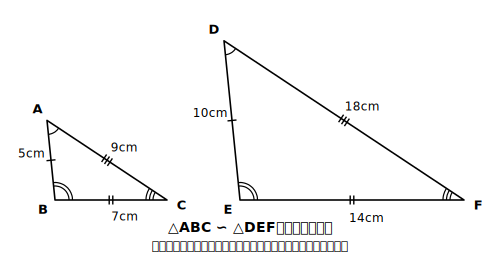

# L01 相似の意味と記号∽

## ねらい

- 「形が同じ」とはどういうことかを、小6の縮図・拡大図の経験を足場に、数学の言葉で言い直せるようになる。
- 記号∽を使って相似を表し、**対応の順序**を守って書けるようになる。

## 導入：形が同じって、どういうこと？

小学6年生のとき、縮図や拡大図をかいたのを覚えているだろうか？ あのとき「形が同じで大きさがちがう図形」を扱った。中学3年ではこれをもう一歩はっきりさせる。

中2で学んだ**合同**は「ぴったり重なる」だった。では、大きさがちがっても「形が同じ」は、どう言えばよいだろう？

## 主概念1：相似の意味

一方の図形を**拡大または縮小**したとき、他方の図形と**合同**になる——このとき、2つの図形は**相似**であるという。

合同の考えを知っているからこそ、この定義が使える。「移動で重なる」が合同、「拡大・縮小してから重ねると合同」が相似。つまり相似は、合同を含んだ一回り大きい仲間分けだ（拡大率1倍なら合同そのもの！）。

相似な図形では、次の2つが成り立つ。

- **対応する線分の比は、すべて等しい。**
- **対応する角は、それぞれ等しい。**

逆に、この2つが成り立っていれば、2つの図形は相似だといえる。角がそっくりのまま、辺だけが同じ割合で伸び縮みする——これが「形が同じ」の正体だ。

:::guide
**相似の定義が「拡大・縮小」から始まる理由**

実は相似には、見方が複数ある。①「拡大または縮小したときに合同になる」、②「対応する線分の比がすべて等しく、対応する角がそれぞれ等しい」、そして「1つの点から見通した位置関係」で捉える見方（相似の位置。このレッスンのstretchで登場する）だ。このレッスンが①から入るのには理由がある。①は小6の縮図・拡大図の経験にそのままつながるうえ、三角形だけでなく円のような曲線の図形にも使えるからだ。一方②は、この先の証明で「相似が示せたあとに辺の比や角の相等を導く根拠」として主役になる。①でイメージをつかみ、②を道具として持つ。2つの見方を行き来できることが、この単元の土台になる。
:::

## 主概念2：記号∽と対応の順序

△ABCと△DEFが相似であることを、記号∽を使って

**△ABC ∽ △DEF**

と書く。このとき、**対応する頂点を同じ順に**書く約束がある。A↔D、B↔E、C↔Fが対応しているなら、この順で書く。合同の記号≡のときと同じ約束だ。「どの頂点とどの頂点が対応しているか」が記号の並びだけで読み取れる。この約束が、あとで辺の長さを求めるときの命綱になる。

## 例題1

四角形ABCDと四角形EFGHについて、次のことが分かっている。

- AB=3cm、BC=4cm、CD=5cm、DA=6cm
- EF=4.5cm、FG=6cm、GH=7.5cm、HE=9cm
- 対応する角はそれぞれ等しい（∠A=∠E、∠B=∠F、∠C=∠G、∠D=∠H）

2つの四角形は相似といえるか？

**考え方**: 対応する辺の比を全部調べる。
AB:EF=3:4.5=2:3、BC:FG=4:6=2:3、CD:GH=5:7.5=2:3、DA:HE=6:9=2:3。
対応する線分の比がすべて2:3で等しく、対応する角もそれぞれ等しい。→ **相似といえる**。四角形ABCD∽四角形EFGHと書く。

:::guide
**「対角線は調べなくていいの？」と細部が気になる人への補足**

定義②の「対応する線分の比がすべて等しい」を文字どおりに読むと、辺だけでなく対角線のような線分まで含んでいるように見える。「4組の辺しか調べていないのに、相似と言い切ってよいのか」と疑えたら、とても良い着眼だ。安心してほしい。四角形の形は、対応する4組の辺の比と4組の角の相等で完全に決まる。この2つがそろえば、対角線などほかの線分の比も自動的に同じ比になる。だから例題1の「4辺＋4角」による判定は、手抜きではなく正当な判定である。
:::

## 例題2

△ABC∽△PQRのとき、次の問いに答えよう。

(1) 頂点Bに対応する頂点はどれ？
(2) 辺CAに対応する辺はどれ？
(3) ∠Rと等しい角はどれ？

**考え方**: 記号の並び順がすべてを教えてくれる。A↔P、B↔Q、C↔R。
(1) **頂点Q** (2) CAはC→Aだから、対応はR→Pで**辺RP** (3) Rに対応するのはCだから∠**C**。

## 練習

1. △ABCの辺が5cm、7cm、9cm、△DEFの辺が10cm、14cm、18cmで、対応する角がそれぞれ等しいとき、2つの三角形は相似といえるか。いえるなら対応する辺の比を答えよう。 
2. たての長さ3cm・よこの長さ5cmの長方形と、たて6cm・よこ9cmの長方形は相似といえるか。理由もつけて答えよう。

（解答は指導者用answer_keyに分離）

:::zatsudan
## 雑談枠：地図は巨大な「縮図」

「2万5千分の1」の地図は、実際の距離を2万5千分の1に縮めてかいた縮図だ。土地と地図は相似な関係——だから地図上の長さを測れば、実際の距離が計算できる！ 逆に、機械の細かい部品の設計図には、実物より大きくかいた拡大図が使われることがある。縮めるのも広げるのも、「形を変えない」相似の考えが支えている。
:::

:::stretch
## stretch（発展・分離枠）

- 相似にはもう1つの見方がある。「1つの点から見通して、対応する点までの距離が同じ比になる位置（相似の位置）に置ける」という見方だ。方眼紙に三角形をかき、1点Oから各頂点への距離を2倍にした点を打って、2倍の相似な三角形を作図してみよう。裏返しの図形では、そのままでは相似の位置に置けない場合があることにも気づけるか？
- 「拡大・縮小で合同になる」という定義①は、実は円や曲線の図形にも使える。すべての円はたがいに相似だと言えるのはなぜか、定義①で説明してみよう。
:::

---

対応解答: answer_key_supplement.md

<!-- gen_nav:nav:start（自動生成・手編集しない） -->

---

[単元の目次](README.md)｜[解答](answer_key_supplement.md)｜[次のレッスン →](lesson_02.md)

<!-- gen_nav:nav:end -->
