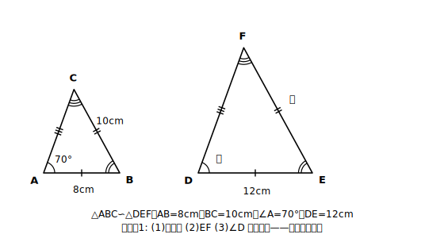

# L02 相似比と対応する辺・角

## ねらい

- 相似な図形の対応する線分の比を**相似比**として捉える。
- 相似比を使って、わからない辺の長さを求められるようになる。

## 導入：「何倍か」に名前をつける

L01で、相似な図形では対応する線分の比がすべて等しいことを確かめた。この「すべて等しい比」に名前をつけよう。

## 主概念1：相似比

相似な図形で、**対応する線分の長さの比**を**相似比**という。

たとえば△ABC∽△DEFで、AB=8cm、DE=12cmなら、相似比は8:12=**2:3**。このとき残りの辺の比も、全部2:3になっている。それが相似というものだった。だから相似比は「1組の対応する辺」さえ分かれば決まる。

注意したいのは、比には**向きがある**こと。「△ABCと△DEFの相似比が2:3」と「3:2」では意味が逆になる！ どちらからどちらへの比かを、いつも意識しよう。

:::guide
**「対応する」がしつこく出てくる理由**

この単元では、性質や条件の文言に毎回「対応する」が付く。飾りではない。つまずきやすいのは、対応を確かめないまま「数字の大きい順」「書かれている順」で機械的に辺を組み合わせてしまうことだ。組み合わせを1つ取り違えると、そこから先の比例式が全部ずれる。防ぎ方ははっきりしている——記号∽の並び順（L01の約束）を毎回読み取り、「この辺とこの辺が対応」と図の上で指差してから比を書くこと。この一手間は、遠回りに見えて、この章全体でいちばん確実な時間の節約になる。
:::

## 主概念2：相似比で長さを求める

相似比が分かれば、対応する辺の長さを比例式で求められる。手順は3つ。

1. **対応を確認する**（記号の並び順を読む。L01の約束が命綱になる場面だ）。
2. **相似比を求める**（長さが両方分かっている1組の対応辺から）。
3. **比例式を立てて解く**。

角については、相似比は関係ない。**対応する角は、相似比が何であってもそのまま等しい**。大きさが変わっても角は変わらない——これが「形が同じ」ということだった。

## 例題1

△ABC∽△DEFで、AB=8cm、BC=10cm、∠A=70°、DE=12cmのとき、次を求めよう。

(1) △ABCと△DEFの相似比 (2) EFの長さ (3) ∠Dの大きさ

**考え方**:
(1) ABとDEが対応する（記号の並び順A↔D、B↔E）。相似比はAB:DE=8:12=**2:3**。
(2) BCとEFが対応する。BC:EF=2:3より、10:EF=2:3。2×EF=30、**EF=15cm**。
(3) ∠Aと∠Dが対応する。角はそのまま等しいので**∠D=70°**。

## 例題2

△ABC∽△PQRで、相似比は3:4。AC=9cm、QR=12cmのとき、PRとBCの長さを求めよう。

**考え方**:
ACに対応するのはPR。AC:PR=3:4より、9:PR=3:4。3×PR=36、**PR=12cm**。
BCに対応するのはQR。BC:QR=3:4より、BC:12=3:4。4×BC=36、**BC=9cm**。
求める辺が比例式の前に来るか後に来るか——対応の確認をさぼると、ここでひっくり返る。

:::guide
**「相似比」という言葉と記号∽の格の違い**

学習指導要領でこの単元に正式に指定されている記号は、実は∽の1つだけだ。「相似比」は指導内容の本文に出てくる言葉、「中点連結定理」（この章の後半で登場する）は解説で使われる呼び名で、教科書によって表現が少し違うことがある。用語の「格」に濃淡があると知っておくと、教科書や参考書ごとの表記のゆれに出会っても慌てずにすむ。中身はどれも同じで、「対応する線分の長さの比」を1つの数の組で持ち歩けるようにした名前である。
:::

## 練習

1. △ABC∽△DEFで、相似比が1:3、AB=4cm、BC=6cmのとき、DEとEFの長さを求めよう。
2. △ABC∽△DEFで、AB=6cm、DE=9cm、EF=12cm、∠E=65°のとき、BCの長さと∠Bの大きさを求めよう。
3. △ABCの3辺が4cm、5cm、6cmで、△ABC∽△DEF、相似比が2:3のとき、△DEFの周の長さを求めよう（対応する線分の比はすべて相似比に等しいことを使うと、周の長さの比も見えてくる！）。

（解答は指導者用answer_keyに分離）

:::zatsudan
## 雑談枠：設計図は「拡大図」のことも

機械の部品の設計図は、いつも実物より小さいとは限らない。腕時計の中の歯車のような小さな部品は、実物より**大きく**かいた拡大図で設計されることがある。縮図も拡大図も、実物と相似——相似比さえ書き添えておけば、図から実物のすべての寸法が復元できる。「1枚の図＋相似比」で実物を完全に伝えられるのは、対応する線分の比がすべて等しいという相似の性質のおかげだ。
:::

:::stretch
## stretch（発展・分離枠）

- 練習3で気づいたことを一般化してみよう。相似比がm:nの2つの三角形では、周の長さの比はいくつになるか。三角形でなく五角形でも同じことがいえるか、理由を説明してみよう。
- では**面積の比**も相似比と同じになるだろうか？ 方眼紙に、相似比1:2の2つの長方形をかいて、方眼の数を数えて確かめてみよう（答えはこの章の後半で本格的に扱う。予想を立てておくこと！）。
:::

---

対応解答: answer_key_supplement.md

<!-- gen_nav:nav:start（自動生成・手編集しない） -->

---

[← 前のレッスン](lesson_01.md)｜[単元の目次](README.md)｜[解答](answer_key_supplement.md)｜[次のレッスン →](lesson_03.md)

<!-- gen_nav:nav:end -->
