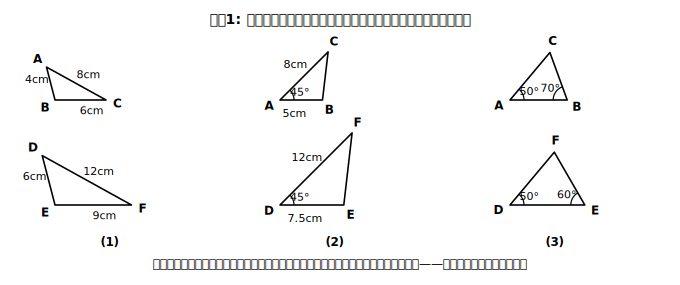

# L03 三角形の相似条件

## ねらい

- 三角形の相似条件3つを、中2の合同条件と対比しながら理解する。
- 2つの三角形が相似かどうかを、条件を根拠にして判定できるようになる。

## 導入：全部調べなくていいのが「条件」

2つの三角形が相似だと言うには、定義どおりなら「対応する3組の辺の比」と「対応する3組の角」を全部調べることになる。でも中2の合同のとき、3つの条件のどれか1つで合同が言えた。相似にも、同じような「近道」があるはずだ——それが相似条件！

## 主概念1：三角形の相似条件

2つの三角形は、次のそれぞれの場合に相似となる。

1. **対応する3組の辺の比がすべて等しい。**
2. **対応する2組の辺の比とその間の角がそれぞれ等しい。**
3. **対応する2組の角がそれぞれ等しい。**

どの条件にも「**対応する**」がついていることに注目！ どの辺とどの辺、どの角とどの角が対応するのかを確かめずに数だけ合わせると、判定を誤る。条件を口にするとき、図の上で対応を指差す習慣をつけよう。

この3つの条件は、まず自分の手で作図して確かめると直観がつくれる（このレッスンの紙面ではstretchの反例づくりがその入口だ）。学習が進んだら（次のレッスンで）証明の根拠として使えるようにしていく。

## 主概念2：合同条件との対比

中2の合同条件と並べると、そっくりな構造をしていることが分かる。

| 合同条件（中2） | 相似条件（中3） |
|---|---|
| 3組の辺がそれぞれ等しい | 対応する3組の辺の**比**がすべて等しい |
| 2組の辺とその間の角がそれぞれ等しい | 対応する2組の辺の**比**とその間の角がそれぞれ等しい |
| 1組の辺とその両端の角がそれぞれ等しい | 対応する**2組の角**がそれぞれ等しい |

「辺が等しい」が「辺の**比**が等しい」に変わっている——大きさを問わないのが相似だから当然だ。3つ目だけ形が違うのはなぜだろう？ 相似では辺の長さの情報が1つもいらない。角が2組等しければ残りの角も等しく（三角形の内角の和は180°）、形が決まってしまうからだ。合同で「1組の辺」が必要だったのは、大きさまで決めるためだったと振り返ることができる。

:::guide
**この対比表が、実はレッスンの本体**

相似条件を「新しい暗記が3つ増えた」と受け取ると、覚える量が単純に倍になる。そうではなく、**中2の合同条件という既に持っている型の「差分」** として受け取るのが、このレッスンの設計だ。変わったのは「等しい」→「比が等しい」の1点と、3つ目の条件から辺が消えた1点だけ。差分で覚えれば、合同条件を思い出すたびに相似条件も一緒に復元できる。さらにこの見方は、次のレッスン以降の証明でも効く。中2で作った「証明の根拠リスト」に、相似条件と相似な図形の性質という**2行が追加されただけ**で、証明の書き方そのものは変わらないからだ。
:::

:::guide
**条件は毎回「正式な文言」で言おう**

慣れてくると「3辺の比」「2角」のような省略形で条件を思い浮かべたくなる。ただ、省略形の暗唱には落とし穴がある。「対応する」が抜け落ちたまま数だけ数えて、対応がずれた組で条件を使ってしまったり、合同条件と混ざった「存在しない条件」（たとえば「1組の辺とその間の角」のような言い方）を書いてしまったりしやすいのだ。証明で条件を書くときは、面倒でも「対応する2組の角がそれぞれ等しい」と正式な文言で書く。文言を正確に言えることが、条件を正確に使えることの一番の保険になる。
:::

## 例題1

次の各組の三角形は相似といえるか。いえる場合は、使った相似条件を答えよう。

(1) △ABC: AB=4cm、BC=6cm、CA=8cm ／ △DEF: DE=6cm、EF=9cm、FD=12cm
(2) △ABC: AB=5cm、AC=8cm、∠A=45° ／ △DEF: DE=7.5cm、DF=12cm、∠D=45°
(3) △ABC: ∠A=50°、∠B=70° ／ △DEF: ∠D=50°、∠E=60°

**考え方**:
(1) AB:DE=4:6=2:3、BC:EF=6:9=2:3、CA:FD=8:12=2:3。→ **相似（対応する3組の辺の比がすべて等しい）**。△ABC∽△DEF。
(2) AB:DE=5:7.5=2:3、AC:DF=8:12=2:3、その間の角∠A=∠D=45°。→ **相似（対応する2組の辺の比とその間の角がそれぞれ等しい）**。△ABC∽△DEF。
(3) △ABCの残りの角は∠C=180°−50°−70°=60°。角の組は{50°,70°,60°}。△DEFの残りは∠F=180°−50°−60°=70°で、角の組は{50°,60°,70°}——同じ組だ！ ∠A=∠D=50°、∠B=∠F=70°が対応するので**相似（対応する2組の角がそれぞれ等しい）**。ただし対応はB↔Fだから、書くなら△ABC∽△DFE。数字が同じ順に並んでいなくても、対応を探し直せば相似が見つかることがある。

## 例題2

△ABC: AB=6cm、BC=9cm ／ △DEF: DE=8cm、EF=12cm。この情報だけで2つの三角形は相似といえるか？

**考え方**: AB:DE=6:8=3:4、BC:EF=9:12=3:4。2組の辺の比は等しい。でも**その間の角（∠Bと∠E）が等しいかどうかは分かっていない**。条件2は「2組の辺の比＋その間の角」がそろって初めて使える。→ **この情報だけでは相似といえない**。「比が2組そろったから相似！」と飛びつかないこと。

## 練習

1. 次の各組は相似といえるか。いえる場合は相似条件を、いえない場合は理由を答えよう。
   (ア) △ABC: AB=3cm、BC=5cm、CA=7cm ／ △DEF: DE=4.5cm、EF=7.5cm、FD=10.5cm
   (イ) △ABC: ∠A=55°、∠B=60° ／ △DEF: ∠D=55°、∠E=70°
   (ウ) △ABC: AB=4cm、AC=6cm、∠A=50° ／ △DEF: DE=10cm、DF=15cm、∠D=50°
2. △ABCと△DEFが相似比1:1で相似であるとき、2つの三角形はどんな関係といえるか。合同条件と相似条件の対比表を見ながら説明してみよう。

（解答は指導者用answer_keyに分離）

:::zatsudan
## 雑談枠：測れない高さに手が届く？

木のてっぺんや校舎の屋上——高すぎて巻尺では測れない。地面に立てた棒と木に太陽の光が当たると、棒とその影、木とその影がつくる2つの三角形には等しい角の組ができる、つまり相似！ 棒の高さと影の長さ、木の影の長さを測れば、木の高さが計算できる理屈だ。この「直接測れないものを相似で測る」話は、章の最後（相似の利用）でじっくり取り組む。
:::

:::stretch
## stretch（発展・分離枠）

- 例題2で「相似といえない」と判定した。では実際に、AB=6cm・BC=9cmで∠Bの大きさだけを変えた三角形を2つ作図し、DE=8cm・EF=12cmの三角形と形が合わない例を作ってみよう（反例づくり）。「条件が足りない」ことを、言葉でなく図で示せるか？
- 次のレッスンでは相似条件を「証明の根拠」として使う。中2の証明で使った根拠リスト（対頂角・平行線の性質・合同条件など）に、相似の性質と相似条件が**新しく加わる**。中2のノートの証明を1本見返して、「根拠として使った事実」に印をつけておこう。同じ型をそのまま使う準備になる。
:::

---

対応解答: answer_key_supplement.md

<!-- gen_nav:nav:start（自動生成・手編集しない） -->

---

[← 前のレッスン](lesson_02.md)｜[単元の目次](README.md)｜[解答](answer_key_supplement.md)｜[次のレッスン →](lesson_04.md)

<!-- gen_nav:nav:end -->
