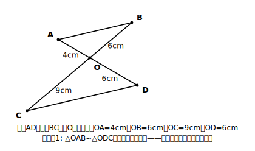
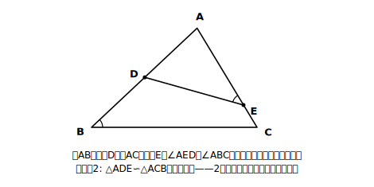

# L04 相似の証明①（構想）

## ねらい

- 中2で使った証明の根拠リストに、相似の性質と三角形の相似条件が**加わった**ことを確認する。
- 証明を書き出す前に、結論から逆向きにたどる**方針メモ（構想）** を立てられるようになる。

## 導入：書く前に、地図をかく

中2の証明で、いきなり書き始めて途中で止まってしまった経験はないだろうか？ 証明が書けない原因の多くは、書く技術ではなく「方針がないまま書き始めること」にある。今日は**証明を1行も書かない**。その代わり、証明の設計図＝方針メモの立て方だけを徹底的に練習する。

## 主概念1：根拠リストが2つ増えた

中2の証明で根拠として使えたのは、対頂角の性質・平行線の性質と条件・三角形の合同条件・合同な図形の性質などだった。中3では、ここに次の2つが**新しく加わる**。

- **三角形の相似条件**（L03の3つ。相似であることを示すときの根拠）
- **相似な図形の性質**（対応する線分の比はすべて等しい・対応する角はそれぞれ等しい。相似が示せた**あと**に、辺の比や角の相等を導く根拠）

書式は中2とまったく同じ。使った根拠は〔 〕で明示する。〔仮定〕〔対頂角は等しい〕〔対応する2組の角がそれぞれ等しい〕のように。新しい道具が2つ増えただけで、証明という営みの型は変わらない。

:::guide
**「条件」と「性質」は役割がちがう。ここで区別しておくと後がラク**

新しく増えた2つの根拠は、使う場面が正反対だ。**相似条件は「相似であることをこれから示す」ときの根拠**、**相似な図形の性質は「相似が示せたあとで、辺の比や角の相等を取り出す」ときの根拠**である。つまずきやすいのは、この2つの区別があいまいなまま証明に入ることだ。「まだ示していない相似」から性質を取り出してしまうと、次のレッスンで学ぶ循環論法にまっすぐ落ちる。方針メモを書くとき、「いま相似を示そうとしているのか、示せた相似を使おうとしているのか」を一言つぶやく癖をつけておこう。
:::

## 主概念2：構想は結論から逆向きに

方針メモは、次の3ステップで**結論から逆向きに**たどって作る。

1. **結論を確認する**: 何を示したい？（△○∽△○か、それとも辺の比・角の相等か）
2. **条件を選ぶ**: 相似を示すなら、3つの相似条件のどれが使えそうか？ 図の情報を見て選ぶ。**辺の長さが多く与えられていれば比の条件、角の印が多ければ「対応する2組の角」** が第一候補。
3. **材料を集める**: 選んだ条件に必要な「等しい組」を、図のどこから調達できるか探す。調達先はたとえば、仮定・対頂角・共通な角。

方針メモの書き方（矢印は「←」で逆向きに）:

> △OAB∽△ODC を示したい
> ← 使えそうな条件: 対応する2組の辺の比とその間の角
> ← 材料: OA:OD=OB:OC〔仮定の長さから〕、∠AOB=∠DOC〔対頂角〕

ここまでできれば、証明の清書（次のレッスン）は方針メモを文章に直すだけになる。

:::guide
**なぜ「証明を1行も書かない」レッスンがあるのか**

証明の学習でいちばん多い挫折は「何を書けばいいか分からず、1行も書けない」だ。その原因を分解すると、書く技術ではなく、①結論から後ろ向きに考える発想そのものに慣れていない、②どの条件を選べばよいか判断できない、③「条件」と「性質」の区別があいまい、の3つに行き着くことが多い。このレッスンはその3つに1つずつ手当てをしている。①には「←」で結論から逆向きに書く方針メモの型、②には「辺の長さが多ければ比の条件、角の印が多ければ2組の角」という選択の目安、③には主概念1の役割分離だ。「書けない」が「方針だけなら言える」に変われば、証明の半分は越えている。
:::

:::guide
**材料の調達先は、いまは3つで足りる**

このレッスンで登場する「等しい組の調達先」は、仮定・対頂角・共通な角の3つに意図的に絞ってある。図形の問題では他にも調達先があるのでは、と思ったら鋭い——次の節（平行線と線分の比）で、平行線の同位角・錯角が新しい調達先として加わる。調達先リストは、根拠リストと同じように学習が進むほど育っていく。いまは3つの調達先を「図のどこに隠れているか」まで含めて確実に見つけられるようになることが先決だ。
:::

## 例題1

線分ADと線分BCが点Oで交わっていて、OA=4cm、OB=6cm、OC=9cm、OD=6cm。△OABと△ODCが相似であることを証明するための方針メモを作ろう（証明はまだ書かない）。

**考え方**:
1. 結論: △OAB∽△ODC（対応はO↔O、A↔D、B↔C）。
2. 条件選び: 与えられているのは辺の長さ4つと、交わってできる角。角の大きさの値はないが、**対頂角**という角の相等が図に隠れている。→「対応する2組の辺の比とその間の角」が候補。
3. 材料集め: OA:OD=4:6=2:3、OB:OC=6:9=2:3——2組の比がそろった！ その間の角は∠AOBと∠DOCで、これは対頂角。

> △OAB∽△ODC を示したい
> ← 対応する2組の辺の比とその間の角
> ← OA:OD=OB:OC=2:3〔仮定の長さ〕、∠AOB=∠DOC〔対頂角は等しい〕

## 例題2

△ABCの辺AB上に点D、辺AC上に点Eがあり、∠AED=∠ABCである。△ADEと△ACBが相似であることを証明するための方針メモを作ろう。

**考え方**:
1. 結論: △ADE∽△ACB（対応はA↔A、D↔C、E↔B——∠AED=∠ABCの対応と合わせて記号の順を決める）。
2. 条件選び: 辺の長さは1つも与えられていない。角の情報だけ。→「対応する2組の角がそれぞれ等しい」一択。
3. 材料集め: 1組目は仮定の∠AED=∠ABC。2組目はどこから？——2つの三角形は**∠Aを共有している**。共通な角は、いつでも使える調達先だ。

> △ADE∽△ACB を示したい
> ← 対応する2組の角がそれぞれ等しい
> ← ∠AED=∠ABC〔仮定〕、∠Aは共通〔共通な角〕

## 練習

1. 線分ABと線分CDが点Pで交わっていて、PA=8cm、PB=6cm、PC=12cm、PD=9cm。相似になっている三角形の組を見つけ、方針メモを作ろう。
2. △ABCの辺BC上に点Dがあり、∠BAD=∠BCAである。相似になっている三角形の組を見つけ、方針メモを作ろう（ヒント: 2つの三角形が共有しているものは何？）。

（解答は指導者用answer_key_S1に分離）

:::zatsudan
## 雑談枠：道具箱は学年とともに育つ

中2の合同は「移動して重なる」こと、相似の定義①は「拡大または縮小すれば合同になる」ことだった。定義が、前の学年の定義の上に積み上がっている！ 証明の根拠リストも同じで、中2の根拠一覧に今日、相似条件と相似の性質が加わった。数学の証明とは、こうして道具箱が少しずつ育っていく世界なのだ。
:::

:::stretch
## stretch（発展・分離枠）

- 例題2の点D・Eが、辺AB・ACの**延長上**にあるとしたら、同じ方針メモが通用するだろうか？ 図をかいて、材料の調達先がどう変わるか（共通な角は使える？ 対頂角は？）を考えてみよう。この「延長上でも成り立つか」という問いは、次の節（平行線と線分の比）で本格的に扱う。
- 方針メモの「材料の調達先」を自分の言葉でリスト化してみよう（今日登場したのは仮定・対頂角・共通な角の3つ。この先の学習で増えていく）。なお、入試でよく出る図形の配置のパターン整理は、本編とは別の入試対策レーンで扱う（予約）。
:::

---

対応解答: answer_key_S1.md

<!-- gen_nav:nav:start（自動生成・手編集しない） -->

---

[← 前のレッスン](lesson_03.md)｜[単元の目次](README.md)｜[解答](answer_key_S1.md)｜[次のレッスン →](lesson_05.md)

<!-- gen_nav:nav:end -->
