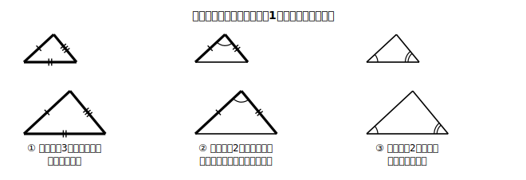
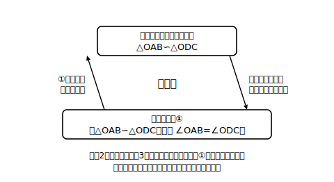

# L05 相似の証明②（記述と検査）

## ねらい

- 方針メモをもとに、根拠を〔 〕で明示しながら相似の証明を記述できるようになる。
- 書いた証明を**循環論法セルフチェック3点検**で検査する習慣を身につける。

## 導入：書いて、終わりじゃない

前回作った方針メモを、今日はついに証明文に清書する。そしてもう1つ、今日から一生モノの習慣を導入する。証明は「書いたら検査する」——書きっぱなしの証明は、提出前に読み返さない作文と同じだ。検査の道具は、たった3つの点検でできている。

## 主概念1：証明の記述——根拠は〔 〕で明示する

書式は中2の合同の証明とまったく同じ。**取り上げる2つの三角形を宣言→等しい組を根拠つきで並べる→相似条件を述べる→結論**、の順で書く。

**例題1**: ∠A=90°の直角三角形ABCで、頂点Aから辺BCに垂線ADをひく。△DBA∽△ABCを証明しよう。

**方針メモ（前回の型で）**:
> △DBA∽△ABC を示したい
> ← 対応する2組の角がそれぞれ等しい
> ← ∠BDA=∠BAC=90°〔仮定〕、∠Bは共通〔共通な角〕

**証明**:
> △DBAと△ABCで、
> ADは辺BCへの垂線だから ∠BDA=90° …①〔仮定〕
> ∠BAC=90° …②〔仮定〕
> ①、②より ∠BDA=∠BAC …③
> ∠DBA=∠ABC（共通） …④〔共通な角〕
> ③、④より、対応する2組の角がそれぞれ等しいので
> △DBA∽△ABC

記号の順にも意味がある。△**DBA**∽△**ABC**と書けば、D↔A、B↔B、A↔Cの対応まで宣言したことになる（L01の約束がここでも命綱！）。

## 主概念2：循環論法セルフチェック3点検

書き終えたら、必ず次の3点検を行う。これを今日から**すべての証明の標準手順**にする。

1. **結論に印**: 証明したい事柄（結論）に印を付ける。上の例なら「△DBA∽△ABC」。
2. **根拠の照合**: 書いた根拠〔 〕を1つずつ指差して、「これは仮定？ 既習の性質・条件？ すでに示したこと？」と自分に問う。どれでもない根拠が混ざっていたら要注意。
3. **循環の検査**: 根拠の中に**結論そのもの（または結論を使わないと言えないこと）** が混ざっていないかを確認する。混ざっていたら、その根拠を消して別の材料を探す。

例題1でやってみると、①②は仮定、④は共通な角（図の事実）。結論「△DBA∽△ABC」を使った根拠はどこにもない。合格！

なぜこの点検が要るのか？ 「示したいことを、知らないうちに根拠に使ってしまう」誤りは、証明でいちばん気づきにくい事故だからだ。結論を根拠に使った証明は、一見それらしく見えるのに、実は何も証明していない。

:::guide
**点検2と点検3の「深い読み方」**

3点検を形だけなぞると、すり抜ける事故が2種類ある。1つ目：点検3で警戒すべきは、結論を字面どおり書き写す循環だけではない。「相似だから∠OAB=∠ODC」のように、**結論から導かれる事実**を根拠に持ち込む形のほうがむしろ起こりやすい（次の例題2がまさにこの形だ。①は一見「角の相等」というまっとうな顔をしている）。2つ目：点検2で「すでに示したこと」に分類した根拠は、**それを示した過程が結論を使っていないか**まで一度さかのぼって確かめる。遠回りの循環は、分類だけでは通過してしまうことがある。もう1つ、点検2で根拠を指差すついでに「その等しい組は、対応の位置と合っているか」も見ておくと、対応の取り違えまで同じ動作で拾える。
:::

## 例題2：3点検で誤りを見つける

L04例題1の図（線分ADとBCが点Oで交わり、OA=4cm、OB=6cm、OC=9cm、OD=6cm）について、ある生徒が次の証明を書いた。3点検で検査し、誤りがあれば直そう。

> △OABと△ODCで、
> △OAB∽△ODCだから ∠OAB=∠ODC …①
> ∠AOB=∠DOC …②〔対頂角は等しい〕
> ①、②より、対応する2組の角がそれぞれ等しいので
> △OAB∽△ODC

**考え方**:
- 点検1: 結論は「△OAB∽△ODC」。印を付ける。
- 点検2: ②の根拠は対頂角。既習の性質でOK。①の根拠は……「△OAB∽△ODCだから」？
- 点検3: ①は**結論そのものを根拠に使っている**。これが循環論法。①を消す。

①を消したら、別の材料を探す。角の相等はもう対頂角しか残っていないから、**辺の比**に切り替える（L04で立てた方針メモの通り）。

**直した証明**:
> △OABと△ODCで、
> OA:OD=4:6=2:3 …①〔仮定〕
> OB:OC=6:9=2:3 …②〔仮定〕
> ①、②より OA:OD=OB:OC …③
> ∠AOB=∠DOC …④〔対頂角は等しい〕
> ③、④より、対応する2組の辺の比とその間の角がそれぞれ等しいので
> △OAB∽△ODC

3点検をもう一度通すと、①②は仮定の長さ、④は対頂角。循環なし。今度こそ合格！

:::guide
**「他人の誤り」から先に練習する理由**

例題2が「自分で証明を書く」より先に「他人の誤り証明を検査する」形になっているのは、偶然ではない。循環論法には「自分の証明では気づきにくく、他人の証明では見つけやすい」という性質がある。自分で書いた直後は「相似だから角が等しい」が自然な流れに見えてしまうのだ。だから、まず他人の答案で「見つける目」を作ってから、その目を自分の証明に向ける——この順番で練習すると、3点検が儀式でなく本当の検査として働きだす。書き終えるたびに数十秒、自分の証明を「他人の答案のつもりで」読み直そう。
:::

:::guide
**証明は「書けたら終わり」ではなく「使えたら一人前」**

練習2の(2)に、証明のあとの求値問題が付いているのには意味がある。相似条件は「相似を示す」ための道具、相似な図形の性質は「示せた相似から長さや角を取り出す」ための道具。この役割分離（L04で確認した）は、実際に両方を1問の中で使ってみて初めて腑に落ちる。証明を書き上げた瞬間、△OAB∽△ODCという事実が「使ってよい根拠」に昇格する。この昇格の感覚（さっきまで示す対象だったものが、いまは道具になっている）をつかめたら、証明の学習は半分どころか大部分が完了している。
:::

## 練習

1. △ABCの辺BC上に点Dがあり、∠BAD=∠BCAである。△BAD∽△BCAを、根拠を〔 〕で明示しながら証明し、書き終えたら3点検を実施して「合格」まで確認しよう（方針メモはL04練習2で作成済み）。
2. 線分ADと線分BCが点Oで交わっていて、OA=6cm、OB=4cm、OC=6cm、OD=9cm。
   (1) △OAB∽△ODCを証明しよう（3点検も忘れずに）。
   (2) AB=5cmのとき、DCの長さを求めよう（相似が**示せたあと**は、相似な図形の性質が根拠として使える）。

（解答は指導者用answer_key_S1に分離）

:::zatsudan
## 雑談枠：確かめ方が育っている

小6でも、縮図をかいて木の高さを求める学習をした。あのときは「かいて、測って」確かめたが、中3の今は、相似条件を根拠に「なぜ成り立つのか」を証明で確かめられる。同じ「形が同じ」を扱っていても、確かめ方が測定から論証へと育っているわけだ！ 章の最後の測量では、この2つの確かめ方を両方使うことになる。
:::

:::stretch
## stretch（発展・分離枠）

- 例題1の図には、相似の組がもう1つ隠れている。△DBA∽△DACを証明してみよう（ヒント: △ABCの内角の和から∠DBA=90°−∠C。△DACの内角の和から∠DAC=90°−∠C。つまり…？）。さらにBD=4cm、DC=9cmのとき、DB:DA=DA:DCを使ってADの長さを求めてみよう。
- 円や三平方の定理と組み合わせた相似の複合問題、入試頻出の図形配置のパターンは、この先の章と入試対策レーンで扱う（予約）。今は「方針メモ→記述→3点検」の型を確実にすることが最優先だ。
:::

---

対応解答: answer_key_S1.md

<!-- gen_nav:nav:start（自動生成・手編集しない） -->

---

[← 前のレッスン](lesson_04.md)｜[単元の目次](README.md)｜[解答](answer_key_S1.md)｜[次のレッスン →](lesson_06.md)

<!-- gen_nav:nav:end -->
