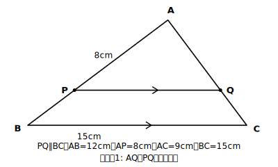

# L06 三角形と比（基本形）

## ねらい

- 三角形の辺上に平行線を引いたときに生まれる線分の比を、**まず測って推測し、相似条件で論理的に確かめる**。
- PQ∥BCのとき成り立つ2種類の比の式を区別して使えるようになる。

## 導入：まず測ってみる

△ABCの辺AB上に点P、辺AC上に点Qをとり、PQ∥BCとなるようにかいてみよう。定規でAP、AB、AQ、AC、PQ、BCを測って、AP:ABとAQ:ACとPQ:BCを計算すると——3つとも同じ比になっていないだろうか。場所を変えてPをとり直しても、やはり同じ。「いつでも成り立ちそうだ」という推測が立ったら、次は相似条件で確かめる番だ。

## 主概念1：基本形の3つの比

**△ABCで、辺AB、AC上の点P、QについてPQ∥BCならば**

$$AP:AB=AQ:AC=PQ:BC$$

**確かめ方（証明の構想から）**: 「3つの比が等しい」と言うには、△APQ∽△ABCが言えればよい（構想はL04の型）。
△APQと△ABCで、∠Aは共通〔共通な角〕。PQ∥BCだから、同位角より∠APQ=∠ABC〔仮定・平行線の同位角〕。対応する2組の角がそれぞれ等しいので、△APQ∽△ABC〔相似条件〕。相似な図形では対応する線分の比がすべて等しいから〔相似な図形の性質〕、AP:AB=AQ:AC=PQ:BCが成り立つ。

書き終えたら循環論法セルフチェック（L05）。根拠に使ったのは「∠A共通」「平行線の同位角」「相似条件」で、結論の比の式そのものは使っていない。合格だ。

:::guide
**測ってから証明する、の順序には意味がある**

導入の「定規で測る」を飛ばして証明から入りたくなるかもしれない。だが、この順序こそが本体だ。測って「いつでも成り立ちそうだ」という推測が自分の中に生まれてから証明を読むと、証明は「当たり前の確認」ではなく「推測を確信に変える道具」として働く。もう1つ、この証明で新しいことが起きたのに気づいただろうか。等しい角の調達先に、仮定・対頂角・共通な角（L04の3つ）に続いて**平行線の同位角・錯角**が加わった。調達先リストが1行育った記念すべき場面である。
:::

## 主概念2：辺の上で分ける比

同じ図で、**PQ∥BCならばAP:PB=AQ:QC**も成り立つ。PとQは、それぞれの辺を「同じ比で」分けているのだ。

なぜ主概念1から言えるのか、橋を一度だけ架けておこう。AP:AB=AQ:ACをたとえばm:nとすると、PB=AB−AP、QC=AC−AQだから、PB:AB=(n−m):n=QC:AC。よってAP:PB=m:(n−m)=AQ:QC。**「頂点からの比」が等しければ、「残りの部分どうしの比」も自動的に等しくなる**——だから主概念2は主概念1のおまけとして手に入る。

ここで**最重要の注意**。AP:PB=AQ:QCは正しいが、**PQ:BCはAP:PBとは等しくない**。PQ:BCと等しいのは、あくまでAP:**AB**（頂点Aから測った全体との比）。「辺の一部どうしの比」と「頂点からの比」を混ぜるのが、この性質の使い方で特に起こりやすい代表的なミスだ。比を書く前に「どこからどこまでの長さか」を図で指差し確認しよう。

## 例題1

△ABCで、辺AB、AC上の点P、QについてPQ∥BC。AB=12cm、AP=8cm、AC=9cm、BC=15cmのとき、AQとPQの長さを求めよう。

**考え方**:
AP:AB=8:12=2:3。
AQ:AC=2:3より、AQ:9=2:3、**AQ=6cm**。
PQ:BC=2:3より、PQ:15=2:3、**PQ=10cm**。
（検算: AP:PB=8:4=2:1、AQ:QC=6:3=2:1で一致——主概念2とも合う。）

## 例題2

△ABCで、辺AB、AC上の点P、QについてPQ∥BC。AP=6cm、PB=3cm、AQ=8cm、BC=12cmのとき、QCとPQの長さを求めよう。

**考え方**:
QCは「辺の一部どうし」だからAP:PB=AQ:QCを使う。6:3=8:QC、**QC=4cm**。
PQは「頂点からの比」に切り替える。AB=6+3=9cmだから、AP:AB=6:9=2:3。PQ:BC=2:3より、PQ:12=2:3、**PQ=8cm**。
6:3=2:1をそのままPQ:BCに使うと間違える——切り替えがこの問題の本体だ。

:::guide
**つまずきやすいのは「2種類の比の混在」。その検知のコツ**

このレッスンの性質には、「頂点から測った比」（AP:AB=AQ:AC=PQ:BC）と「辺の一部どうしの比」（AP:PB=AQ:QC）の2種類が同居している。まちがいの典型は、AP:PB=2:1のような「一部どうしの比」を、そのままPQ:BCに流用してしまう形だ。例題2はこの混在をわざと踏ませる設計になっている。自分で検知するコツは、比の式を書く前に「この比は頂点Aから測ったか、途中で切った部分か」を毎回声に出す（または式の横に「全体」「部分」とメモする）こと。PQ:BCの相棒になれるのは「全体」印の比だけ。このルールさえ守れば、この節の求値問題はほぼ機械的に解ける。
:::

## 練習

1. △ABCで、PQ∥BC、AP=4cm、PB=2cm、AC=9cm、BC=9cmのとき、AQ、QC、PQの長さを求めよう。
2. △ABCで、PQ∥BC、AP:PB=3:2、AQ=9cm、PQ=12cmのとき、QCとBCの長さを求めよう。
3. △ABCで、PQ∥BC、AP=5cm、AB=8cm、AC=16cmのとき、AQの長さを求めよう。

（解答は指導者用answer_key_S2に分離）

:::zatsudan
## 雑談枠：小6の拡大図で、実は経験している

小学6年で拡大図をかいたとき、方眼の上で「すべての辺を2倍」にすると、辺の途中にある点も勝手に同じ2倍の位置に移っていた。今日の性質は、あの「途中の点も同じ比で動く」ことに、平行線と相似条件で理由を与えたものだ。小学校では「そうなる」と受け入れた事実に、中3では「なぜそうなるか」の証明が付く。同じ図でも、見え方が一段深くなっている。
:::

:::stretch
## stretch（発展・分離枠）

- 例題1の図で、AP:AB=2:3のときの△APQと△ABCの周の長さの比を求め、それが相似比と一致する理由をL02の練習3の結果とつなげて説明してみよう。
- PがABの上を頂点Aから頂点Bまで動くとき、PQ:BCの比はどこからどこまで変わるか。「Pが Aに重なる瞬間」「Bに重なる瞬間」を考えてみよう。
:::

---

対応解答: answer_key_S2.md

<!-- gen_nav:nav:start（自動生成・手編集しない） -->

---

[← 前のレッスン](lesson_05.md)｜[単元の目次](README.md)｜[解答](answer_key_S2.md)｜[次のレッスン →](lesson_07.md)

<!-- gen_nav:nav:end -->
