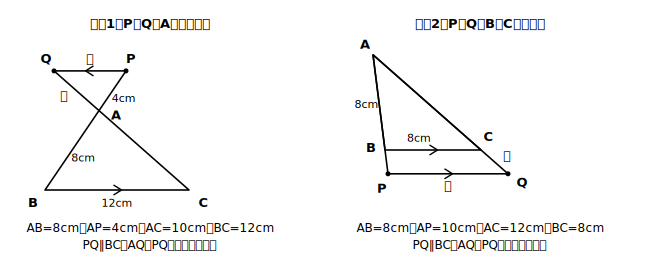

# L07 延長上への発展——どこにあっても成り立つか

## ねらい

- 点P、Qが辺の**延長上**にあるときも、PQ∥BCなら同じ比が成り立つかを発展的に考察する。
- 「Pがどこにあっても、平行なら比は等しい」という**1つの性質**として統合して捉える。

## 導入：性質の「守備範囲」を広げる

L06の性質は「辺AB、AC**上**の点P、Q」という条件つきだった。数学ではよい性質が見つかると、次に「条件を広げても成り立つか？」と問う。今日の問いはこれだ——**PとQが辺の延長上に飛び出しても、PQ∥BCなら、AP:AB=AQ:AC=PQ:BCは成り立つか？**

## 主概念：延長上でも同じ比が成り立つ

**場合1：頂点Aを越えて反対側へ。** 辺BA、CAをAの側へ延長し、その上に点P、QをPQ∥BCとなるようにとる。図は、△ABCと△APQが頂点Aで向かい合わせに接した形になる。

△APQと△ABCで、対頂角より∠PAQ=∠BAC〔対頂角は等しい〕。PQ∥BCだから、錯角より∠APQ=∠ABC〔仮定・平行線の錯角〕。対応する2組の角がそれぞれ等しいので、△APQ∽△ABC〔相似条件〕。したがってここでも**AP:AB=AQ:AC=PQ:BC**。

**場合2：頂点B、Cを越えて外側へ。** 辺AB、ACをB、Cの側へ延長し、その上に点P、Qをとる。今度は△ABCがすっぽり△APQの内側に入る形で、∠Aは共通〔共通な角〕、同位角で∠APQ=∠ABC〔仮定・平行線の同位角〕。L06とまったく同じ筋で△APQ∽△ABCが言え、同じ比の式が成り立つ。

（場合1・場合2とも、書き終えたら3点検。根拠に使ったのは対頂角または共通な角・平行線の錯角/同位角・相似条件・相似な図形の性質だけで、結論の比の式そのものは使っていない。合格だ。）

**統合**: 3つの図（辺上・Aの反対側・B, Cの外側）は見た目がずいぶん違う。しかし証明を並べてみると、使った根拠は毎回「角が2組等しい→相似→対応する線分の比」だけ。つまりこれは3つの性質ではなく、**「PQ∥BCならAP:AB=AQ:AC=PQ:BC」というたった1つの性質**が、点の位置に関係なく成り立っているのだ。図の形ではなく「平行」という条件が本体だった——これが今日いちばん持ち帰ってほしい見方だ。

:::guide
**このレッスンは、この節の「思想的な山場」**

計算だけ見れば、今日の例題はL06と同じ比例式で、新しい技は1つもない。それでもこの1時間が独立しているのは、「別々に見えた3つの場合を、1つの性質として統合する」という考え方そのものが学習内容だからだ。数学が進むときの典型的な足取り（性質を見つける→条件を広げても成り立つか試す→証明の骨格が同じだと気づく→1つに統合する）を、この単元でいちばん小さくきれいな形で体験できる。3つの図を並べてかき、証明のどこが変わってどこが変わらなかったかを見比べる時間を惜しまないでほしい（stretchの表づくりはそのための課題だ）。
:::

:::guide
**参考書で見かける「あの呼び名」について**

問題集や塾のテキストでは、今日の「Aの反対側で交差する配置」を砂時計型、「辺上の配置」をピラミッド型と呼ぶことがある。図の形を覚えるには便利な愛称だが、これは塾・参考書の慣用的な呼び名であって、教科書や学習指導要領の正式な用語ではない。愛称で配置を分類して安心してしまうと、今日学んだ「形ではなく平行という条件が本体」という統合の見方と逆走してしまう面もある。愛称は思い出すための取っ手くらいに考えて、証明の根拠はいつでも「平行→角の相等→相似」で言えるようにしておこう。
:::

## 例題1（Aの反対側）

△ABCで、辺BA、CAをAの側へ延長した直線上に点P、Qがあり、PQ∥BC。AB=8cm、AP=4cm、AC=10cm、BC=12cmのとき、AQとPQの長さを求めよう。

**考え方**:
AP:AB=4:8=1:2。
AQ:AC=1:2より、AQ:10=1:2、**AQ=5cm**。
PQ:BC=1:2より、PQ:12=1:2、**PQ=6cm**。
交差した図でも、式はL06と一字も変わらない。

## 例題2（B、Cの外側）

△ABCで、辺AB、ACをB、Cの側へ延長した直線上に点P、Qがあり、PQ∥BC。AB=8cm、AP=10cm、AC=12cm、BC=8cmのとき、AQとPQの長さを求めよう。

**考え方**:
AP:AB=10:8=5:4（今度は比が1より大きい——Pが外側にあるから）。
AQ:AC=5:4より、AQ:12=5:4、**AQ=15cm**。
PQ:BC=5:4より、PQ:8=5:4、**PQ=10cm**。

## 練習

1. △ABCで、辺BA、CAをAの側へ延長した直線上に点P、QがありPQ∥BC。AB=9cm、AP=6cm、AC=12cm、BC=15cmのとき、AQとPQの長さを求めよう。
2. △ABCで、辺AB、ACをB、Cの側へ延長した直線上に点P、QがありPQ∥BC。AB=6cm、AP=9cm、AC=10cm、BC=8cmのとき、AQとPQの長さを求めよう。
3. 例題1（Aの反対側）の証明を、根拠を1つずつ書いて自分で完成させ、L05の循環論法セルフチェック3点検を実行しよう。

（解答は指導者用answer_key_S2に分離）

:::zatsudan
## 雑談枠：「1点から見通す」という相似の見方

相似には「1つの点から見通して、対応する点までの距離が同じ比になる位置（相似の位置）に置ける」という見方があった（L01のstretchで紹介）。今日の「Aの反対側」の図で頂点Aから見通すと、PとB、QとCがそれぞれAを通る一直線上に並んでいないだろうか？ つまりこの図は、Aを中心に△ABCを反対側へ縮めた「相似の位置」そのもの——延長上の考察は、実は相似のもう1つの見方と再会する場所でもある。
:::

:::stretch
## stretch（発展・分離枠）

- 場合1と場合2の証明を見比べて、「変わった根拠」と「変わらなかった根拠」を表にしてみよう（変わったのは角の等しさの理由だけ。対頂角・錯角か、共通・同位角か）。
- ※延長上の配置を複数組み合わせた複合問題は、入試対策レーン（別教材）に予約。ここでは扱わない。
:::

---

対応解答: answer_key_S2.md

<!-- gen_nav:nav:start（自動生成・手編集しない） -->

---

[← 前のレッスン](lesson_06.md)｜[単元の目次](README.md)｜[解答](answer_key_S2.md)｜[次のレッスン →](lesson_08.md)

<!-- gen_nav:nav:end -->
