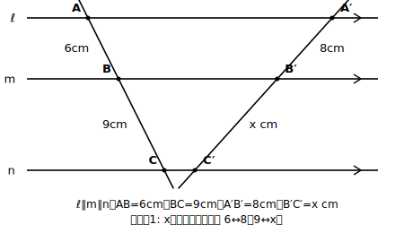

# L08 平行線と線分の比——三角形から飛び出す

## ねらい

- 三角形の中の性質だった「平行線と比」を、**平行な3本以上の直線が2本の直線を切り取る比**へ一般化する。
- 補助線で「知っている形（三角形の基本形）」に帰着させる考え方を経験する。

## 導入：三角形がなくても言えるか

L06・L07で確かめた性質は、どれも三角形の中の話だった。では、三角形を取り払って、**平行な3本の直線ℓ、m、n**だけが残ったら？ そこに2本の直線を斜めに引くと、それぞれ2つの線分に切り取られる。この切り取られた線分の比も、やはり等しいのだろうか。

## 主概念：平行線が切り取る線分の比

**平行な3直線ℓ、m、nに、2本の直線がそれぞれ点A、B、Cと点A′、B′、C′で交わるとき**

$$AB:BC=A'B':B'C'$$

**確かめ方（帰着の考え方）**: 新しい図のままでは手が出ない。そこで補助線だ。点Aを通り、直線A′C′に**平行な**直線を引き、m、nとの交点をB″、C″とする。すると四角形AB″B′A′とB″C″C′B′は、2組の対辺がそれぞれ平行だから平行四辺形で、AB″=A′B′、B″C″=B′C′。
一方、△ACC″を見ると、BB″∥CC″（ℓ∥m∥nの一部）だから、L06の基本形そのもの。AB:BC=AB″:B″C″が成り立つ。2つを合わせて、AB:BC=A′B′:B′C′。

**新しい性質に見えて、中身は基本形**——補助線1本で、知らない図を知っている図に変えたことが今日の核心だ。なお、この性質が「等しい」と保証してくれるのは、同じ直線上の線分どうしの比の組（AB:BCとA′B′:B′C′）だけ。AB:B′C′のような、2本の直線をまたいだ比も数としては計算できるが、平行線が対応させている線分の比ではないので、この性質の対象にはならない。

:::guide
**帰着の構造を、一度は自分の手で追う**

このレッスンの例題は、性質さえ受け入れれば比例式1本で解けてしまう。だからこそ「答えが出ればよい」に流れやすい。だが今日いちばん価値があるのは答えではなく、確かめ方の中身——**平行四辺形2つ＋三角形の基本形1つ**という帰着の構造だ。補助線を引いた瞬間に、①平行四辺形で長さを「引っ越し」させ、②三角形の中でL06を使う、という2段構えができている。この「知らない図を、補助線で知っている図に変える」動きは、この先の図形学習（次のレッスンの逆、L11の中点四角形、さらに次章の円）で何度も主役になる。図を自分でかき写して、補助線のどこで何が起きているかを一度は指でなぞっておこう。
:::

:::guide
**求値がすらすら解けても、山はその先にある**

平行線と比の「長さを求める」技能は、比較的すんなり身につく人が多い。一方で、この節の本当の山は「なぜ等しいと言えるのか」を自分の言葉で言えること——つまり判定・証明の側にある（次のレッスンの「逆」や、L11の証明で正面から問われる）。練習がすらすら解けた人は、それで安心せず、例題の「確かめ方」を何も見ずに再現できるか試してみてほしい。計算が速いことと、根拠が言えることは、別の力である。
:::

## 例題1

平行な3直線に2本の直線が交わり、一方の直線は6cmと9cmに、もう一方は8cmとxcmに切り取られている（6cmと8cm、9cmとxcmが対応）。xを求めよう。

**考え方**:
6:9=8:xより、6x=72、**x=12cm**。
（検算: 6:9=2:3、8:12=2:3で一致。）

## 例題2

平行な3直線に2本の直線が交わる。一方の直線は4cmと6cmに切り取られ、もう一方の直線は切り取られた2つの線分の合計が15cm。もう一方の2つの線分の長さをそれぞれ求めよう。

**考え方**:
比4:6=2:3は、もう一方でも保たれる。15cmを2:3に分けて、15×2/5=**6cm**、15×3/5=**9cm**。
（検算: 6+9=15、6:9=2:3。）

## 練習

1. 平行な3直線に2本の直線が交わり、一方は5cmと7cm、もう一方は10cmとxcmに切り取られている（5と10、7とxが対応）。xを求めよう。
2. 平行な3直線に2本の直線が交わり、一方は6cmとxcm、もう一方は9cmと12cmに切り取られている（6と9、xと12が対応）。xを求めよう。
3. 平行な3直線に2本の直線が交わる。一方は4cmと6cm、もう一方は合計20cm。もう一方の2線分の長さを求めよう。

（解答は指導者用answer_key_S2に分離）

:::zatsudan
## 雑談枠：地図は「比を保つ」道具

L01で話した「地図は巨大な縮図」の続きを1つ。地図がすごいのは、隅に縮尺（実物との比）を1つ書き添えておくだけで、地図上の**どの**長さからでも実際の距離が復元できることだ。「図の中のあらゆる長さが同じ比で縮んでいる」という相似の性質を、私たちは毎日あたりまえのように信用して使っている。今日の「どの線分の比も等しい」という話は、その信用の数学的な土台の一部だ。
:::

:::stretch
## stretch（発展・分離枠）

- 平行線が4本になったらどうなるか。切り取られる線分は3つずつになるが、AB:BC:CD=A′B′:B′C′:C′D′は言えるか。3本の場合の性質を2回使って説明してみよう。
- 例題2で「合計だけ分かっていれば各部分が求められた」のはなぜか。比の性質（全体を比で分ける）と結びつけて一言で説明してみよう。
:::

---

対応解答: answer_key_S2.md

<!-- gen_nav:nav:start（自動生成・手編集しない） -->

---

[← 前のレッスン](lesson_07.md)｜[単元の目次](README.md)｜[解答](answer_key_S2.md)｜[次のレッスン →](lesson_09.md)

<!-- gen_nav:nav:end -->
