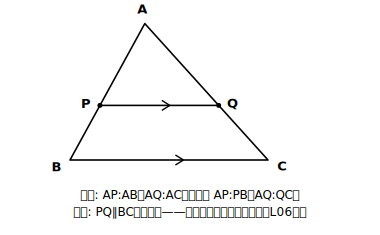

# L09 比から平行を導く——矢印の向きを逆にする

## ねらい

- 「平行ならば比が等しい」の**逆**、「比が等しければ平行」が成り立つことを確かめる。
- 平行を証明するための新しい道具として、証明の根拠リストに追加する。

## 導入：矢印を逆に読めるか

L06で確かめたのは「PQ∥BC **ならば** AP:AB=AQ:AC」、平行から比へ、の向きだった。中2で学んだとおり、「ならば」の矢印は自動では逆に読めない。逆が成り立つかは、あらためて確かめる必要がある。今日の問いは——**AP:AB=AQ:ACならば、PQ∥BCと言えるか？**

## 主概念：平行線と線分の比の逆

**△ABCで、辺AB、AC上の点P、Qについて**

- **AP:AB=AQ:AC ならば PQ∥BC**
- **AP:PB=AQ:QC ならば PQ∥BC**

**確かめ方（構想から）**: 平行を言うには「同位角が等しい」が言えればよく、そのためには△APQ∽△ABCが言えればよい（結論からの逆向き設計。L04の型）。
△APQと△ABCで、∠Aは共通〔共通な角〕。仮定よりAP:AB=AQ:AC〔仮定〕。**対応する2組の辺の比とその間の角がそれぞれ等しい**ので、△APQ∽△ABC〔相似条件〕。よって∠APQ=∠ABC〔相似な図形の性質〕。同位角が等しいから、PQ∥BC〔同位角が等しければ平行〕。

2つ目の**AP:PB=AQ:QCならばPQ∥BC**も、これで確かめられる。AP:PB=AQ:QCをたとえばm:nとすると、AB=AP+PB、AC=AQ+QCだから、AP:AB=m:(m+n)=AQ:AC。1つ目の形に言い換えられるので、上の証明がそのまま使える。

循環論法セルフチェック。L06では「平行」を根拠に使って「比」を導いたが、今日は「比」を根拠に「平行」を導いた。使った相似条件も違う（L06は二角、今日は二辺比夾角）。**同じ図でも、仮定と結論が入れ替われば別の証明**。ここを混ぜると、結論の平行を根拠に使う循環論法に落ちる。

:::guide
**使う相似条件が変わる理由：ここが「逆」の試金石**

L06と今日の証明は、同じ図なのに使う相似条件が違う。理由を自分の言葉で言えるかが、逆を理解したかどうかの試金石だ。L06では平行が仮定だったから、同位角で「2組の角」が調達できた。今日は平行がまだ手元にない（それを示したい）ので、角の調達先は共通な∠Aの1組だけ——だから角2組の条件は使えず、仮定の「比」を活かせる**二辺比夾角**に切り替えるしかない。この「手持ちの仮定から条件を選び直す」判断はL04の構想の実践そのものだ。逆に、うっかり同位角を根拠に書いたら、それは示したい平行を使ったことになり、循環論法に落ちている。3点検の点検3が鳴る場面である。
:::

**注意**: 逆で使えるのは「頂点Aから測った比」か「辺の一部どうしの比」のそろった組だけ。AP:ABとAQ:QCのような**混ぜた比**が等しくても、平行は言えない。

## 例題1

△ABCで、辺AB、AC上に点P、Qがあり、AP=6cm、AB=9cm、AQ=8cm、AC=12cm。PQとBCは平行といえるか。

**考え方**:
AP:AB=6:9=2:3。AQ:AC=8:12=2:3。2つの比が等しいので、**PQ∥BC**（平行線と線分の比の逆）。

## 例題2

△ABCで、辺AB、AC上に点P、Qがあり、AP=4cm、AB=6cm、AQ=6cm、AC=10cm。PQとBCは平行といえるか。

**考え方**:
AP:AB=4:6=2:3。AQ:AC=6:10=3:5。2:3≠3:5だから、**平行とはいえない**。「比を2組作って比べる→等しくなければ平行でない」——判定は機械的にできる。

:::guide
**判定問題の手順に「比の種類の確認」を1行足す**

つまずきやすいのは、与えられた長さから反射的に比を作って比べてしまうことだ。本文の注意にあるとおり、逆で使えるのは「頂点からの比どうし」（AP:ABとAQ:AC）か「一部どうしの比どうし」（AP:PBとAQ:QC）のそろった組だけ。練習の(ウ)は、わざと種類のそろっていない長さの与え方をしてある。AP:PBは作れるが、Q側はAQ:ACしか直接作れない。ここで「そろっていないから判定不能」と止まるのではなく、AC=15とAQ=5からQC=10を出して**種類をそろえてから**比べるのが正しい動きだ。判定の手順は「①比の種類を確認してそろえる→②2組の比を比べる」の2段で覚えておこう。①を飛ばした判定は、当たっても偶然である。
:::

## 練習

次の(ア)〜(ウ)のそれぞれについて、PQ∥BCといえるか判定し、理由を比の式で示そう（P、QはそれぞれAB、AC上の点）。

- (ア) AP=3cm、PB=6cm、AQ=4cm、QC=8cm
- (イ) AP=5cm、AB=8cm、AQ=10cm、AC=15cm
- (ウ) AP=4cm、PB=8cm、AQ=5cm、AC=15cm

（(ウ)は与えられた比の「種類」がそろっていない。そろえてから比べること。解答は指導者用answer_key_S2に分離）

:::zatsudan
## 雑談枠：根拠リストが、また1行育った

中2の証明で使ってよい根拠は、対頂角、平行線の性質、合同条件……というリストだった。この章で相似条件と相似な図形の性質が加わり、今日そこに「比が等しければ平行」がもう1行加わった。証明の勉強は、実はこの**根拠リストを育てていく**営み——リストが長くなるほど、証明できる世界が広がる。次のレッスンでは、今日の逆と基本形を組み合わせると、有名な性質が「特別な場合」として転がり出てくる。
:::

:::stretch
## stretch（発展・分離枠）

- 「AP:AB=PQ:BCならばPQ∥BC」は正しいか。反例を探してみよう（ヒント: PQ∥BCの正しい図で、Pを中心に半径PQの円をかく。PQがACと垂直でないかぎり、円は直線ACとQ以外のもう1点Q′でも交わる。PQ′=PQだから比は保たれるのに、PQ′はBCと平行でない）。
- L06〜L09で登場した性質を「平行→比」「比→平行」の2つの向きに仕分けして、自分の根拠リストを1枚にまとめてみよう。
:::

---

対応解答: answer_key_S2.md

<!-- gen_nav:nav:start（自動生成・手編集しない） -->

---

[← 前のレッスン](lesson_08.md)｜[単元の目次](README.md)｜[解答](answer_key_S2.md)｜[次のレッスン →](lesson_10.md)

<!-- gen_nav:nav:end -->
