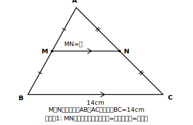

# L10 中点連結定理——「特別な場合」のごほうび

## ねらい

- 三角形の2辺の中点を結ぶ線分の性質（中点連結定理）を、**平行線と線分の比の特別な場合**として捉え直す。
- 「MN∥BC、MN=½BC」を、長さ・平行の両方の道具として使えるようになる。

## 導入：いちばん特別な点を選んだら

L06〜L09で、辺上の点P、Qがどんな比で辺を分けても成り立つ性質を手に入れた。では、**いちばん特別な分け方**（ちょうど真ん中）を選んだら、何が出てくるだろう。辺AB、ACの**中点**をM、Nとして、これまでの道具をそのまま当ててみる。

## 主概念1：中点連結定理

**△ABCで、辺AB、ACの中点をそれぞれM、Nとすると**

$$MN∥BC,\quad MN=\frac{1}{2}BC$$

**新しい証明は、ほぼいらない。** MはABの中点だからAM:AB=1:2〔仮定〕。NはACの中点だからAN:AC=1:2〔仮定〕。2つの比が等しいので、L09の逆より**MN∥BC**〔平行線と線分の比の逆〕。平行が言えたので、L06の基本形よりMN:BC=AM:AB=1:2、つまり**MN=½BC**〔基本形の3つの比〕。

書き終えたら、ここでも循環論法セルフチェック3点検（L05）。根拠に使ったのは「中点〔仮定〕」「L09の逆」「L06の基本形」で、結論のMN∥BC、MN=½BCそのものは根拠に使っていない。合格だ。

つまり中点連結定理は、平行線と線分の比で**比を1:2にした特別な場合**にすぎない。新しい定理を覚えたというより、持っていた性質の中から特別な場合を取り出して名前をつけた——この「捉え直し」の感覚が今日の主役だ。特別な場合は、条件が単純なぶん出番が多い。「中点が2つ見えたら、平行と半分がタダで手に入る」と覚えておこう。

:::guide
**証明が2行で済む「軽さ」こそが、今日の教材**

新しい定理の授業なのに、証明はL09の逆＋L06の基本形を1回ずつ呼び出すだけで終わってしまった。この軽さに拍子抜けしたなら、それこそが狙いだ。定理を1つずつゼロから証明し直すのではなく、**すでに確かめた性質の「特別な場合」として取り出せば、証明はほとんど済んでいる**——これが「統合的に捉え直す」という学び方で、覚える量を劇的に減らしてくれる。もし将来この定理の式をど忘れしても、「中点だから比は1:2、あとは平行線と線分の比のとおり」とたどれば、その場で復元できる。定理を暗記の対象ではなく、性質の網の目の1点として持つ。この持ち方は、この先の数学全体で効く。
:::

:::guide
**「中点連結定理」という名前について**

この定理の呼び名は、実は公式に指定された用語ではない。この教材では広く使われている「中点連結定理」を採用しているが、教科書によって表記や提示のしかたが少し異なることがある。使っている教科書の表記に合わせて読み替えてほしい。名前がどうであれ、中身は今日確かめたとおり「中点2つ→平行と半分」。名前より、この中身と導き方を持ち歩くことが大切だ。
:::

## 主概念2：中点連結定理を使う

使い方は2方向ある。

1. **長さ**: 中点2つ→結んだ線分は底辺の半分（逆に、MNからBCを2倍で復元もできる）。
2. **平行**: 中点2つ→結んだ線分は底辺と平行。角の問題や、次のレッスンの「平行四辺形であることの証明」で効く。

## 例題1

△ABCで、辺AB、ACの中点をM、Nとする。BC=14cmのとき、MNの長さを求めよう。

**考え方**:
中点連結定理より、MN=½BC=½×14=**7cm**。（MN∥BCも同時に成り立っている——使わなくても、成り立っている。）

## 例題2

△ABCで、辺AB、ACの中点をM、Nとする。MN=9cmのとき、BCの長さを求めよう。

**考え方**:
MN=½BCを逆向きに使って、BC=2×MN=2×9=**18cm**。

## 練習

1. △ABCで、辺AB、ACの中点をM、Nとする。BC=16cmのとき、MNの長さを求めよう。
2. △ABCで、辺AB、ACの中点をM、Nとする。MN=6.5cmのとき、BCの長さを求めよう。
3. △ABCの3辺の長さが8cm、10cm、12cmで、辺BC、CA、ABの中点をそれぞれD、E、Fとする。△DEFの周の長さを求め、△ABCの周の長さと比べて気づいたことを書こう。

（解答は指導者用answer_key_S2に分離）

:::zatsudan
## 雑談枠：測れない距離を「半分の橋」で

この章の終わりには、直接測れない木の高さや、池をはさんだ2本の木の間の距離を、縮図を使って求める勉強が待っている。中点連結定理は、その現場でも顔を出す。自分の立つ1つの地点から、測りたい2地点それぞれへ**まっすぐ**向かう道のりを考え、それぞれの道のりの中点に印をつけて、中点どうしの距離を測れば、測りたい距離はその2倍（自分と2地点がつくる三角形で、2辺の中点を結んだことになる）——障害物の上を通らずに、半分サイズの「橋」で測ったことになる。真ん中を選ぶだけで比が1:2に固定される単純さが、道具としての強さだ。
:::

:::stretch
## stretch（発展・分離枠）

- 逆向きの問い: MがABの中点で、MN∥BC（NはAC上）ならば、NはACの中点といえるか。L06の基本形を使って確かめてみよう。
- 練習3の「周の長さが半分の三角形」について、△DEFと△ABCは相似といえるか。相似条件のどれが使えるか考えてみよう。
:::

---

対応解答: answer_key_S2.md

<!-- gen_nav:nav:start（自動生成・手編集しない） -->

---

[← 前のレッスン](lesson_09.md)｜[単元の目次](README.md)｜[解答](answer_key_S2.md)｜[次のレッスン →](lesson_11.md)

<!-- gen_nav:nav:end -->
