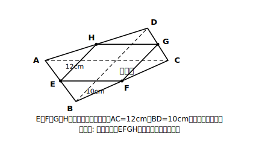

# L11 中点四角形の発見——定理で新しい性質を掘り当てる

## ねらい

- 四角形の各辺の中点を結んでできる四角形が**いつでも平行四辺形になる**ことを、実験から発見し、中点連結定理で証明する。
- 手に入れた定理を使って「新しい性質を自分で見つける」経験をする。

## 導入：まず、へんてこな四角形でやってみる

ノートに四角形を1つかこう。きれいな四角形でなくていい。むしろ、ゆがんだ四角形ほどおもしろい。4辺それぞれの中点に印をつけ、隣どうしを順に結ぶ。内側にできた四角形（**中点四角形**と呼ぼう）は、どんな形に見えるだろうか。

もう1つ、まったく違う形の四角形でも試す。細長いもの、つぶれたもの。……何度やっても、中にできるのは**平行四辺形らしき形**ではないだろうか。外側がどんなにゆがんでいても、だ。「本当にいつでもか？」——推測ができたら、証明の出番。

:::guide
**実験→推測→証明の順を、今日だけは崩さない**

結論を知ってしまえば、この実験は省略できる。だが今日のレッスンは「性質を知る」ことではなく「性質を自分で発見する」体験が主題なので、実験→推測→証明の順を崩すと値打ちの大半が消えてしまう。作図は最低2回、できるだけ違う形で。きれいな四角形だと「たまたまでは？」という疑いが生まれず、推測が弱くなる。ゆがんだ四角形ほど、中に現れる平行四辺形の意外さが際立つ。もしへこんだ四角形（矢じり形）で試したくなったら、ぜひやってみてほしい。実はそれでも成り立つ。「へこんでいても成り立つのか」という驚きまで拾えたら、実験は大成功だ。
:::

## 主概念：中点四角形は平行四辺形

**四角形ABCDの辺AB、BC、CD、DAの中点をそれぞれE、F、G、Hとすると、四角形EFGHは平行四辺形である。**

**構想（L04の型）**: 平行四辺形と言うには、中2の「平行四辺形になるための条件」のどれかが言えればよい。ここでは「1組の対辺が平行で長さが等しい」を狙う。EFとHGについて何か言えないか。EはABの中点、FはBCの中点。**中点が2つ**。L10の出番だ。ただし三角形が見当たらない……なら、**対角線ACを引いて作ればいい**。

**証明**:
対角線ACを引く。
△BACで、E、FはBA、BCの中点だから〔仮定〕、中点連結定理より EF∥AC、EF=½AC〔中点連結定理〕。
△DACで、H、GはDA、DCの中点だから〔仮定〕、中点連結定理より HG∥AC、HG=½AC〔中点連結定理〕。
よってEF∥HG、EF=HG。1組の対辺が平行で長さが等しいから、四角形EFGHは平行四辺形である〔平行四辺形になるための条件〕。

書き終えたらここでも3点検。根拠は中点〔仮定〕・中点連結定理・平行四辺形になるための条件だけで、結論「EFGHは平行四辺形」は使っていない。合格（練習3で、自分の手でも確認する）。

補助線1本（対角線）で三角形を2つ作り、同じ定理を2回使う——それだけで、どんな四角形にも通用する性質が証明できた。実験で「いつでもそうなりそう」を見つけ、証明で「いつでもそうなる」に変える。この流れ全体が、今日の学びだ。

:::guide
**補助線「対角線」は、どうやって思いつくのか**

「対角線を引く」は天下り的に見えるが、構想の型（L04）から自然に出てくる。ほしい結論は平行四辺形の条件、そのためにEFとHGについて平行や長さが言えればよい。EとFは中点で、「中点が2つ見えたらL10」だった。ところが定理を使うには三角形が要るのに、四角形の図に三角形は見当たらない。**なければ作る**。E・Fを2辺の中点として含む三角形を探すと、△BACが見えて、その第3の辺がちょうど対角線ACになっている。引くべき補助線は、使いたい定理の側から逆算されて決まったわけだ。「使いたい道具が要求する形を、図の中に作る」——補助線の思いつき方の正体は、たいていこれである。なお、stretchのひし形・長方形の話は「対角線の長さ・交わり方が中点四角形の形を決める」という観察までで十分。深追いは要らない。
:::

## 例題

四角形ABCDの各辺の中点を順にE、F、G、Hとする。対角線AC=12cm、BD=10cmのとき、中点四角形EFGHの周の長さを求めよう。

**考え方**:
EF=HG=½AC=6cm（上の証明のとおり）。
同様に対角線BDを引くと、△ABDと△CBDでFG=EH=½BD=5cm。
周の長さ=2×(6+5)=**22cm**。中点四角形の周は、**2本の対角線の長さの和に等しい**ことも見えてくる。

## 練習

1. 上の証明で、「1組の対辺が平行で長さが等しい」の代わりに対角線BDを引いてFG・EHについて同じことを示し、「2組の対辺がそれぞれ平行」で証明を完成させよう。
2. 四角形ABCDの対角線がAC=18cm、BD=14cmのとき、中点四角形の周の長さを求めよう。
3. 完成した証明に、L05の循環論法セルフチェック3点検を実行しよう。根拠に使ったものをすべて書き出すこと。

（解答は指導者用answer_key_S2に分離）

:::zatsudan
## 雑談枠：定理は「使うと増える」

この2節で手に入れた道具を振り返ると、基本形→延長上→一般化→逆→中点連結定理、と一本の鎖になっている。そして今日、その鎖の先で「中点四角形は平行四辺形」という、教科書に載る前なら誰も知らなかったはずの性質を自分の手で掘り当てた。「すでにある定理を新しい場所で使ってみる」——数学の発見には、こうして生まれたものが少なくないと言われることがある。少なくとも今日の君は、その手順で1つ掘り当てた。
:::

:::stretch
## stretch（発展・分離枠）

- 元の四角形ABCDの**対角線が等しい**（AC=BD）とき、中点四角形はただの平行四辺形より特別な形になる。何になるか、証明のEF=½AC、FG=½BDを見直して予想し、確かめてみよう。
- 対角線が**垂直に交わる**ときはどうか。平行四辺形の角に注目して考えてみよう。
:::

---

対応解答: answer_key_S2.md

<!-- gen_nav:nav:start（自動生成・手編集しない） -->

---

[← 前のレッスン](lesson_10.md)｜[単元の目次](README.md)｜[解答](answer_key_S2.md)｜[次のレッスン →](lesson_12.md)

<!-- gen_nav:nav:end -->
