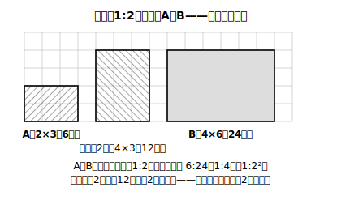

# L12 面積比は相似比の2乗

## ねらい

- 相似な図形の面積比が、相似比**そのままではない**ことを、方眼の数え上げで実感する。
- 面積比＝相似比の2乗を理解し、一方の面積からもう一方の面積を求められるようになる。

## 導入：まず予想を書く（消さないこと！）

L02のstretchで予告した問題に、いよいよ正面から取り組む。

> 相似比が1:2の2つの長方形がある。**面積は何倍になるだろうか？**

先に進む前に、自分の予想をノートの上端に書こう。**あとで消さないこと**。予想が合っていたか外れていたか、それ自体が今日いちばんの教材になる。

:::guide
**「予想を先に書く」を飛ばしてはいけない理由**

「相似比が2倍なら面積も2倍」という感覚は、この単元でいちばん根強い思い込みだ。大人になっても残っていることがあると言われるほどで、一度の説明を聞いただけでは上書きされにくい。この思い込みを本当に消せるのは、説明ではなく**違和感**——「自分は2倍だと予想したのに、数えたら4倍あった」という、自分の予想との衝突だけだ。だから予想を先に書かずに数え始めると、違和感の生まれる場所がなくなり、今日のワークは効き目の大半を失う。外れた予想は恥ではなく、今日いちばんの収穫である。消さずに残して、外れ方まで含めて味わってほしい。
:::

## 主概念1：方眼で数える——対比ワーク

**手順**: 方眼紙に、縦2マス×横3マスの長方形Aをかく。次に、Aと相似で相似比が1:2の長方形B（縦4マス×横6マス）をかく。そして**マスの数を数える**。

- 長方形A：2×3=**6マス**
- 長方形B：4×6=**24マス**

24÷6=**4倍**。「2倍」と予想した人は、ここで手が止まるはずだ。数え間違いではない。もう一度数えても24マスある。

**なぜ2倍ではないのか**。縦**だけ**を2倍にした長方形（縦4×横3=12マス）をかいてみると、これがちょうど2倍。つまり「面積も2倍」という感覚は、**縦しか伸ばしていない**のと同じなのだ。相似では縦も横も2倍になる。だから 2×2=**4倍**。

:::guide
**「縦だけ2倍」の長方形が、このワークの心臓部**

24マスを数えて「4倍だった」で終わらせず、必ず「縦だけ2倍」の12マスの長方形もかいてほしい。この1枚があると、「面積も2倍」という誤った感覚が**何をした場合の正しい答えなのか**が目に見える。2倍という直感は間違いというより、「1方向しか伸ばしていない操作」の答えだったのだ。相似の拡大は縦と横の2方向に効くから2×2。この「操作を目で見る」経験があると、あとで公式（m²:n²）だけ思い出せなくなっても、頭の中で方眼をかき直して復元できる。L14で立体（3方向、3乗）に進むとき、同じ絵をもう一段深くして使う。
:::

三角形でも確かめよう。底辺4マス・高さ3マスの三角形（面積6マス分）を相似比1:2で拡大すると、底辺8・高さ6で面積24マス分。やはり4倍だ。

## 主概念2：面積比は相似比の2乗

相似比が m:n の2つの図形では、対応する長さがすべて m:n。長方形なら縦・横の両方が m:n だから面積は m²:n²、三角形も底辺と高さの両方が m:n だから同じ。一般の図形も、細かい方眼（小さな長方形）の集まりで近づけられるので、この関係はそのまま広がる。つまり面積は「長さ×長さ」の量で、

**面積比 = m²:n²（相似比の2乗）**

面積比は対応する線分の長さの比に等しく**ならない**——ここが今日の核心。長さの比（相似比）と面積の比は、別の比として使い分ける。

## 例題1

相似比が2:3の2つの相似な図形がある。(1) 面積比を求めよう。(2) 小さい方の面積が20cm²のとき、大きい方の面積を求めよう。

**考え方**:
(1) 面積比=2²:3²=**4:9**。
(2) 20:x=4:9 より 4x=180、**x=45cm²**。
（検算のすすめ: 45÷20=2.25=(3/2)²。答えが相似比の2乗倍になっているか、最後に確かめる習慣を。）

## 例題2

△ABC∽△DEFで、AB=8cm、DE=12cm。△DEFの面積が36cm²のとき、△ABCの面積を求めよう。

**考え方**:
相似比はAB:DE=8:12=2:3。面積比は4:9。△ABC:36=4:9 より 9×△ABC=144、**△ABC=16cm²**。
「12は8の1.5倍だから面積も1.5倍」とやりたくなったら、今日の方眼を思い出すこと。

## 練習

1. 相似比が3:5の2つの相似な図形について、面積比を求めよう。また、小さい方の面積が18cm²のとき、大きい方の面積を求めよう。
2. 相似比が1:4の2つの相似な図形の面積比を求めよう。
3. 相似な2つの図形の面積比が16:25のとき、相似比を求めよう。また、小さい方の図形のある辺が8cmのとき、大きい方の対応する辺の長さを求めよう（今日の逆向き——面積比から長さの比へ戻る）。

（解答は指導者用answer_key_S3S4に分離）

:::zatsudan
## 雑談枠：地図の上の「面積」

縮尺1:25000の地図では、長さはどこも実際の25000分の1。では地図上の公園の面積は？——今日の法則で、実際の（25000×25000）分の1。広い土地が手のひらサイズの地図に収まるのは、面積が縮尺の2乗で縮むおかげ。
:::

:::stretch
## stretch（発展・分離枠）

- 相似比1:3の長方形で、今日の方眼ワークをもう一度やってみよう。「縦だけ3倍」の長方形もかくと、3倍と9倍のあいだの「差の正体」が見える。
- 相似比m:nの図形の周の長さの比はm:n（L02練習3）、面積比はm²:n²。では長さ・面積のどちらでもない「対角線の本数」のような**個数**は、相似で変わるだろうか。理由をつけて考えてみよう。
:::

---

対応解答: answer_key_S3S4.md

<!-- gen_nav:nav:start（自動生成・手編集しない） -->

---

[← 前のレッスン](lesson_11.md)｜[単元の目次](README.md)｜[解答](answer_key_S3S4.md)｜[次のレッスン →](lesson_13.md)

<!-- gen_nav:nav:end -->
