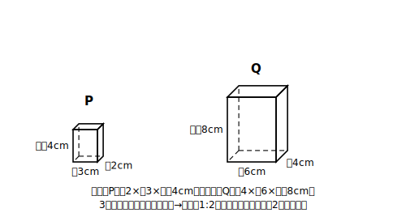

# L13 立体の相似・表面積の比

## ねらい

- 平面図形の相似から**類推**して、立体の相似の意味を理解する。
- 表面積の比が相似比の2乗になることを、実際の計算で確かめる。

## 導入：立体にも「形が同じ」はある

同じ形で大きさの違う箱、同じ形で大きさの違うボール。平面で考えてきた「形が同じ」＝相似は、立体にもそのまま広げられる。立方体、直方体、柱体、錐体、球。こうした基本的な立体で、相似を考えていこう。

## 主概念1：立体の相似

一方を**一定の割合で拡大または縮小したとき他方と合同になる**とき、2つの立体は相似であるという。平面のときの定義①とまったく同じ発想だ。

そして平面と同じく、相似な立体では**対応する線分の長さの比がすべて等しい**。この比が立体の**相似比**。直方体なら縦・横・高さのすべて、円柱なら底面の半径も高さも、同じ比になっている。

例: 縦2cm×横3cm×高さ4cmの直方体Pと、縦4cm×横6cm×高さ8cmの直方体Q。3組の辺がすべて2:4=3:6=4:8=1:2。PとQは相似で、相似比は**1:2**。

:::guide
**「類推」という道具：定義を暗記せずに作る**

今日の立体の相似の定義を、新しい暗記として覚える必要はほとんどない。平面の定義①「拡大または縮小したとき合同になる」の「図形」を「立体」に読み替えただけだからだ。このように、すでに持っている考えを新しい対象に写して試すことを**類推**という。類推は便利だが、写した先で本当に成り立つかの確認は必要で、今日の表面積の計算（52cm²と208cm²）はその確認作業にあたる。「定義を写す→数値で確かめる」。この2段構えを覚えておくと、この先、新しい概念に出会うたびに「どの古い概念の言い直しか」を探す構えができる。覚えることが減り、つながりが増える。
:::

## 主概念2：表面積の比は相似比の2乗

表面積は「面の面積の合計」。面積の話だから、L12の法則がそのまま効く。

**相似比 m:n の立体の表面積の比 = m²:n²**

さっきのPとQで実際に確かめよう。

- Pの表面積: (2×3＋3×4＋2×4)×2 = (6＋12＋8)×2 = **52cm²**
- Qの表面積: (4×6＋6×8＋4×8)×2 = (24＋48＋32)×2 = **208cm²**

208÷52=**4倍**=2²。相似比1:2に対して、表面積の比は確かに1:4になっている。

## 例題

相似な2つの直方体があり、相似比は1:3。小さい方の表面積が40cm²のとき、大きい方の表面積を求めよう。

**考え方**:
表面積の比=1²:3²=1:9。40:x=1:9 より **x=360cm²**。
（長さが3倍なら面の1つ1つが9倍になり、面の数は変わらない——だから合計も9倍、と意味で納得しておこう。）

:::guide
**「表面積なのに、なぜ立体の3乗ではないのか」と迷ったら**

立体の問題になったとたん、反射的に3乗を使いたくなる人がいる（逆に、次のレッスンで体積に2乗を使ってしまう人もいる）。分かれ目は「立体か平面か」ではなく、**問われている量が長さ・面積・体積のどれか**だ。表面積は、立体に貼りついてはいるが中身は「面の面積の合計」——面積の仲間だから2乗。体積は空間を満たす量だから3乗（次のレッスン）。問題文を読んだら、計算を始める前に「これは長さの話？面積の話？体積の話？」と量の種類を1つ宣言する。この1行の習慣が、2乗と3乗の取り違えをほぼ根絶してくれる。
:::

## 練習

1. 相似比が2:5の2つの相似な立体の、表面積の比を求めよう。
2. 縦1cm×横2cm×高さ3cmの直方体Aと、縦2cm×横4cm×高さ6cmの直方体Bがある。AとBが相似であることを確かめ、相似比と表面積の比を求めよう。さらに両方の表面積を実際に計算して、比が合っているか検算しよう。
3. 相似な2つの立体の表面積の比が9:16のとき、相似比を求めよう。また、小さい方のある辺が6cmのとき、大きい方の対応する辺の長さを求めよう。

（解答は指導者用answer_key_S3S4に分離）

:::zatsudan
## 雑談枠：定義はいつも「前の学年の言い直し」

合同の定義は「移動すると重なる」、相似の定義は「拡大または縮小すると合同になる」で、後者は合同の言葉を使って作られていた。そして今日の立体の相似も、平面の相似の発想をそのまま立体に写して作った。数学の新しい定義は、すでに持っている定義を土台に「言い直し」で積み上げて作られることがある——少なくとも合同→相似→立体の相似は、ずっとその作り方だった。新しい用語に出会ったら「どの古い言葉で作られているか」を探すと、覚えることがぐっと減る。
:::

:::stretch
## stretch（発展・分離枠）

- 円柱で確かめよう。底面の半径2cm・高さ3cmの円柱と、半径4cm・高さ6cmの円柱の表面積をそれぞれπのまま計算し、比が1:4（＝相似比1:2の2乗）になることを検算してみよう。
- 半径の違う2つの球は、いつでも相似といえるだろうか。理由も考えてみよう。
:::

---

対応解答: answer_key_S3S4.md

<!-- gen_nav:nav:start（自動生成・手編集しない） -->

---

[← 前のレッスン](lesson_12.md)｜[単元の目次](README.md)｜[解答](answer_key_S3S4.md)｜[次のレッスン →](lesson_14.md)

<!-- gen_nav:nav:end -->
