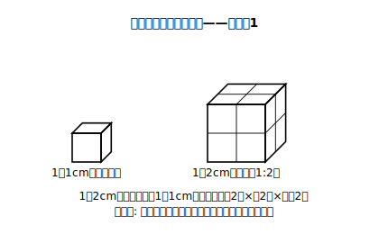

# L14 体積比は相似比の3乗

## ねらい

- 相似な立体の体積比が相似比の**3乗**になることを、積み木の数え上げと計算の両方で確かめる。
- 体積比と価格を組み合わせて、大きさの違う相似な商品の**割安さ**を比較できるようになる。

## 導入：方眼の次は積み木

L12では、方眼を数えて「長さ2倍→面積4倍」を目撃した。立体では何が起きるか。予想をまた**先に**書いてから、数えにいこう。1辺1cmの立方体を積み木として使う。

## 主概念1：体積比は相似比の3乗

1辺1cmの立方体（積み木1個）を、相似比1:2で拡大すると1辺2cmの立方体。これを積み木で組むと——縦2個×横2個×高さ2個で**8個**。面積のときの「縦×横」に、今度は**高さ**も加わる。2×2×2=**8倍**。

直方体でも確かめる。縦2×横3×高さ4（cm）の直方体の体積は24cm³。相似比1:2で拡大した縦4×横6×高さ8の体積は192cm³。192÷24=**8倍**=2³。

**相似比 m:n の立体の体積比 = m³:n³（相似比の3乗）**

まとめると、相似な立体では:

| 量 | 比 |
|---|---|
| 長さ（相似比） | m:n |
| 表面積 | m²:n² |
| 体積 | m³:n³ |

長さ・面積・体積で比が**全部違う**。どの量を聞かれているかを最初に確認するのが、この節の作法だ。

:::guide
**積み木はL12の方眼の「3次元版」：型を2回通す意味**

今日の積み木の数え上げは、L12の方眼ワークとまったく同じ型（予想を先に書く→数える→操作で納得する）の2回目だ。同じ型を2回通すのには理由がある。1回目（面積）で「拡大は2方向に効くから2乗」を操作の記憶として持った人は、2回目（体積）で「今度は高さの方向が加わって3方向、だから3乗」と、**公式ではなく操作の違い**として2乗と3乗を区別できるようになる。もし2乗か3乗かで迷う日が来たら、方眼と積み木の絵を思い出せばいい。面積は縦×横の2方向、体積は縦×横×高さの3方向。指を折って方向を数えれば、指数は自動的に決まる。
:::

## 例題1

相似比が2:3の2つの相似な立体がある。小さい方の体積が40cm³のとき、大きい方の体積を求めよう。

**考え方**:
体積比=2³:3³=8:27。40:x=8:27 より 8x=1080、**x=135cm³**。
（検算: 135÷40=3.375=(3/2)³。3乗になっているか最後に確認。）

## 主概念2：どちらが割安か——体積比×価格比

大きさ違いで売られている商品は、**容器が相似**で、どちらも同じ割合まで中身が入っている（容器の厚みは無視できる）とみなせるなら、体積比で中身の量を比べられる。ここからは、そうみなせる架空のお店で考える。

## 例題2

架空の店「まる工房」のはちみつは、**相似な容器**の2サイズで売られている。

- 小サイズ: 高さ8cm、400円
- 大サイズ: 高さ12cm、1200円

どちらが割安だろうか。

**考え方**:
容器は相似で、相似比は高さの比=8:12=2:3。体積比は2³:3³=**8:27**。
大サイズの中身は小サイズの 27/8=3.375倍。一方、価格は 1200÷400=3倍。
**量は3.375倍なのに、価格は3倍**——大サイズの方が割安だ。
別の確かめ方: 体積8あたり400円（小）と体積27あたり1200円（大）で、体積1あたりは小が50円、大が約44.4円。やはり大が割安。

「大きい方の値段は3倍だから損」でも「大きい方がいつも得」でもない。**量の倍率（体積比）と価格の倍率を別々に出して比べる**。これが今日の型。

:::guide
**現実に数学を当てるときは、「仮定」を先に言う**

主概念2の冒頭に置かれた条件（容器が相似・どちらも同じ割合まで中身が入っている・厚みは無視できる）は、飾りの但し書きではない。現実の商品は、背だけ高いボトルや底上げされた容器のように**相似でないものも多い**し、中身の詰まり方もさまざまだ。そういう商品には今日の体積比の計算はそのまま使えない。数学を現実に当てはめるときの正しい作法は、「この場面は〜とみなせるなら」と**仮定を先に宣言してから**計算に入ること。仮定が言えることは、計算ができることと同じくらい大事な数学の力だ。買い物の場面で今日の型を使うときも、「この2つ、そもそも相似かな？」の一瞥から始めてほしい。
:::

## 練習

1. 相似比が1:4の2つの相似な立体の体積比を求めよう。
2. 相似な2つの円錐があり、相似比は3:5。小さい方の体積が54cm³のとき、大きい方の体積を求めよう。
3. 架空の店「アオイ商店」のジュースは、相似なボトルの2サイズ。小（高さ10cm）150円、大（高さ20cm）900円。どちらが割安か、体積比と価格の倍率を比べて判断しよう。
4. 相似比2:3の2つの相似な立体について、表面積の比と体積比を両方求めよう（2乗と3乗の使い分け確認）。

（解答は指導者用answer_key_S3S4に分離）

:::zatsudan
## 雑談枠：棚の前の「体積比の目」

箱詰めやボトル詰めの商品をサイズ違いで比べる話は、学習指導要領解説にも学習例として載っている、れっきとした数学の応用先だ。高さが1.5倍の容器は、相似なら中身が3.375倍で、見た目の印象よりずっと多い。逆に「ちょっと大きくて値段は2倍」が実は割安なこともある。買い物のとき、価格の倍率と体積の倍率を頭の中で別々に立てる——今日の授業は、棚の前で一生使える。
:::

:::stretch
## stretch（発展・分離枠）

- 例題2で、大サイズが小サイズと「体積1あたりの価格がちょうど同じ」になるのは、大サイズが何円のときか求めてみよう。
- 相似比1:2の相似な容器で、表面積は4倍なのに体積（中身）は8倍。材質と厚さが同じという仮定のもとでは表面積が材料の量の目安になる——この仮定のもとで、容器を大きくするほど「中身に対して材料が割安」になる理由を、2乗と3乗の差から説明してみよう。
:::

---

対応解答: answer_key_S3S4.md

<!-- gen_nav:nav:start（自動生成・手編集しない） -->

---

[← 前のレッスン](lesson_13.md)｜[単元の目次](README.md)｜[解答](answer_key_S3S4.md)｜[次のレッスン →](lesson_15.md)

<!-- gen_nav:nav:end -->
