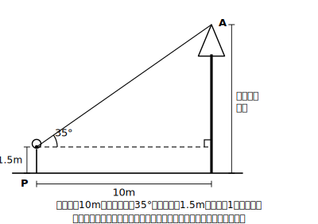
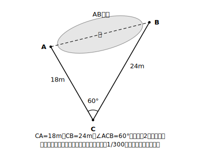

# L15 縮図による測量（手順分解）

## ねらい

- 直接測れない高さ・距離を、縮図を使って求める方法を理解する。
- 「①測定 → ②縮図作成 → ③求値」の**3手順**に分けて、どんな場面でも同じ型で解けるようになる。

## 導入：巻尺では届かない

木のてっぺんまでの高さ。あいだに池があって歩いて渡れない2地点の距離。巻尺を当てられないものを、どう測るか——答えは「**測れるものだけ測って、縮図をかく**」。縮図は実物と相似だから、縮図の上で測った長さを相似比（縮尺）で戻せば、実物の長さが手に入る。

やることはいつも3手順。**どの手順にいるか**を意識しながら進もう。

:::guide
**なぜわざわざ「3手順」に固定するのか**

「条件を当てはめて計算する」問題と、「現実の場面の中から相似を自分で見つけて使う」問題のあいだには、見た目以上に大きな段差がある。計算はできるのに、木や池の場面になると何から手を付けてよいか分からなくなる。このつまずき方は珍しくない。原因は能力不足ではなく、場面問題には「式を立てる前の仕事」（何を測るか決める・図に翻訳する）が隠れているのに、それが手順として教わらないことにある。3手順はこの隠れた仕事に名前を付けて、段差に階段をかけたものだ。どんな場面でも「いま①か②か③か」と自分の現在地を言えるようにする——それがこのレッスンの本当の目標である。
:::

> **手順①測定**: 実際に測れる距離と角を測る（この教材では、測った値は問題文が与える）
> **手順②縮図作成**: 縮尺を決めて、測った値どおりの縮図をかく
> **手順③求値**: 縮図上で知りたい長さを測り、縮尺で実際の長さに戻す

## 主概念1：木の高さ——3手順の型

**問題**: 木の根元から10m離れた地点Pに立ち、木の先端Aを見上げたら、水平から35°の角だった。目の高さは1.5m。木の高さを求めよう。

**手順①測定**（問題文から整理する）: 水平距離10m、見上げる角35°、目の高さ1.5m。測ったのは「距離1つ・角1つ」だけ。木そのものには触っていない。

**手順②縮図作成**: 縮尺を1/200と決める。10mは200分の1で5cm。横に5cmの線分をひき、端から35°の角をとって直角三角形の縮図をかく（目の高さの分は、あとで足すので縮図には入れない）。

**手順③求値**: 縮図の縦の辺（目の高さから先端まで分）を測ると**約3.5cm**。実際には 3.5×200=700cm=約7m。目の高さ1.5mを足して、木の高さは**約8.5m**。

「目の高さを足す」のを最後まで覚えていられるかが、この型の第一関門。手順①で書き出した3つの値を、③で全部使ったか確認しよう。

:::guide
**「①で書き出した値を③で全部使ったか」は、そのまま検算になる**

目の高さ1.5mの足し忘れが起こるのは、縮図の中に1.5mが**登場しない**からだ（縮図にかいたのは目の高さから上の三角形だけ）。図に出てこない値は、意識から消えやすい。そこで手順①の段階で、測った値・与えられた値をすべて書き出しておき、答えを出したあとに「この値は使ったか」と1つずつ消し込む。未使用の値が残っていたら、足し忘れか、そもそも図の設定を誤解しているかのどちらかだ。この「材料の消し込み検算」は縮図の問題に限らず、文章題全般で使える。使わない値をわざと混ぜた問題に出会うまでは、「余った値=事故のサイン」と思ってよい。
:::

## 主概念2：池ごしの距離——同じ型をもう一度

**問題**: 池をはさんだ2地点A・Bの距離を知りたい。池の外に点Cをとり、CA=18m、CB=24m、∠ACB=60°と測れた。ABを求めよう。

**手順①測定**: CA=18m、CB=24m、∠C=60°。AとBのあいだは1歩も歩いていないことに注目。

**手順②縮図作成**: 縮尺1/300。CA→6cm、CB→8cmとして、60°の角をはさむ2辺をかき、△ABCの縮図を作る。

**手順③求値**: 縮図上のABを測ると**約7.2cm**。実際には 7.2×300=2160cm=**約21.6m**。

場面は変わっても、3手順は一字も変わらない。「高さ」でも「距離」でも、**測れるものから相似な三角形（縮図）を1つ作る**——それがすべて。

なお、学校で実際に校庭の木やビルで測定活動を行う場合もある（角を測る道具と巻尺があればできる）。そのときも頭の中はこの3手順のままだ。

## 練習

1. ビルの根元から30m離れた地点から屋上を見上げたら、水平から25°だった。目の高さは1.5m。縮尺1/500の縮図をかいて、ビルの高さを求めよう。
2. 川の手前の岸に点Aをとり、対岸の木Pとのあいだの距離APを知りたい。Aから岸に沿って20m進んだ点Bで、∠PAB=90°、∠PBA=54°と測れた。縮尺1/400の縮図をかいてAPを求めよう。
3. （説明問題）縮図でなぜ実際の長さが求められるのか。「相似」「対応する線分の比」「縮尺」の3語を使って説明しよう。

（解答は指導者用answer_key_S3S4に分離）

:::zatsudan
## 雑談枠：触らずに測る

今日の方法の面白さは、**測りたいものに一度も触れていない**ことだ。木に登らず、池を泳がず、地上で測れる距離1つと角1〜2つから、届かない長さが出てくる。学習指導要領解説にも「直接測定することが困難な木の高さ」や「間に池などの障害物がある２本の木の間の距離」が、この単元の活用例としてそのまま挙げられている。測れないものを測れるものに置き換える——測量の発想の核心は、相似そのものだ。
:::

:::stretch
## stretch（発展・分離枠）

- 練習1を縮尺1/250でかき直すと、縮図上の長さはどう変わるか。求まる「実際の高さ」は変わるか。
- 手順①で測る値の組み合わせは1通りではない。木の高さの問題で「距離1つ＋角1つ」の代わりに使えそうな測定の組を考えてみよう（ヒント: 晴れた日には木は地面に何を作る？ 同じ時刻なら、棒も同じ比で作る）。
:::

---

対応解答: answer_key_S3S4.md

<!-- gen_nav:nav:start（自動生成・手編集しない） -->

---

[← 前のレッスン](lesson_14.md)｜[単元の目次](README.md)｜[解答](answer_key_S3S4.md)｜[次のレッスン →](lesson_16.md)

<!-- gen_nav:nav:end -->
