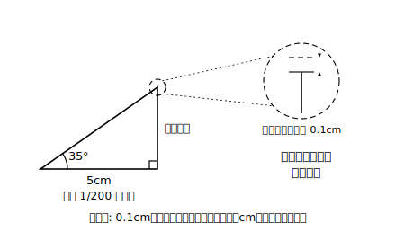

# L16 誤差と活用の深まり

## ねらい

- 縮図による測量の答えに**誤差**が含まれることを理解し、誤差の大きさを見積もれるようになる。
- 小6の縮図学習と比べて、中3で**何ができるようになったのか**を言葉にする。

## 導入：「約8.5m」の「約」の正体

L15で木の高さは「**約**8.5m」だった。なぜ「約」がつくのか。8.5mちょうどではない、と言い切れる理由が、3手順のそれぞれに潜んでいる。

- **手順①測定**の誤差: 巻尺の10mも角の35°も測定値。真の値との差（誤差）を必ず含む。
- **手順②縮図作成**の誤差: 5cmの線分や35°の角を、完全に正確にはかけない。
- **手順③求値**の誤差: 縮図上の長さを定規で読むとき、目盛りの読み取りにずれが出る。

測量の答えは**近似値**。だから「約」をつけ、細かすぎる桁まで書かない。これはA(1)で学んだ誤差・近似値の話が、図形の世界で現実に効いてくる場面だ。

## 主概念1：読み取りのずれは、縮尺の逆数倍になって返ってくる

3つの誤差のうち、手順③の読み取り誤差は自分で見積もれる。

**例題**: L15の木の縮図（縮尺1/200）で、縦の長さを読むとき0.1cm（1mm）読み違えたとする。木の高さの答えは、実際の長さで何cmずれるか。

**考え方**: 縮図上の0.1cmは、実際には 0.1×200=**20cm**。たった1mmの読み違いが、答えでは20cm（0.2m）のずれになる。**縮図上の小さなずれは、縮尺の逆数倍（縮尺1/200なら200倍）に拡大されて答えに現れる**。だから答えを「8.502m」のように書くのは、精度の見せかけ——「約8.5m」が正直な書き方だ。

では、ずれの影響を小さくするには？ **縮図を大きくかけばよい**（縮尺を1/200から1/100にすれば、同じ1mmの読み違いでも実長のずれは半分）。紙の大きさと相談して縮尺を選ぶ、という手順②の判断には、ちゃんと意味があった。

:::guide
**誤差の学習は「答えの信用度」を言えるようになる学習**

数と式の学習で出てきた誤差・近似値の話が、なぜ図形の章の最後に戻ってくるのか。縮図測量は、測定値（誤差を含む）を図形の性質（正確）に通して答えを出す、つまり**測定と論証が合流する場面**だからだ。答えの数値だけでなく「この答えはどのくらい信用できるか」「なぜ約を付けるのか」まで言えて、初めて測量の答えとして完成する。細かい桁まで書けば正確に見えるが、それは精度の見せかけにすぎない。今日の例題の「1mmの読み違いが20cmになる」計算は、その見せかけを自分で暴くための道具である。
:::

:::guide
**縮尺選びはトレードオフの練習**

「縮図を大きくかくほど誤差に強い」なら、いくらでも大きくかけばよいかというと、紙の大きさ・作図の手間という現実の制約がある。縮尺の選択は、精度と実用性の**トレードオフ**（あちらを立てればこちらが立たず）を自分で調停する判断だ。正解が1つに決まらない判断を、根拠をもって下す。教科書の問題では縮尺が与えられることが多いが、実際に使うときは自分で決めることになる。「この場面なら紙に収まる範囲でなるべく大きく」という判断の理由を言えるようになれば、手順②は完全に自分のものになっている。
:::

## 主概念2：小6の縮図から、何が深まったか

縮図で木の高さを求める課題は、実は小学校6年でも扱っている。では中3の私たちは、あのころと同じことをもう一度やっただけだろうか。——違う。3つ深まった。

1. **根拠が言える**: 小6では「縮図をかけば求められる」だった。今は「縮図と実物は相似で、対応する線分の比がすべて縮尺に等しい**から**求められる」と、相似の性質を根拠に説明できる（L15練習3でやったこと）。
2. **計算でも求められる**: 相似比が分かれば、縮図を実際にかかなくても比例式で長さを出せる場面がある（例: 縮図上3.5cm・縮尺1/200なら 3.5×200 の計算だけでよい）。
3. **誤差を見積もれる**: 答えがどれくらい信用できるかまで、今日の方法で議論できる。

道具が増えると、同じ課題の「解ける深さ」が変わる。これがこの章の活用のゴールだ。

## 練習

1. 縮尺1/500の縮図で、長さを0.1cm読み違えると、実際の長さでは何cmのずれになるか。
2. 同じ場面の縮図を、縮尺1/100でかく場合と1/500でかく場合とでは、読み取り誤差の影響はどちらが小さいか。理由をつけて答えよう。
3. 小6の縮図学習と比べて、中3の相似の学習で「できるようになったこと」を2つ、自分の言葉で書こう。

（解答は指導者用answer_key_S3S4に分離）

:::zatsudan
## 雑談枠：小6の自分に説明できるか

いちばん深く分かったかどうかのテストは、「昔の自分に説明できるか」だ。縮図で木の高さを出せた小6の自分は、「なんでそれでいいの？」と聞かれたら、たぶん「そういうものだから」と答えただろう。いまの君は、相似・対応する線分の比・縮尺という言葉で理由ごと答えられる——同じ問題が解けることと、なぜ解けるかを説明できることのあいだには、3年分の距離がある。
:::

:::stretch
## stretch（発展・分離枠）

- 手順①（測定）の誤差も見積もってみよう。L15の木の問題で、水平距離の測定が10mではなく実は10.1mだったとすると、縮図の方法で出る木の高さの答えはおよそ何%変わるか（**目の高さから木の先端までの部分**の長さが水平距離に比例することを使ってよい。目の高さの1.5m分は水平距離を変えても変わらないことに注意）。
- 「誤差を小さくする工夫」を測定・作図・読み取りの3手順それぞれについて1つずつ提案してみよう。
:::

---

対応解答: answer_key_S3S4.md

<!-- gen_nav:nav:start（自動生成・手編集しない） -->

---

[← 前のレッスン](lesson_15.md)｜[単元の目次](README.md)｜[解答](answer_key_S3S4.md)｜[次のレッスン →](lesson_17.md)

<!-- gen_nav:nav:end -->
